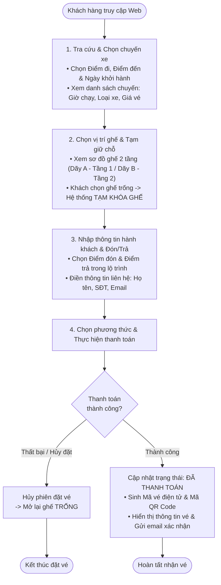
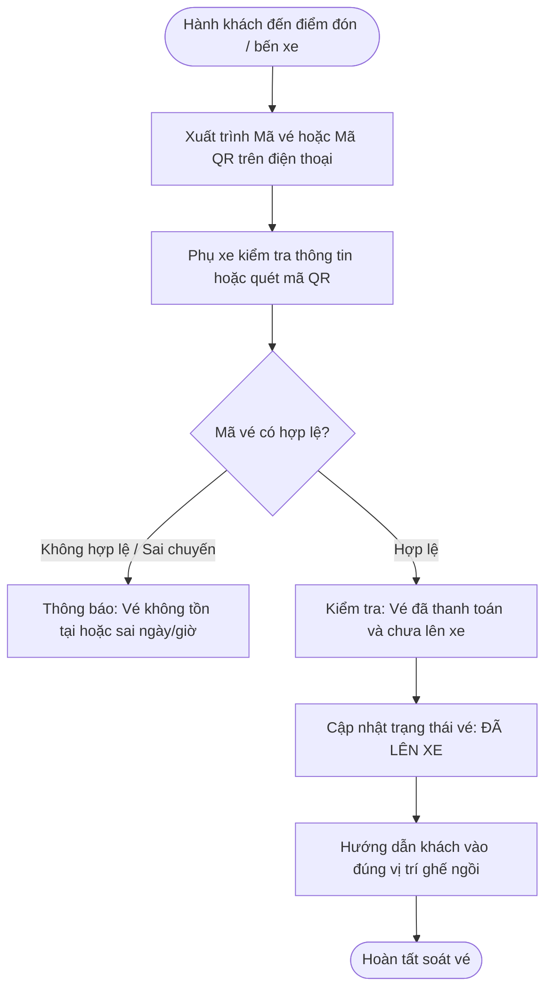
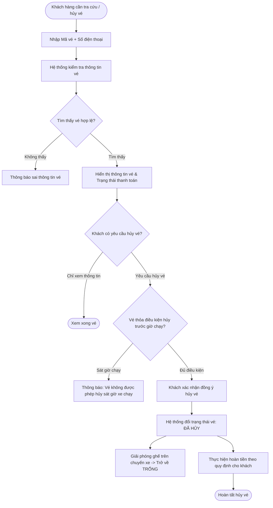

# TỔNG QUAN PHÂN TÍCH & THIẾT KẾ HƯỚNG ĐỐI TƯỢNG (OOAD INSIGHT)
## HỆ THỐNG ĐẶT VÉ XE KHÁCH TRỰC TUYẾN (MÔ PHỎNG PHƯƠNG TRANG)

> **Môn học:** Phân tích & Thiết kế Hướng đối tượng (OOAD)  
> **Đề tài:** Hệ thống Quản lý và Đặt vé xe khách trực tuyến  
> **Mô hình tham chiếu:** Hệ thống bán vé xe khách Phương Trang  
> **Định hướng nghiệp vụ:** Xây dựng quy trình vận hành cơ bản, tinh gọn, tập trung vào các chức năng cốt lõi (tìm chuyến, chọn ghế, tạm khóa chỗ, thanh toán, xuất vé, soát vé và quản lý tuyến/chuyến).

---

## MỤC LỤC TỔNG QUAN

1. [Giới thiệu Đề tài & Phạm vi Nghiệp vụ](#1-giới-thiệu-đề-tài--phạm-vi-nghiệp-vụ)
2. [Các Tác nhân Hệ thống (System Actors)](#2-các-tác-nhân-hệ-thống-system-actors)
3. [Mô hình Luồng Nghiệp vụ Cốt lõi (Core Business Workflows)](#3-mô-hình-luồng-nghiệp-vụ-cốt-lõi-core-business-workflows)
4. [Các Quy tắc Nghiệp vụ Cơ bản (Business Rules)](#4-các-quy-tắc-nghiệp-vụ-cơ-bản-business-rules)

---

## 1. Giới thiệu Đề tài & Phạm vi Nghiệp vụ

### 1.1. Bối cảnh đề tài
Hệ thống Đặt vé xe khách trực tuyến được xây dựng nhằm mô phỏng quy trình đặt vé và quản lý chuyến đi của nhà xe liên tỉnh (như Phương Trang). Hệ thống tập trung giải quyết bài toán cốt lõi:
- Giúp hành khách dễ dàng tìm kiếm chuyến xe theo lộ trình, ngày đi và tự chọn vị trí ghế mong muốn trực quan trên sơ đồ xe.
- Giúp nhà xe quản lý danh mục tuyến đường, lịch trình các chuyến xe, theo dõi danh sách hành khách và kiểm soát tình trạng vé bán ra.

### 1.2. Phạm vi vận hành cơ bản
Để phù hợp với quy mô đồ án môn học, hệ thống tập trung vào các nghiệp vụ nền tảng:
- **Khách hàng:** Tìm kiếm chuyến xe $\rightarrow$ Xem sơ đồ ghế $\rightarrow$ Chọn ghế & Hệ thống tạm khóa chỗ $\rightarrow$ Nhập thông tin & Chọn điểm đón/trả $\rightarrow$ Thanh toán $\rightarrow$ Nhận vé điện tử (Mã vé / QR Code) $\rightarrow$ Tra cứu / Hủy vé.
- **Nhân viên / Phụ xe:** Bán vé tại quầy bến xe, kiểm tra vé / quét mã vé khi khách lên xe.
- **Quản trị viên (Admin):** Quản lý tuyến đường, chuyến xe, giá vé cơ bản và xem báo cáo danh sách đặt vé.

---

## 2. Các Tác nhân Hệ thống (System Actors)

| Tác nhân (Actor) | Phân loại | Vai trò & Trách nhiệm cơ bản |
| :--- | :--- | :--- |
| **Khách hàng (Customer)** | Tác nhân con người | Người dùng đặt vé qua web; có thể tìm kiếm chuyến xe, chọn ghế, tạm khóa chỗ, nhập thông tin liên hệ, thanh toán và tra cứu lại vé đã đặt. |
| **Nhân viên bán vé (Staff)** | Tác nhân con người | Nhân viên làm việc tại quầy bến xe; hỗ trợ bán vé trực tiếp, in thông tin vé cho khách mua tại quầy. |
| **Tài xế / Phụ xe (Driver / Attendant)** | Tác nhân con người | Tiếp nhận danh sách khách của chuyến xe; kiểm tra mã vé hoặc quét mã QR soát vé khi khách lên xe. |
| **Quản trị viên (Admin)** | Tác nhân con người | Quản lý danh mục tuyến đường, trạm dừng, lịch trình chuyến xe, biển số xe và xem thống kê doanh thu cơ bản. |
| **Cổng thanh toán (Payment Gateway)** | Hệ thống ngoài | Xử lý giao dịch thanh toán trực tuyến (Chuyển khoản VietQR, VNPAY, Ví điện tử) và gửi kết quả về hệ thống. |

---

## 3. Mô hình Luồng Nghiệp vụ Cốt lõi (Core Business Workflows)

### 3.1. Quy trình Đặt vé trực tuyến & Tạm khóa chỗ

Khách hàng truy cập website thực hiện tìm chuyến và đặt vé:

---

### 3.2. Quy trình Soát vé khi lên xe

---

### 3.3. Quy trình Tra cứu & Hủy vé cơ bản

---

## 4. Các Quy tắc Nghiệp vụ Cơ bản (Business Rules)

1. **BR01 - Cơ chế Tạm khóa chỗ khi đặt vé:**
   - Khi khách hàng nhấn chọn một ghế còn trống trên sơ đồ xe, hệ thống **tạm thời khóa ghế đó trong phiên giao dịch hiện tại** để người khác không thể chọn trùng.
   - Nếu khách hàng thanh toán thành công, ghế chính thức chuyển sang trạng thái `ĐÃ BÁN`.
   - Nếu khách hủy giao dịch hoặc thao tác đặt vé thất bại, ghế được mở lại trạng thái `TRỐNG`.

2. **BR02 - Cấu hình ghế xe 2 tầng:**
   - Xe giường nằm được phân chia trực quan thành 2 tầng:
     - Tầng 1 (Tầng dưới): Dãy ghế A (ví dụ: A01, A02...).
     - Tầng 2 (Tầng trên): Dãy ghế B (ví dụ: B01, B02...).
   - Mỗi vị trí ghế chỉ được bán cho duy nhất một hành khách trên một chuyến xe cụ thể.

3. **BR03 - Điểm đón và điểm trả:**
   - Khách hàng chọn điểm đón và điểm trả từ danh sách các trạm dừng cố định thuộc lộ trình của chuyến xe đó.

4. **BR04 - Quy định Hủy vé cơ bản:**
   - Khách hàng được phép hủy vé trước giờ xe xuất bến theo quy định thời gian của nhà xe (ví dụ: trước giờ chạy tối thiểu vài tiếng).
   - Khi hủy vé thành công, hệ thống chuyển vé sang trạng thái `ĐÃ HỦY` và tự động giải phóng vị trí ghế đó trở lại thành `TRỐNG` để khách khác có thể đặt.

> **Ghi chú:** Các sơ đồ thiết kế chi tiết theo từng bài thực hành (BFD, Use Case, Sequence, Class Diagram, RDM CSDL, Giao diện UI) được lưu trữ đầy đủ trong các thư mục con tương ứng từ `01_MoTa_DeTai_Va_BFD/` đến `08_ThietKe_GiaoDien_UI/`.
