# Sơ đồ phân rã chức năng (BFD)

> **File này là nguồn gốc duy nhất (single source of truth) của BFD.**
> Sửa chữ ở đây trước, rồi render lại ảnh. Ảnh `BFD.png` và file `BFD.drawio` cùng thư mục
> được sinh ra từ file này.
>
> **Dành cho AI Coding:** mục 4 cho biết mỗi chức năng tương ứng với sơ đồ use case nào và
> động tới bảng dữ liệu nào. Mục 5 liệt kê những thứ **cố ý không làm** — đừng tự sinh code
> cho chúng. Mục 6 là những thứ **chưa chốt** — hỏi trước khi làm.

---

## 1. Phạm vi hệ thống

Website đặt vé xe khách liên tỉnh, phục vụ 3 nhóm người dùng:

| Tác nhân | Vai trò |
|----------|---------|
| Khách hàng | Tra cứu chuyến, đặt vé online, tự quản lý tài khoản và lịch sử vé, hủy vé online |
| Nhân viên bán vé | Bán vé và in vé tại quầy, tra cứu và hủy vé hộ khách vãng lai |
| Quản trị viên (Admin) | Quản lý xe, chuyến, giá vé, khuyến mãi, tài khoản, xem thống kê |

Hai hệ thống ngoài:

- **Cổng thanh toán** — VietQR / MoMo / ZaloPay / Thẻ. Dùng bản mock trong đồ án.
- **Dịch vụ SMS** — gửi mã OTP tới số điện thoại. (Phiên bản 2.0 ghi là Email / SMS / Zalo;
  nhóm đã chốt **chỉ dùng SMS**.)

---

## 2. Cây phân rã chức năng

```
HỆ THỐNG ĐẶT VÉ XE KHÁCH TRỰC TUYẾN
│
├── 1. Quản lý Tài khoản & Người dùng
│   ├── 1.1 Đăng ký tài khoản
│   ├── 1.2 Đăng nhập & Đăng xuất
│   ├── 1.3 Khôi phục mật khẩu
│   ├── 1.4 Đổi mật khẩu
│   ├── 1.5 Quản lý thông tin cá nhân
│   └── 1.6 Quản lý tài khoản & Phân quyền
│
├── 2. Quản lý Chuyến xe & Giá vé
│   ├── 2.1 Quản lý xe & Sơ đồ ghế
│   ├── 2.2 Quản lý chuyến xe & Lịch trình
│   ├── 2.3 Quản lý giá vé & Khuyến mãi
│   └── 2.4 Tra cứu chuyến xe
│
├── 3. Bán vé & Thanh toán
│   ├── 3.1 Đặt vé trực tuyến
│   ├── 3.2 Bán vé & In vé tại quầy
│   ├── 3.3 Giữ chỗ tạm thời
│   ├── 3.4 Thanh toán
│   └── 3.5 Áp dụng mã giảm giá
│
├── 4. Quản lý Vé & Hoàn tiền
│   ├── 4.1 Xem lịch sử mua vé
│   ├── 4.2 Tra cứu vé
│   ├── 4.3 Hủy vé trực tuyến
│   ├── 4.4 Hủy vé tại quầy
│   └── 4.5 Hoàn tiền
│
└── 5. Thống kê & Báo cáo
    ├── 5.1 Thống kê doanh thu
    ├── 5.2 Thống kê vé bán & vé hủy
    ├── 5.3 Thống kê tỷ lệ lấp đầy chỗ ngồi
    ├── 5.4 Bảng điều khiển tổng quan
    └── 5.5 Xuất báo cáo
```

**5 nhóm chức năng — 25 chức năng lá.**

---

## 3. Sơ đồ Mermaid

Copy nguyên khối dưới đây → draw.io → **+** → **Advanced → Mermaid…** → dán → **Insert**.
Hoặc mở thẳng file `BFD.drawio` cùng thư mục.

```mermaid
flowchart TB
    ROOT["HỆ THỐNG ĐẶT VÉ XE KHÁCH TRỰC TUYẾN"]

    N1["1. Quản lý Tài khoản<br/>& Người dùng"]
    N2["2. Quản lý Chuyến xe<br/>& Giá vé"]
    N3["3. Bán vé<br/>& Thanh toán"]
    N4["4. Quản lý Vé<br/>& Hoàn tiền"]
    N5["5. Thống kê<br/>& Báo cáo"]

    ROOT --- N1
    ROOT --- N2
    ROOT --- N3
    ROOT --- N4
    ROOT --- N5

    N1_1["1.1 Đăng ký tài khoản"]
    N1_2["1.2 Đăng nhập & Đăng xuất"]
    N1_3["1.3 Khôi phục mật khẩu"]
    N1_4["1.4 Đổi mật khẩu"]
    N1_5["1.5 Quản lý thông tin cá nhân"]
    N1_6["1.6 Quản lý tài khoản<br/>& Phân quyền"]
    N1 --- N1_1
    N1 --- N1_2
    N1 --- N1_3
    N1 --- N1_4
    N1 --- N1_5
    N1 --- N1_6

    N2_1["2.1 Quản lý xe<br/>& Sơ đồ ghế"]
    N2_2["2.2 Quản lý chuyến xe<br/>& Lịch trình"]
    N2_3["2.3 Quản lý giá vé<br/>& Khuyến mãi"]
    N2_4["2.4 Tra cứu chuyến xe"]
    N2 --- N2_1
    N2 --- N2_2
    N2 --- N2_3
    N2 --- N2_4

    N3_1["3.1 Đặt vé trực tuyến"]
    N3_2["3.2 Bán vé<br/>& In vé tại quầy"]
    N3_3["3.3 Giữ chỗ tạm thời"]
    N3_4["3.4 Thanh toán"]
    N3_5["3.5 Áp dụng mã giảm giá"]
    N3 --- N3_1
    N3 --- N3_2
    N3 --- N3_3
    N3 --- N3_4
    N3 --- N3_5

    N4_1["4.1 Xem lịch sử mua vé"]
    N4_2["4.2 Tra cứu vé"]
    N4_3["4.3 Hủy vé trực tuyến"]
    N4_4["4.4 Hủy vé tại quầy"]
    N4_5["4.5 Hoàn tiền"]
    N4 --- N4_1
    N4 --- N4_2
    N4 --- N4_3
    N4 --- N4_4
    N4 --- N4_5

    N5_1["5.1 Thống kê doanh thu"]
    N5_2["5.2 Thống kê vé bán<br/>& vé hủy"]
    N5_3["5.3 Thống kê tỷ lệ lấp đầy chỗ ngồi"]
    N5_4["5.4 Bảng điều khiển tổng quan"]
    N5_5["5.5 Xuất báo cáo"]
    N5 --- N5_1
    N5 --- N5_2
    N5 --- N5_3
    N5 --- N5_4
    N5 --- N5_5

    classDef default fill:#ffffff,stroke:#333333,stroke-width:1.5px,color:#000000
    classDef rootStyle fill:#ffffff,stroke:#222222,stroke-width:2.5px,font-weight:bold,color:#000000
    class ROOT rootStyle
```



---

## 4. Bảng ánh xạ BFD ↔ Use Case ↔ Bảng CSDL

Mọi chức năng lá đều có ít nhất một sơ đồ use case chịu trách nhiệm — **độ phủ 100%**.
Số sơ đồ tham chiếu theo thứ tự tab trong `UseCase_DatVeXeKhach.drawio`.

| BFD | Chức năng | Sơ đồ Use Case | Tác nhân | Bảng CSDL chính |
|-----|-----------|----------------|----------|-----------------|
| 1.1 | Đăng ký tài khoản | Sơ đồ 2 | Khách hàng | `NGUOI_DUNG`, `VAI_TRO`, `MA_XAC_THUC` |
| 1.2 | Đăng nhập & Đăng xuất | Sơ đồ 1 | Cả 3 | `NGUOI_DUNG`, `NHAT_KY_HOAT_DONG` |
| 1.3 | Khôi phục mật khẩu | Sơ đồ 3 | Khách hàng | `NGUOI_DUNG`, `MA_XAC_THUC` |
| 1.4 | Đổi mật khẩu | Sơ đồ 4 | Cả 3 | `NGUOI_DUNG` |
| 1.5 | Quản lý thông tin cá nhân | Sơ đồ 5 | Cả 3 | `NGUOI_DUNG` |
| 1.6 | Quản lý tài khoản & Phân quyền | Sơ đồ 15 | Admin | `NGUOI_DUNG`, `VAI_TRO`, `NHAT_KY_HOAT_DONG` |
| 2.1 | Quản lý xe & Sơ đồ ghế | Sơ đồ 13 | Admin | `XE`, `LOAI_XE`, `GHE` |
| 2.2 | Quản lý chuyến xe & Lịch trình | Sơ đồ 12 | Admin | `CHUYEN_XE`, `TUYEN_XE`, `XE`, `DIEM_DUNG`, `VE` |
| 2.3 | Quản lý giá vé & Khuyến mãi | Sơ đồ 14 | Admin | `CHUYEN_XE`, `MA_GIAM_GIA` |
| 2.4 | Tra cứu chuyến xe | Sơ đồ 7 | Khách hàng, Nhân viên | `CHUYEN_XE`, `TUYEN_XE`, `GHE`, `CHI_TIET_VE` |
| 3.1 | Đặt vé trực tuyến | Sơ đồ 8 | Khách hàng | `VE`, `CHI_TIET_VE`, `CHUYEN_XE` |
| 3.2 | Bán vé & In vé tại quầy | Sơ đồ 9 | Nhân viên | `VE`, `CHI_TIET_VE`, `NGUOI_DUNG` |
| 3.3 | Giữ chỗ tạm thời | Sơ đồ 8, 9 | (dùng chung) | `CHI_TIET_VE`, `GHE`, `THAM_SO` |
| 3.4 | Thanh toán | Sơ đồ 8, 9 | (dùng chung) | `THANH_TOAN`, `VE` |
| 3.5 | Áp dụng mã giảm giá | Sơ đồ 8, 9 | Khách hàng, Nhân viên | `MA_GIAM_GIA`, `VE` |
| 4.1 | Xem lịch sử mua vé | Sơ đồ 6 | Khách hàng | `VE`, `CHI_TIET_VE`, `CHUYEN_XE` |
| 4.2 | Tra cứu vé | Sơ đồ 11 | Nhân viên | `VE`, `CHI_TIET_VE` |
| 4.3 | Hủy vé trực tuyến | Sơ đồ 10 | Khách hàng | `VE`, `THANH_TOAN` |
| 4.4 | Hủy vé tại quầy | Sơ đồ 11 | Nhân viên | `VE`, `THANH_TOAN`, `NHAT_KY_HOAT_DONG` |
| 4.5 | Hoàn tiền | Sơ đồ 10, 11, 12 | (dùng chung) | `THANH_TOAN`, `THAM_SO` |
| 5.1 | Thống kê doanh thu | Sơ đồ 16 | Admin | `VE`, `CHI_TIET_VE`, `THANH_TOAN`, `TUYEN_XE` |
| 5.2 | Thống kê vé bán & vé hủy | Sơ đồ 16 | Admin | `VE` |
| 5.3 | Thống kê tỷ lệ lấp đầy chỗ ngồi | Sơ đồ 16 | Admin | `CHUYEN_XE`, `GHE`, `CHI_TIET_VE` |
| 5.4 | Bảng điều khiển tổng quan | Sơ đồ 16 | Admin | (tổng hợp từ 5.1–5.3) |
| 5.5 | Xuất báo cáo | Sơ đồ 16 | Admin | (xuất file từ 5.1–5.3) |

### Ghi chú về chênh lệch giữa BFD và Use Case

BFD phân rã theo **chức năng**, use case mô tả theo **mục tiêu của tác nhân**, nên hai bên
không ánh xạ 1–1. Ba chỗ lệch cần biết:

1. **Chọn vị trí ghế** không có lá riêng. Đây là một **bước trong luồng cơ bản** của 3.1 và
   3.2, không phải một chức năng độc lập. Trạng thái ghế thuộc về cặp (chuyến xe, ghế).
2. **Phát hành vé điện tử & in vé** không có lá riêng. Nằm trong 3.1 (vé điện tử) và
   3.2 (in vé tại quầy).
3. **Xử lý vé của chuyến bị hủy** nằm trong 2.2, gọi sang 4.5 Hoàn tiền. Nhà xe hủy chuyến
   thì hoàn 100%, không trừ phí.

---

## 5. Ngoài phạm vi — KHÔNG cài đặt

Không sinh code, không tạo màn hình, không thêm API cho các mục dưới đây.

| Mục đã bỏ | Lý do | Hệ quả cần biết |
|-----------|-------|-----------------|
| **Đổi vé** | Luồng riêng, phức tạp (tính chênh lệch giá, giữ giao dịch cũ). Khách muốn đổi thì hủy rồi đặt lại. | Không có API đổi vé. Chỉ có hủy (4.3 / 4.4) rồi đặt mới (3.1 / 3.2). |
| **Sửa và xóa mã giảm giá** | Giữ toàn vẹn dữ liệu của những vé đã dùng mã đó | 2.3 chỉ có: thêm mã, xem danh sách, bật/tắt. Không có `PUT` và `DELETE` cho mã giảm giá. |
| **Trụ bán vé tự động (kiosk)** | Đã cân nhắc rồi bỏ, giữ nguyên nhân viên bán vé | Không có tác nhân máy bán vé. Khách vãng lai mua tại quầy qua nhân viên. |
| **Quản lý tài xế** | Ngoài phạm vi đồ án | Không có bảng và màn hình cho tài xế. |
| **Thống kê hoàn tiền riêng** | Trùng thông tin với 5.1 (doanh thu đã trừ tiền hoàn) và 5.2 | Màn hình thống kê không có biểu đồ riêng cho tiền hoàn. |

---

## 6. Chưa chốt

| Vấn đề | Trạng thái |
|--------|------------|
| Chức năng **Quản lý đơn đặt vé** cho Admin | **Chưa quyết định** có làm hay không. Hiện chưa có trong BFD và chưa có sơ đồ use case. Hỏi trước khi cài đặt. |

---

## 7. Lịch sử thay đổi

| Phiên bản | Ngày | Thay đổi |
|-----------|------|----------|
| 1.0 | 2026-09-30 | Bản vẽ tay ban đầu (17 lá) |
| 2.0 | 2026-10-03 | Rà soát chéo với Use Case. Bỏ "Quản lý Tuyến xe & Trạm dừng"; "Đổi vé & Hủy vé" → "Hủy vé"; "Thanh toán trực tuyến & Tiền mặt" → "Thanh toán trực tuyến"; "Thống kê Tỷ lệ hủy vé & Hoàn tiền" → "Thống kê Tỷ lệ hủy vé". Bổ sung bảng ánh xạ và mục ngoài phạm vi. (16 lá) |
| 3.0 | 2026-10-07 | Dựng lại toàn bộ cho khớp bộ 17 sơ đồ Use Case cuối cùng. **16 lá → 25 lá.** Chi tiết bên dưới. |

### Chi tiết thay đổi 2.0 → 3.0

**Tách ra vì mỗi thứ là một sơ đồ use case riêng:**

- `4.1 Đăng ký & Đăng nhập tài khoản` → tách thành **1.1 Đăng ký**, **1.2 Đăng nhập & Đăng xuất**,
  **1.3 Khôi phục mật khẩu**, **1.4 Đổi mật khẩu**. Đổi mật khẩu trước đây bị thiếu hẳn.
- `2.3 Hủy vé` → tách thành **4.3 Hủy vé trực tuyến** và **4.4 Hủy vé tại quầy**, vì hai kênh
  có luồng hoàn tiền khác nhau (online chỉ hoàn qua cổng; tại quầy có cả tiền mặt).
- `1.2 Lập lịch Chuyến xe & Bảng giá` → tách thành **2.2 Quản lý chuyến xe & Lịch trình** và
  **2.3 Quản lý giá vé & Khuyến mãi**.
- Thêm lá **3.2 Bán vé & In vé tại quầy** (v2.0 coi đây là kịch bản ghép, không cho lá riêng).
- Thêm lá **3.3 Giữ chỗ tạm thời** và **3.5 Áp dụng mã giảm giá** vì cả hai kênh bán vé đều dùng chung.
- Thêm lá **4.2 Tra cứu vé** (nhân viên tìm vé của khách trước khi hủy).

**Đổi tên / đổi phạm vi:**

- `1.1 Quản lý Loại xe & Sơ đồ ghế` → **2.1 Quản lý xe & Sơ đồ ghế**. Sơ đồ ghế khai báo
  **theo từng xe**, không theo loại xe, để khách chọn chỗ trên app tận dụng lại được.
- `3.1 Thanh toán trực tuyến` → **3.4 Thanh toán**. **Thanh toán tiền mặt tại quầy đã quay lại
  phạm vi** — nhân viên được hỏi chọn tiền mặt hoặc VietQR khi thanh toán.
- Hoàn tiền tách thành lá riêng **4.5**, dùng chung cho hủy vé online, hủy tại quầy và hủy chuyến xe.
  Tiền hoàn về **đúng nguồn đã thanh toán**; phí hủy tính trên **số tiền thực trả**.
- Nhóm 5 từ 3 lá thành 5 lá theo sơ đồ 16: thêm **5.4 Bảng điều khiển tổng quan** và
  **5.5 Xuất báo cáo**.
- OTP: Email / SMS / Zalo → **chỉ SMS**.

**Bỏ:**

- `2.2 Chọn vị trí ghế trên sơ đồ` — là một bước trong luồng đặt vé, không phải chức năng riêng.
- `3.2 Phát hành Vé điện tử & QR Code` — gộp vào 3.1 và 3.2.
