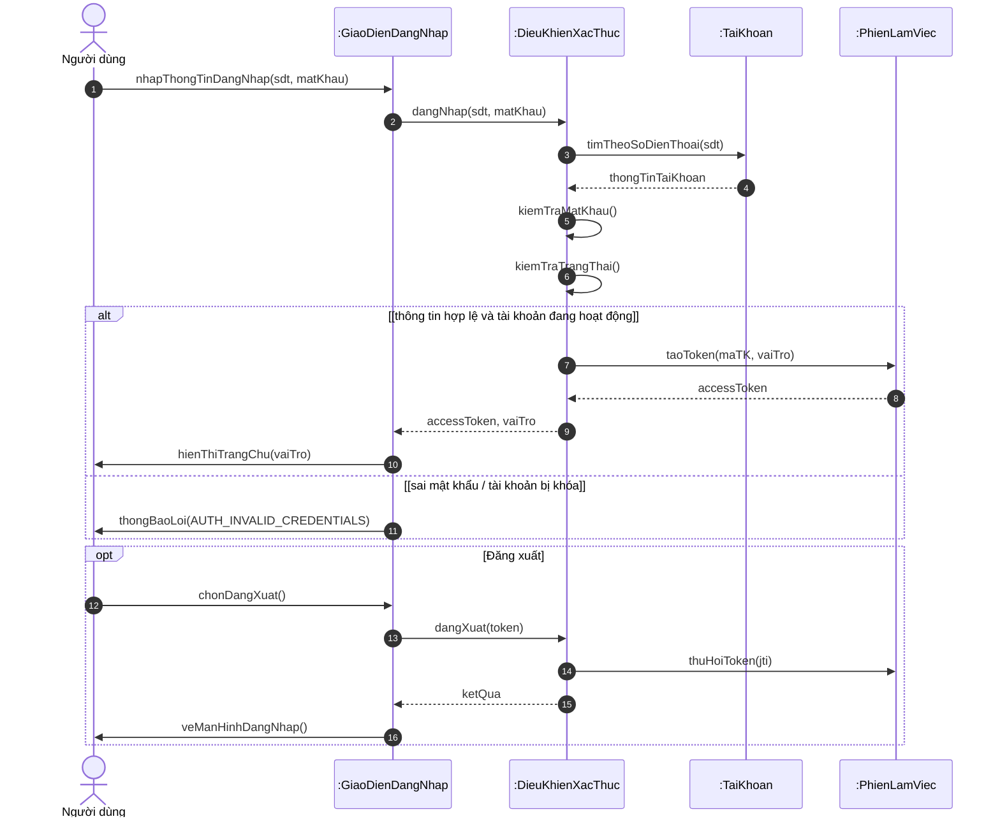
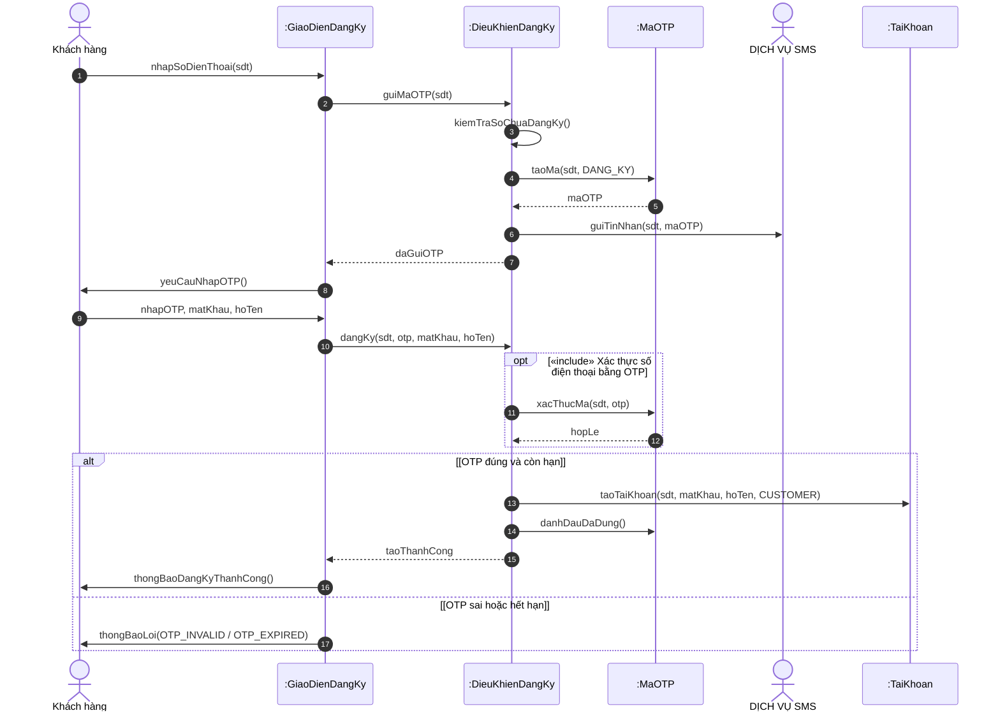
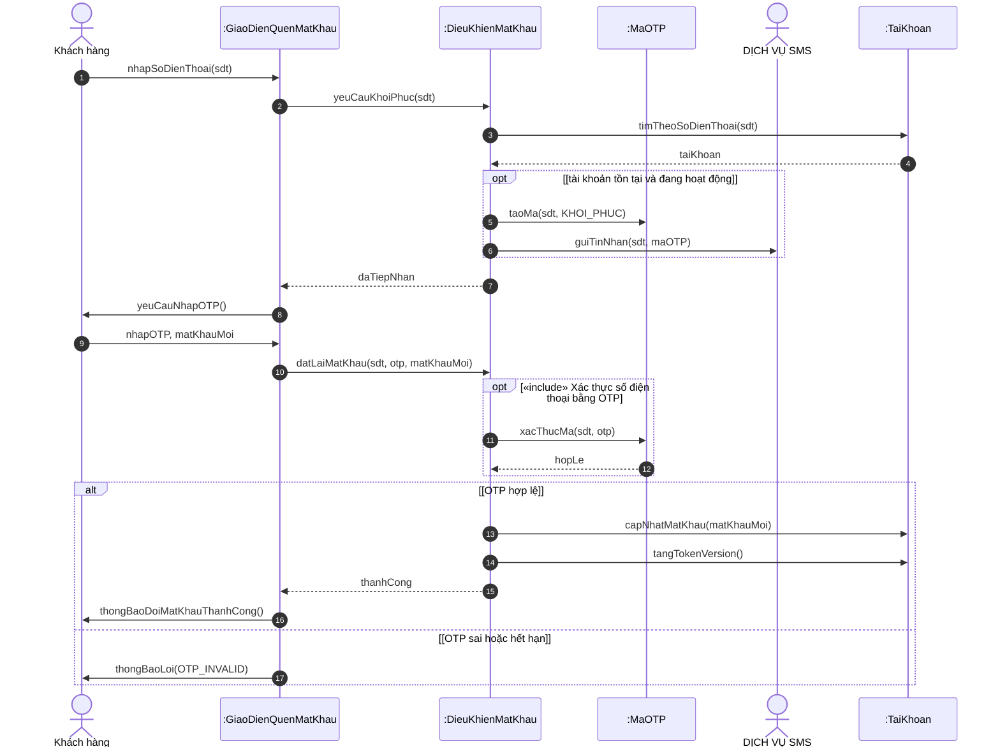
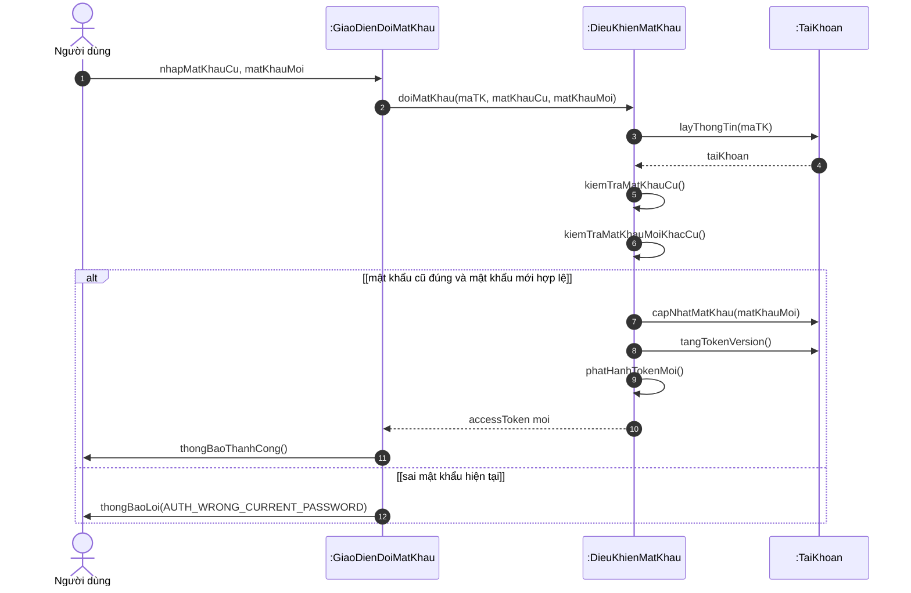
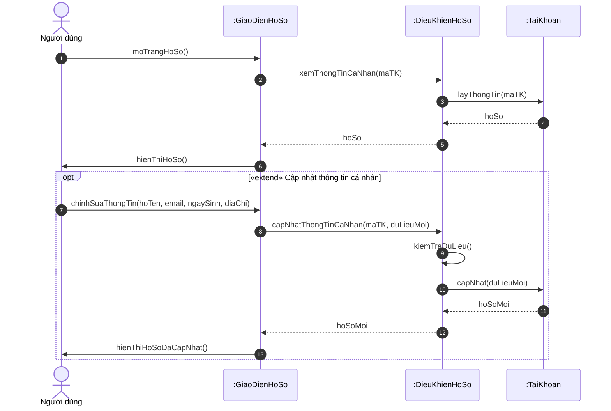
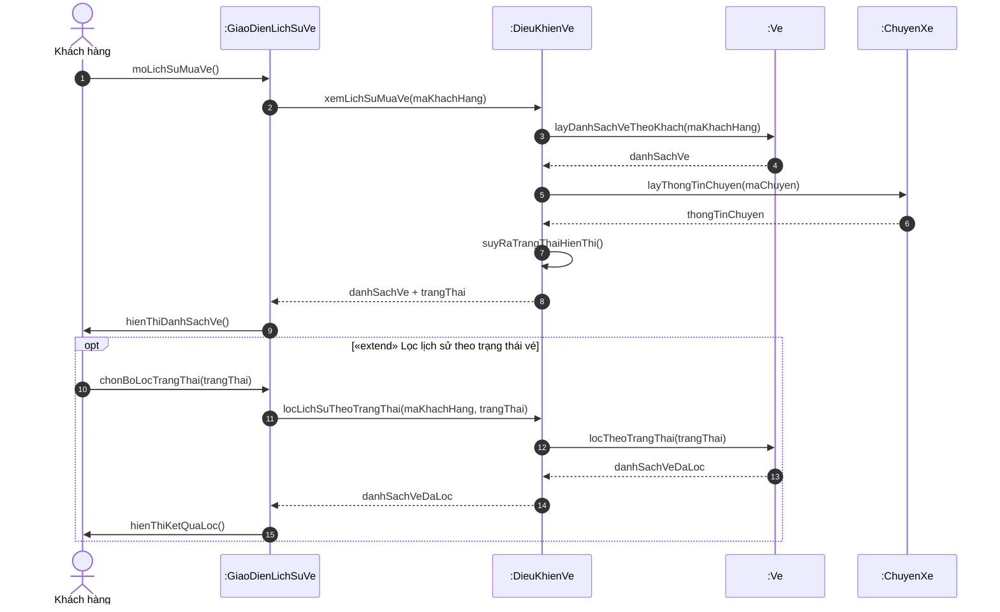
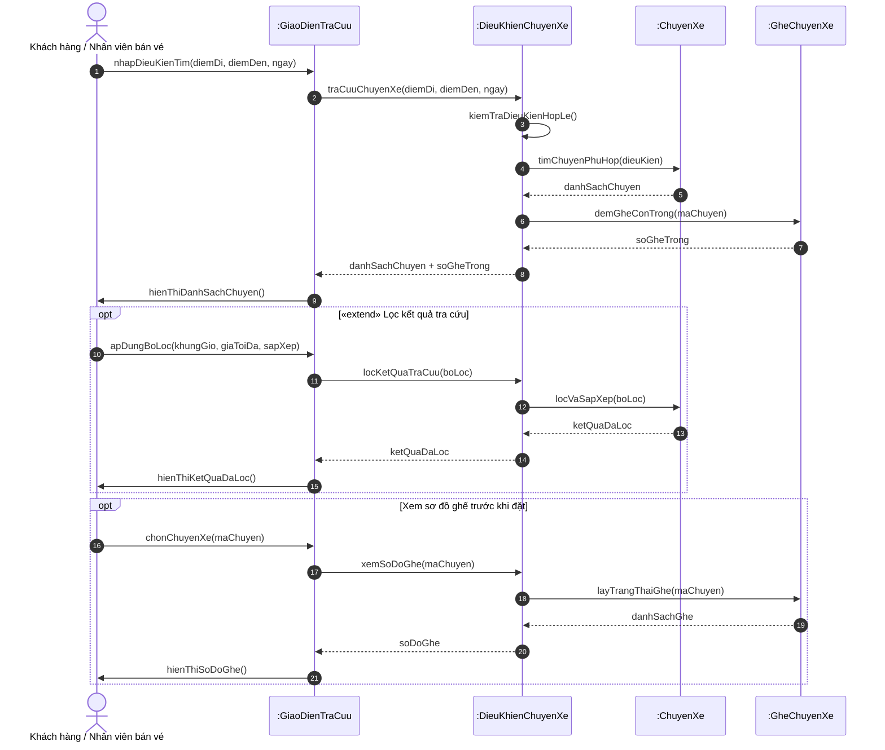
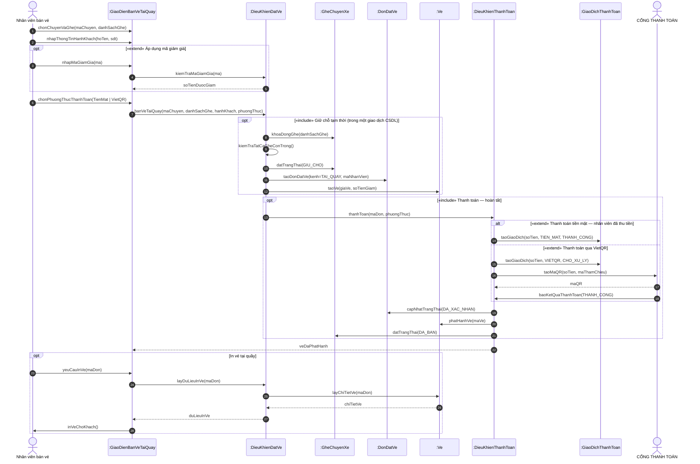
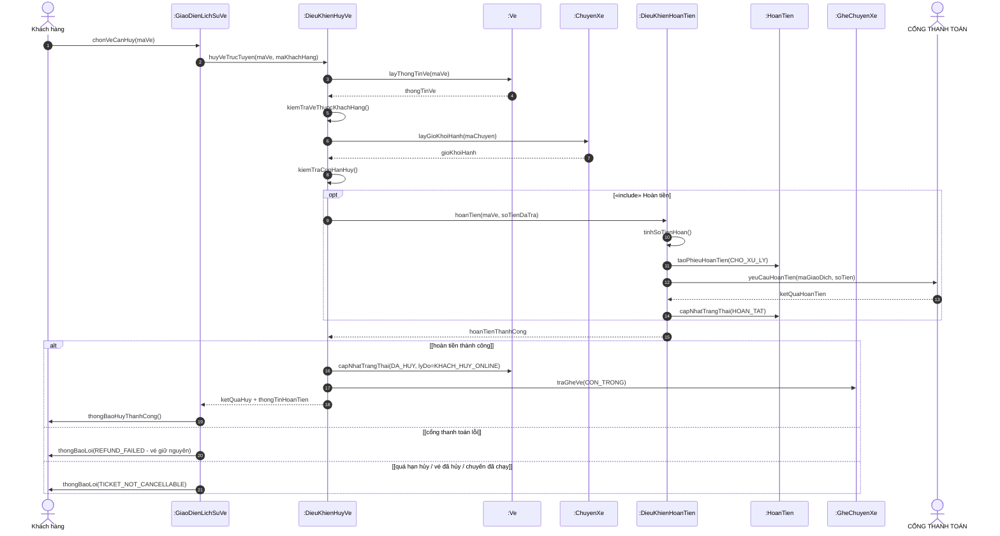
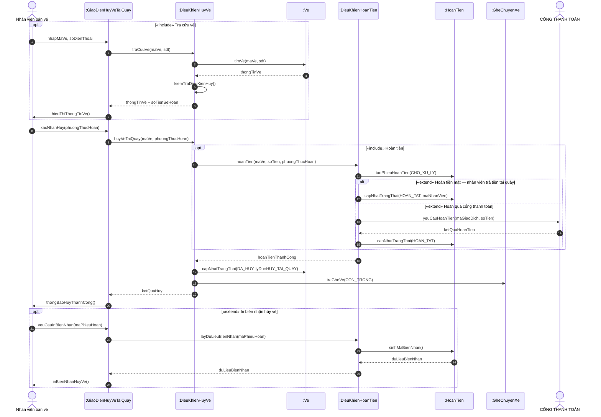

# SEQUENCE DIAGRAM — HỆ THỐNG ĐẶT VÉ XE KHÁCH TRỰC TUYẾN

Mỗi use case một sơ đồ, đánh số SD01 đến SD16 trùng với số sơ đồ use case D01 đến D16.
Sơ đồ D17 (tổng quát) không có sequence riêng.

File này chứa SD01 đến SD11 (nhóm nghiệp vụ). SD12 đến SD16 (nhóm quản trị) nằm ở
`Sequence_Diagrams_P2_QuanTri.md`.

## Quy ước ký hiệu

Theo Chương 4 — Mô hình hóa yêu cầu:

| Phần tử | Ký hiệu trên sơ đồ | Trong file này |
|---|---|---|
| Đối tượng | Hình chữ nhật, tên dạng `:TênLớp` | Bảng "Đối tượng tham gia" |
| Đường sinh tồn | Đường thẳng đứng nét đứt | (ngầm định) |
| Vùng hoạt động | Hình chữ nhật hẹp dọc đường sinh tồn | (ngầm định) |
| Thông điệp đồng bộ | Mũi tên đặc, có đánh số `1:`, `2:` | `Loại = Đồng bộ` |
| Thông điệp đáp ứng | Mũi tên nét đứt, đầu hở, không đánh số | `Loại = Đáp ứng` |
| Tạo đối tượng | Mũi tên nét đứt tới đối tượng mới | `Loại = Tạo đối tượng` |
| Thông điệp bất đồng bộ | Mũi tên đầu hở | `Loại = Bất đồng bộ` |
| Khung alt / opt / loop | Hộp chữ nhật có nhãn ở góc trái | Ghi trong sơ đồ Mermaid |

## Phân lớp đối tượng

Sơ đồ vẽ ở mức chi tiết, bổ sung đối tượng giao diện và điều khiển:

- **Tác nhân**: người hoặc hệ thống ngoài kích hoạt sơ đồ
- **Giao diện (boundary)**: `:GiaoDien...` — màn hình người dùng thao tác
- **Điều khiển (control)**: `:DieuKhien...` — xử lý nghiệp vụ, tương ứng service ở backend
- **Thực thể (entity)**: `:TaiKhoan`, `:Ve`, `:ChuyenXe`... — dữ liệu lưu trong CSDL

Đối tượng điều khiển map thẳng sang các service dùng chung ở mục 8 của `DacTaUseCase_v2.md`.

## Mục lục

| Sơ đồ | Use case | Số đối tượng | Số thông điệp | File |
|---|---|---|---|---|
| SD01 Đăng nhập & Đăng xuất | UC-01 (sơ đồ D01) | 5 | 16 | P1 |
| SD02 Đăng ký tài khoản | UC-02 (sơ đồ D02) | 6 | 17 | P1 |
| SD03 Khôi phục mật khẩu | UC-03 (sơ đồ D03) | 6 | 17 | P1 |
| SD04 Đổi mật khẩu | UC-04 (sơ đồ D04) | 4 | 12 | P1 |
| SD05 Quản lý thông tin cá nhân | UC-05 (sơ đồ D05) | 4 | 13 | P1 |
| SD06 Xem lịch sử mua vé | UC-06 (sơ đồ D06) | 5 | 15 | P1 |
| SD07 Tra cứu & tìm chuyến xe | UC-07 (sơ đồ D07) | 5 | 21 | P1 |
| SD08 Đặt vé trực tuyến | UC-08 (sơ đồ D08) | 10 | 34 | P1 |
| SD09 Bán vé & in vé tại quầy | UC-09 (sơ đồ D09) | 9 | 28 | P1 |
| SD10 Hủy vé trực tuyến | UC-10 (sơ đồ D10) | 9 | 21 | P1 |
| SD11 Hủy vé tại quầy | UC-11 (sơ đồ D11) | 8 | 26 | P1 |
| SD12 Quản lý chuyến xe & lịch trình | UC-12 (sơ đồ D12) | 9 | 34 | P2 |
| SD13 Quản lý xe & sơ đồ ghế | UC-13 (sơ đồ D13) | 6 | 29 | P2 |
| SD14 Quản lý giá vé & khuyến mãi | UC-14 (sơ đồ D14) | 5 | 28 | P2 |
| SD15 Quản lý tài khoản & phân quyền | UC-15 (sơ đồ D15) | 6 | 39 | P2 |
| SD16 Thống kê & báo cáo doanh thu | UC-16 (sơ đồ D16) | 8 | 29 | P2 |

---

## SD01 - Đăng nhập & Đăng xuất

Use case: **UC-01 (sơ đồ D01)**

### Đối tượng tham gia

| Đối tượng | Loại |
|---|---|
| Người dùng | Tác nhân |
| :GiaoDienDangNhap | Giao diện (boundary) |
| :DieuKhienXacThuc | Điều khiển (control) |
| :TaiKhoan | Thực thể (entity) |
| :PhienLamViec | Thực thể (entity) |

### Sơ đồ



### Bảng thông điệp

| STT | Từ | Đến | Thông điệp | Loại |
|---|---|---|---|---|
| 1 | Người dùng | :GiaoDienDangNhap | nhapThongTinDangNhap(sdt, matKhau) | Đồng bộ |
| 2 | :GiaoDienDangNhap | :DieuKhienXacThuc | dangNhap(sdt, matKhau) | Đồng bộ |
| 3 | :DieuKhienXacThuc | :TaiKhoan | timTheoSoDienThoai(sdt) | Đồng bộ |
| - | :TaiKhoan | :DieuKhienXacThuc | thongTinTaiKhoan | Đáp ứng |
| 4 | :DieuKhienXacThuc | :DieuKhienXacThuc | kiemTraMatKhau() | Đồng bộ |
| 5 | :DieuKhienXacThuc | :DieuKhienXacThuc | kiemTraTrangThai() | Đồng bộ |
| 6 | :DieuKhienXacThuc | :PhienLamViec | taoToken(maTK, vaiTro) | Tạo đối tượng |
| - | :PhienLamViec | :DieuKhienXacThuc | accessToken | Đáp ứng |
| - | :DieuKhienXacThuc | :GiaoDienDangNhap | accessToken, vaiTro | Đáp ứng |
| 7 | :GiaoDienDangNhap | Người dùng | hienThiTrangChu(vaiTro) | Đồng bộ |
| 8 | :GiaoDienDangNhap | Người dùng | thongBaoLoi(AUTH_INVALID_CREDENTIALS) | Đồng bộ |
| 9 | Người dùng | :GiaoDienDangNhap | chonDangXuat() | Đồng bộ |
| 10 | :GiaoDienDangNhap | :DieuKhienXacThuc | dangXuat(token) | Đồng bộ |
| 11 | :DieuKhienXacThuc | :PhienLamViec | thuHoiToken(jti) | Đồng bộ |
| - | :DieuKhienXacThuc | :GiaoDienDangNhap | ketQua | Đáp ứng |
| 12 | :GiaoDienDangNhap | Người dùng | veManHinhDangNhap() | Đồng bộ |

> Phải đăng nhập là tiền điều kiện, không phải include. Đăng xuất đưa jti vào bảng revoked_tokens.

---

## SD02 - Đăng ký tài khoản

Use case: **UC-02 (sơ đồ D02)**

### Đối tượng tham gia

| Đối tượng | Loại |
|---|---|
| Khách hàng | Tác nhân |
| :GiaoDienDangKy | Giao diện (boundary) |
| :DieuKhienDangKy | Điều khiển (control) |
| :MaOTP | Thực thể (entity) |
| DỊCH VỤ SMS | Hệ thống ngoài |
| :TaiKhoan | Thực thể (entity) |

### Sơ đồ



### Bảng thông điệp

| STT | Từ | Đến | Thông điệp | Loại |
|---|---|---|---|---|
| 1 | Khách hàng | :GiaoDienDangKy | nhapSoDienThoai(sdt) | Đồng bộ |
| 2 | :GiaoDienDangKy | :DieuKhienDangKy | guiMaOTP(sdt) | Đồng bộ |
| 3 | :DieuKhienDangKy | :DieuKhienDangKy | kiemTraSoChuaDangKy() | Đồng bộ |
| 4 | :DieuKhienDangKy | :MaOTP | taoMa(sdt, DANG_KY) | Tạo đối tượng |
| - | :MaOTP | :DieuKhienDangKy | maOTP | Đáp ứng |
| 5 | :DieuKhienDangKy | DỊCH VỤ SMS | guiTinNhan(sdt, maOTP) | Đồng bộ |
| - | :DieuKhienDangKy | :GiaoDienDangKy | daGuiOTP | Đáp ứng |
| 6 | :GiaoDienDangKy | Khách hàng | yeuCauNhapOTP() | Đồng bộ |
| 7 | Khách hàng | :GiaoDienDangKy | nhapOTP, matKhau, hoTen | Đồng bộ |
| 8 | :GiaoDienDangKy | :DieuKhienDangKy | dangKy(sdt, otp, matKhau, hoTen) | Đồng bộ |
| 9 | :DieuKhienDangKy | :MaOTP | xacThucMa(sdt, otp) | Đồng bộ |
| - | :MaOTP | :DieuKhienDangKy | hopLe | Đáp ứng |
| 10 | :DieuKhienDangKy | :TaiKhoan | taoTaiKhoan(sdt, matKhau, hoTen, CUSTOMER) | Tạo đối tượng |
| 11 | :DieuKhienDangKy | :MaOTP | danhDauDaDung() | Đồng bộ |
| - | :DieuKhienDangKy | :GiaoDienDangKy | taoThanhCong | Đáp ứng |
| 12 | :GiaoDienDangKy | Khách hàng | thongBaoDangKyThanhCong() | Đồng bộ |
| 13 | :GiaoDienDangKy | Khách hàng | thongBaoLoi(OTP_INVALID / OTP_EXPIRED) | Đồng bộ |

> include: Đăng ký tài khoản -> Xác thực số điện thoại bằng OTP. Chỉ tạo tài khoản sau khi OTP đúng.

---

## SD03 - Khôi phục mật khẩu

Use case: **UC-03 (sơ đồ D03)**

### Đối tượng tham gia

| Đối tượng | Loại |
|---|---|
| Khách hàng | Tác nhân |
| :GiaoDienQuenMatKhau | Giao diện (boundary) |
| :DieuKhienMatKhau | Điều khiển (control) |
| :MaOTP | Thực thể (entity) |
| DỊCH VỤ SMS | Hệ thống ngoài |
| :TaiKhoan | Thực thể (entity) |

### Sơ đồ



### Bảng thông điệp

| STT | Từ | Đến | Thông điệp | Loại |
|---|---|---|---|---|
| 1 | Khách hàng | :GiaoDienQuenMatKhau | nhapSoDienThoai(sdt) | Đồng bộ |
| 2 | :GiaoDienQuenMatKhau | :DieuKhienMatKhau | yeuCauKhoiPhuc(sdt) | Đồng bộ |
| 3 | :DieuKhienMatKhau | :TaiKhoan | timTheoSoDienThoai(sdt) | Đồng bộ |
| - | :TaiKhoan | :DieuKhienMatKhau | taiKhoan | Đáp ứng |
| 4 | :DieuKhienMatKhau | :MaOTP | taoMa(sdt, KHOI_PHUC) | Tạo đối tượng |
| 5 | :DieuKhienMatKhau | DỊCH VỤ SMS | guiTinNhan(sdt, maOTP) | Đồng bộ |
| - | :DieuKhienMatKhau | :GiaoDienQuenMatKhau | daTiepNhan | Đáp ứng |
| 6 | :GiaoDienQuenMatKhau | Khách hàng | yeuCauNhapOTP() | Đồng bộ |
| 7 | Khách hàng | :GiaoDienQuenMatKhau | nhapOTP, matKhauMoi | Đồng bộ |
| 8 | :GiaoDienQuenMatKhau | :DieuKhienMatKhau | datLaiMatKhau(sdt, otp, matKhauMoi) | Đồng bộ |
| 9 | :DieuKhienMatKhau | :MaOTP | xacThucMa(sdt, otp) | Đồng bộ |
| - | :MaOTP | :DieuKhienMatKhau | hopLe | Đáp ứng |
| 10 | :DieuKhienMatKhau | :TaiKhoan | capNhatMatKhau(matKhauMoi) | Đồng bộ |
| 11 | :DieuKhienMatKhau | :TaiKhoan | tangTokenVersion() | Đồng bộ |
| - | :DieuKhienMatKhau | :GiaoDienQuenMatKhau | thanhCong | Đáp ứng |
| 12 | :GiaoDienQuenMatKhau | Khách hàng | thongBaoDoiMatKhauThanhCong() | Đồng bộ |
| 13 | :GiaoDienQuenMatKhau | Khách hàng | thongBaoLoi(OTP_INVALID) | Đồng bộ |

> include: Khôi phục mật khẩu -> Xác thực số điện thoại bằng OTP. Đổi mật khẩu xong thì tăng token_version để vô hiệu phiên cũ.

---

## SD04 - Đổi mật khẩu

Use case: **UC-04 (sơ đồ D04)**

### Đối tượng tham gia

| Đối tượng | Loại |
|---|---|
| Người dùng | Tác nhân |
| :GiaoDienDoiMatKhau | Giao diện (boundary) |
| :DieuKhienMatKhau | Điều khiển (control) |
| :TaiKhoan | Thực thể (entity) |

### Sơ đồ



### Bảng thông điệp

| STT | Từ | Đến | Thông điệp | Loại |
|---|---|---|---|---|
| 1 | Người dùng | :GiaoDienDoiMatKhau | nhapMatKhauCu, matKhauMoi | Đồng bộ |
| 2 | :GiaoDienDoiMatKhau | :DieuKhienMatKhau | doiMatKhau(maTK, matKhauCu, matKhauMoi) | Đồng bộ |
| 3 | :DieuKhienMatKhau | :TaiKhoan | layThongTin(maTK) | Đồng bộ |
| - | :TaiKhoan | :DieuKhienMatKhau | taiKhoan | Đáp ứng |
| 4 | :DieuKhienMatKhau | :DieuKhienMatKhau | kiemTraMatKhauCu() | Đồng bộ |
| 5 | :DieuKhienMatKhau | :DieuKhienMatKhau | kiemTraMatKhauMoiKhacCu() | Đồng bộ |
| 6 | :DieuKhienMatKhau | :TaiKhoan | capNhatMatKhau(matKhauMoi) | Đồng bộ |
| 7 | :DieuKhienMatKhau | :TaiKhoan | tangTokenVersion() | Đồng bộ |
| 8 | :DieuKhienMatKhau | :DieuKhienMatKhau | phatHanhTokenMoi() | Đồng bộ |
| - | :DieuKhienMatKhau | :GiaoDienDoiMatKhau | accessToken moi | Đáp ứng |
| 9 | :GiaoDienDoiMatKhau | Người dùng | thongBaoThanhCong() | Đồng bộ |
| 10 | :GiaoDienDoiMatKhau | Người dùng | thongBaoLoi(AUTH_WRONG_CURRENT_PASSWORD) | Đồng bộ |

> Dùng chung cho 3 vai trò: Khách hàng, Nhân viên bán vé, Admin. Cấp token mới cho thiết bị hiện tại, các thiết bị khác phải đăng nhập lại.

---

## SD05 - Quản lý thông tin cá nhân

Use case: **UC-05 (sơ đồ D05)**

### Đối tượng tham gia

| Đối tượng | Loại |
|---|---|
| Người dùng | Tác nhân |
| :GiaoDienHoSo | Giao diện (boundary) |
| :DieuKhienHoSo | Điều khiển (control) |
| :TaiKhoan | Thực thể (entity) |

### Sơ đồ



### Bảng thông điệp

| STT | Từ | Đến | Thông điệp | Loại |
|---|---|---|---|---|
| 1 | Người dùng | :GiaoDienHoSo | moTrangHoSo() | Đồng bộ |
| 2 | :GiaoDienHoSo | :DieuKhienHoSo | xemThongTinCaNhan(maTK) | Đồng bộ |
| 3 | :DieuKhienHoSo | :TaiKhoan | layThongTin(maTK) | Đồng bộ |
| - | :TaiKhoan | :DieuKhienHoSo | hoSo | Đáp ứng |
| - | :DieuKhienHoSo | :GiaoDienHoSo | hoSo | Đáp ứng |
| 4 | :GiaoDienHoSo | Người dùng | hienThiHoSo() | Đồng bộ |
| 5 | Người dùng | :GiaoDienHoSo | chinhSuaThongTin(hoTen, email, ngaySinh, diaChi) | Đồng bộ |
| 6 | :GiaoDienHoSo | :DieuKhienHoSo | capNhatThongTinCaNhan(maTK, duLieuMoi) | Đồng bộ |
| 7 | :DieuKhienHoSo | :DieuKhienHoSo | kiemTraDuLieu() | Đồng bộ |
| 8 | :DieuKhienHoSo | :TaiKhoan | capNhat(duLieuMoi) | Đồng bộ |
| - | :TaiKhoan | :DieuKhienHoSo | hoSoMoi | Đáp ứng |
| - | :DieuKhienHoSo | :GiaoDienHoSo | hoSoMoi | Đáp ứng |
| 9 | :GiaoDienHoSo | Người dùng | hienThiHoSoDaCapNhat() | Đồng bộ |

> extend: Cập nhật thông tin cá nhân mở rộng Xem thông tin cá nhân. Không sửa được số điện thoại và vai trò qua chức năng này.

---

## SD06 - Xem lịch sử mua vé

Use case: **UC-06 (sơ đồ D06)**

### Đối tượng tham gia

| Đối tượng | Loại |
|---|---|
| Khách hàng | Tác nhân |
| :GiaoDienLichSuVe | Giao diện (boundary) |
| :DieuKhienVe | Điều khiển (control) |
| :Ve | Thực thể (entity) |
| :ChuyenXe | Thực thể (entity) |

### Sơ đồ



### Bảng thông điệp

| STT | Từ | Đến | Thông điệp | Loại |
|---|---|---|---|---|
| 1 | Khách hàng | :GiaoDienLichSuVe | moLichSuMuaVe() | Đồng bộ |
| 2 | :GiaoDienLichSuVe | :DieuKhienVe | xemLichSuMuaVe(maKhachHang) | Đồng bộ |
| 3 | :DieuKhienVe | :Ve | layDanhSachVeTheoKhach(maKhachHang) | Đồng bộ |
| - | :Ve | :DieuKhienVe | danhSachVe | Đáp ứng |
| 4 | :DieuKhienVe | :ChuyenXe | layThongTinChuyen(maChuyen) | Đồng bộ |
| - | :ChuyenXe | :DieuKhienVe | thongTinChuyen | Đáp ứng |
| 5 | :DieuKhienVe | :DieuKhienVe | suyRaTrangThaiHienThi() | Đồng bộ |
| - | :DieuKhienVe | :GiaoDienLichSuVe | danhSachVe + trangThai | Đáp ứng |
| 6 | :GiaoDienLichSuVe | Khách hàng | hienThiDanhSachVe() | Đồng bộ |
| 7 | Khách hàng | :GiaoDienLichSuVe | chonBoLocTrangThai(trangThai) | Đồng bộ |
| 8 | :GiaoDienLichSuVe | :DieuKhienVe | locLichSuTheoTrangThai(maKhachHang, trangThai) | Đồng bộ |
| 9 | :DieuKhienVe | :Ve | locTheoTrangThai(trangThai) | Đồng bộ |
| - | :Ve | :DieuKhienVe | danhSachVeDaLoc | Đáp ứng |
| - | :DieuKhienVe | :GiaoDienLichSuVe | danhSachVeDaLoc | Đáp ứng |
| 10 | :GiaoDienLichSuVe | Khách hàng | hienThiKetQuaLoc() | Đồng bộ |

> extend: Lọc lịch sử theo trạng thái vé. Trạng thái UPCOMING / COMPLETED / CANCELLED được suy ra, không lưu trong CSDL.

---

## SD07 - Tra cứu & tìm chuyến xe

Use case: **UC-07 (sơ đồ D07)**

### Đối tượng tham gia

| Đối tượng | Loại |
|---|---|
| Khách hàng / Nhân viên bán vé | Tác nhân |
| :GiaoDienTraCuu | Giao diện (boundary) |
| :DieuKhienChuyenXe | Điều khiển (control) |
| :ChuyenXe | Thực thể (entity) |
| :GheChuyenXe | Thực thể (entity) |

### Sơ đồ



### Bảng thông điệp

| STT | Từ | Đến | Thông điệp | Loại |
|---|---|---|---|---|
| 1 | Khách hàng / Nhân viên bán vé | :GiaoDienTraCuu | nhapDieuKienTim(diemDi, diemDen, ngay) | Đồng bộ |
| 2 | :GiaoDienTraCuu | :DieuKhienChuyenXe | traCuuChuyenXe(diemDi, diemDen, ngay) | Đồng bộ |
| 3 | :DieuKhienChuyenXe | :DieuKhienChuyenXe | kiemTraDieuKienHopLe() | Đồng bộ |
| 4 | :DieuKhienChuyenXe | :ChuyenXe | timChuyenPhuHop(dieuKien) | Đồng bộ |
| - | :ChuyenXe | :DieuKhienChuyenXe | danhSachChuyen | Đáp ứng |
| 5 | :DieuKhienChuyenXe | :GheChuyenXe | demGheConTrong(maChuyen) | Đồng bộ |
| - | :GheChuyenXe | :DieuKhienChuyenXe | soGheTrong | Đáp ứng |
| - | :DieuKhienChuyenXe | :GiaoDienTraCuu | danhSachChuyen + soGheTrong | Đáp ứng |
| 6 | :GiaoDienTraCuu | Khách hàng / Nhân viên bán vé | hienThiDanhSachChuyen() | Đồng bộ |
| 7 | Khách hàng / Nhân viên bán vé | :GiaoDienTraCuu | apDungBoLoc(khungGio, giaToiDa, sapXep) | Đồng bộ |
| 8 | :GiaoDienTraCuu | :DieuKhienChuyenXe | locKetQuaTraCuu(boLoc) | Đồng bộ |
| 9 | :DieuKhienChuyenXe | :ChuyenXe | locVaSapXep(boLoc) | Đồng bộ |
| - | :ChuyenXe | :DieuKhienChuyenXe | ketQuaDaLoc | Đáp ứng |
| - | :DieuKhienChuyenXe | :GiaoDienTraCuu | ketQuaDaLoc | Đáp ứng |
| 10 | :GiaoDienTraCuu | Khách hàng / Nhân viên bán vé | hienThiKetQuaDaLoc() | Đồng bộ |
| 11 | Khách hàng / Nhân viên bán vé | :GiaoDienTraCuu | chonChuyenXe(maChuyen) | Đồng bộ |
| 12 | :GiaoDienTraCuu | :DieuKhienChuyenXe | xemSoDoGhe(maChuyen) | Đồng bộ |
| 13 | :DieuKhienChuyenXe | :GheChuyenXe | layTrangThaiGhe(maChuyen) | Đồng bộ |
| - | :GheChuyenXe | :DieuKhienChuyenXe | danhSachGhe | Đáp ứng |
| - | :DieuKhienChuyenXe | :GiaoDienTraCuu | soDoGhe | Đáp ứng |
| 14 | :GiaoDienTraCuu | Khách hàng / Nhân viên bán vé | hienThiSoDoGhe() | Đồng bộ |

> extend: Lọc kết quả tra cứu. Không yêu cầu đăng nhập. Ghế HELD đã quá hạn giữ được tính là còn trống.

---

## SD08 - Đặt vé trực tuyến

Use case: **UC-08 (sơ đồ D08)**

### Đối tượng tham gia

| Đối tượng | Loại |
|---|---|
| Khách hàng | Tác nhân |
| :GiaoDienDatVe | Giao diện (boundary) |
| :DieuKhienDatVe | Điều khiển (control) |
| :KhuyenMai | Thực thể (entity) |
| :GheChuyenXe | Thực thể (entity) |
| :DonDatVe | Thực thể (entity) |
| :Ve | Thực thể (entity) |
| :DieuKhienThanhToan | Điều khiển (control) |
| :GiaoDichThanhToan | Thực thể (entity) |
| CỔNG THANH TOÁN | Hệ thống ngoài |

### Sơ đồ

```mermaid
sequenceDiagram
    autonumber
    actor P0 as Khách hàng
    participant P1 as :GiaoDienDatVe
    participant P2 as :DieuKhienDatVe
    participant P3 as :KhuyenMai
    participant P4 as :GheChuyenXe
    participant P5 as :DonDatVe
    participant P6 as :Ve
    participant P7 as :DieuKhienThanhToan
    participant P8 as :GiaoDichThanhToan
    actor P9 as CỔNG THANH TOÁN
    P0->>P1: chonGhe(maChuyen, danhSachGhe)
    P0->>P1: nhapThongTinHanhKhach(hoTen, sdt)
    opt «extend» Áp dụng mã giảm giá
    P0->>P1: nhapMaGiamGia(ma)
    P1->>P2: kiemTraMaGiamGia(ma)
    P2->>P3: timMaConHieuLuc(ma)
    P3-->>P2: tyLeGiam
    P2-->>P1: soTienDuocGiam
    end
    P1->>P2: datVeTrucTuyen(maChuyen, danhSachGhe, hanhKhach, ma)
    opt «include» Giữ chỗ tạm thời (trong một giao dịch CSDL)
    alt [mọi ghế còn trống]
    P2->>P4: khoaDongGhe(danhSachGhe)
    P2->>P2: kiemTraTatCaGheConTrong()
    P2->>P4: datTrangThai(GIU_CHO, hetHanSau=10 phút)
    P2->>P5: taoDonDatVe(CHO_THANH_TOAN, hetHanLuc)
    P2->>P6: taoVe(giaVe, soTienGiam)
    P2->>P3: tangSoLanDaDung()
    end
    P2-->>P1: thongTinDon + tongTien
    P1->>P0: hienThiDonChoThanhToan()
    else [có ghế đã bị giữ hoặc đã bán]
    P1->>P0: thongBaoLoi(SEAT_UNAVAILABLE)
    end
    opt «include» Thanh toán  —  «extend» chọn ví điện tử hoặc VietQR/Thẻ
    P0->>P1: chonPhuongThuc(ViMoMo/ZaloPay | VietQR/Thẻ)
    P1->>P7: taoThanhToan(maDon, phuongThuc)
    P7->>P5: kiemTraConHanGiuCho()
    P5-->>P7: conHan
    P7->>P8: taoGiaoDich(soTien, phuongThuc)
    P7->>P9: guiYeuCauThanhToan(soTien, maThamChieu)
    P9-->>P7: duongDanThanhToan / maQR
    P7-->>P1: duongDanThanhToan
    P1->>P0: chuyenDenTrangThanhToan()
    end
    alt [thanh toán thành công]
    P9->>P7: baoKetQuaThanhToan(maGiaoDich, THANH_CONG)
    P7->>P8: capNhatTrangThai(THANH_CONG)
    P7->>P5: capNhatTrangThai(DA_XAC_NHAN)
    P7->>P6: phatHanhVe(maVe)
    P7->>P4: datTrangThai(DA_BAN)
    else [quá hạn giữ chỗ / thanh toán thất bại]
    P7->>P5: capNhatTrangThai(HET_HAN)
    P7->>P4: traGheVe(CON_TRONG)
    P7->>P3: hoanLaiLuotDung()
    end
```

### Bảng thông điệp

| STT | Từ | Đến | Thông điệp | Loại |
|---|---|---|---|---|
| 1 | Khách hàng | :GiaoDienDatVe | chonGhe(maChuyen, danhSachGhe) | Đồng bộ |
| 2 | Khách hàng | :GiaoDienDatVe | nhapThongTinHanhKhach(hoTen, sdt) | Đồng bộ |
| 3 | Khách hàng | :GiaoDienDatVe | nhapMaGiamGia(ma) | Đồng bộ |
| 4 | :GiaoDienDatVe | :DieuKhienDatVe | kiemTraMaGiamGia(ma) | Đồng bộ |
| 5 | :DieuKhienDatVe | :KhuyenMai | timMaConHieuLuc(ma) | Đồng bộ |
| - | :KhuyenMai | :DieuKhienDatVe | tyLeGiam | Đáp ứng |
| - | :DieuKhienDatVe | :GiaoDienDatVe | soTienDuocGiam | Đáp ứng |
| 6 | :GiaoDienDatVe | :DieuKhienDatVe | datVeTrucTuyen(maChuyen, danhSachGhe, hanhKhach, ma) | Đồng bộ |
| 7 | :DieuKhienDatVe | :GheChuyenXe | khoaDongGhe(danhSachGhe) | Đồng bộ |
| 8 | :DieuKhienDatVe | :DieuKhienDatVe | kiemTraTatCaGheConTrong() | Đồng bộ |
| 9 | :DieuKhienDatVe | :GheChuyenXe | datTrangThai(GIU_CHO, hetHanSau=10 phút) | Đồng bộ |
| 10 | :DieuKhienDatVe | :DonDatVe | taoDonDatVe(CHO_THANH_TOAN, hetHanLuc) | Tạo đối tượng |
| 11 | :DieuKhienDatVe | :Ve | taoVe(giaVe, soTienGiam) | Tạo đối tượng |
| 12 | :DieuKhienDatVe | :KhuyenMai | tangSoLanDaDung() | Đồng bộ |
| - | :DieuKhienDatVe | :GiaoDienDatVe | thongTinDon + tongTien | Đáp ứng |
| 13 | :GiaoDienDatVe | Khách hàng | hienThiDonChoThanhToan() | Đồng bộ |
| 14 | :GiaoDienDatVe | Khách hàng | thongBaoLoi(SEAT_UNAVAILABLE) | Đồng bộ |
| 15 | Khách hàng | :GiaoDienDatVe | chonPhuongThuc(ViMoMo/ZaloPay \| VietQR/Thẻ) | Đồng bộ |
| 16 | :GiaoDienDatVe | :DieuKhienThanhToan | taoThanhToan(maDon, phuongThuc) | Đồng bộ |
| 17 | :DieuKhienThanhToan | :DonDatVe | kiemTraConHanGiuCho() | Đồng bộ |
| - | :DonDatVe | :DieuKhienThanhToan | conHan | Đáp ứng |
| 18 | :DieuKhienThanhToan | :GiaoDichThanhToan | taoGiaoDich(soTien, phuongThuc) | Tạo đối tượng |
| 19 | :DieuKhienThanhToan | CỔNG THANH TOÁN | guiYeuCauThanhToan(soTien, maThamChieu) | Đồng bộ |
| - | CỔNG THANH TOÁN | :DieuKhienThanhToan | duongDanThanhToan / maQR | Đáp ứng |
| - | :DieuKhienThanhToan | :GiaoDienDatVe | duongDanThanhToan | Đáp ứng |
| 20 | :GiaoDienDatVe | Khách hàng | chuyenDenTrangThanhToan() | Đồng bộ |
| 21 | CỔNG THANH TOÁN | :DieuKhienThanhToan | baoKetQuaThanhToan(maGiaoDich, THANH_CONG) | Bất đồng bộ |
| 22 | :DieuKhienThanhToan | :GiaoDichThanhToan | capNhatTrangThai(THANH_CONG) | Đồng bộ |
| 23 | :DieuKhienThanhToan | :DonDatVe | capNhatTrangThai(DA_XAC_NHAN) | Đồng bộ |
| 24 | :DieuKhienThanhToan | :Ve | phatHanhVe(maVe) | Đồng bộ |
| 25 | :DieuKhienThanhToan | :GheChuyenXe | datTrangThai(DA_BAN) | Đồng bộ |
| 26 | :DieuKhienThanhToan | :DonDatVe | capNhatTrangThai(HET_HAN) | Đồng bộ |
| 27 | :DieuKhienThanhToan | :GheChuyenXe | traGheVe(CON_TRONG) | Đồng bộ |
| 28 | :DieuKhienThanhToan | :KhuyenMai | hoanLaiLuotDung() | Đồng bộ |

> include: Giữ chỗ tạm thời, Thanh toán. extend: Áp dụng mã giảm giá, Thanh toán qua Ví MoMo/ZaloPay, Thanh toán qua VietQR/Thẻ. Giữ chỗ dùng khóa dòng (FOR UPDATE) để chống đặt trùng ghế.

---

## SD09 - Bán vé & in vé tại quầy

Use case: **UC-09 (sơ đồ D09)**

### Đối tượng tham gia

| Đối tượng | Loại |
|---|---|
| Nhân viên bán vé | Tác nhân |
| :GiaoDienBanVeTaiQuay | Giao diện (boundary) |
| :DieuKhienDatVe | Điều khiển (control) |
| :GheChuyenXe | Thực thể (entity) |
| :DonDatVe | Thực thể (entity) |
| :Ve | Thực thể (entity) |
| :DieuKhienThanhToan | Điều khiển (control) |
| :GiaoDichThanhToan | Thực thể (entity) |
| CỔNG THANH TOÁN | Hệ thống ngoài |

### Sơ đồ



### Bảng thông điệp

| STT | Từ | Đến | Thông điệp | Loại |
|---|---|---|---|---|
| 1 | Nhân viên bán vé | :GiaoDienBanVeTaiQuay | chonChuyenVaGhe(maChuyen, danhSachGhe) | Đồng bộ |
| 2 | Nhân viên bán vé | :GiaoDienBanVeTaiQuay | nhapThongTinHanhKhach(hoTen, sdt) | Đồng bộ |
| 3 | Nhân viên bán vé | :GiaoDienBanVeTaiQuay | nhapMaGiamGia(ma) | Đồng bộ |
| 4 | :GiaoDienBanVeTaiQuay | :DieuKhienDatVe | kiemTraMaGiamGia(ma) | Đồng bộ |
| - | :DieuKhienDatVe | :GiaoDienBanVeTaiQuay | soTienDuocGiam | Đáp ứng |
| 5 | Nhân viên bán vé | :GiaoDienBanVeTaiQuay | chonPhuongThucThanhToan(TienMat \| VietQR) | Đồng bộ |
| 6 | :GiaoDienBanVeTaiQuay | :DieuKhienDatVe | banVeTaiQuay(maChuyen, danhSachGhe, hanhKhach, phuongThuc) | Đồng bộ |
| 7 | :DieuKhienDatVe | :GheChuyenXe | khoaDongGhe(danhSachGhe) | Đồng bộ |
| 8 | :DieuKhienDatVe | :DieuKhienDatVe | kiemTraTatCaGheConTrong() | Đồng bộ |
| 9 | :DieuKhienDatVe | :GheChuyenXe | datTrangThai(GIU_CHO) | Đồng bộ |
| 10 | :DieuKhienDatVe | :DonDatVe | taoDonDatVe(kenh=TAI_QUAY, maNhanVien) | Tạo đối tượng |
| 11 | :DieuKhienDatVe | :Ve | taoVe(giaVe, soTienGiam) | Tạo đối tượng |
| 12 | :DieuKhienDatVe | :DieuKhienThanhToan | thanhToan(maDon, phuongThuc) | Đồng bộ |
| 13 | :DieuKhienThanhToan | :GiaoDichThanhToan | taoGiaoDich(soTien, TIEN_MAT, THANH_CONG) | Tạo đối tượng |
| 14 | :DieuKhienThanhToan | :GiaoDichThanhToan | taoGiaoDich(soTien, VIETQR, CHO_XU_LY) | Tạo đối tượng |
| 15 | :DieuKhienThanhToan | CỔNG THANH TOÁN | taoMaQR(soTien, maThamChieu) | Đồng bộ |
| - | CỔNG THANH TOÁN | :DieuKhienThanhToan | maQR | Đáp ứng |
| 16 | CỔNG THANH TOÁN | :DieuKhienThanhToan | baoKetQuaThanhToan(THANH_CONG) | Bất đồng bộ |
| 17 | :DieuKhienThanhToan | :DonDatVe | capNhatTrangThai(DA_XAC_NHAN) | Đồng bộ |
| 18 | :DieuKhienThanhToan | :Ve | phatHanhVe(maVe) | Đồng bộ |
| 19 | :DieuKhienThanhToan | :GheChuyenXe | datTrangThai(DA_BAN) | Đồng bộ |
| - | :DieuKhienThanhToan | :GiaoDienBanVeTaiQuay | veDaPhatHanh | Đáp ứng |
| 20 | Nhân viên bán vé | :GiaoDienBanVeTaiQuay | yeuCauInVe(maDon) | Đồng bộ |
| 21 | :GiaoDienBanVeTaiQuay | :DieuKhienDatVe | layDuLieuInVe(maDon) | Đồng bộ |
| 22 | :DieuKhienDatVe | :Ve | layChiTietVe(maDon) | Đồng bộ |
| - | :Ve | :DieuKhienDatVe | chiTietVe | Đáp ứng |
| - | :DieuKhienDatVe | :GiaoDienBanVeTaiQuay | duLieuInVe | Đáp ứng |
| 23 | :GiaoDienBanVeTaiQuay | Nhân viên bán vé | inVeChoKhach() | Đồng bộ |

> include: Giữ chỗ tạm thời, Thanh toán. extend: Áp dụng mã giảm giá, Thanh toán tiền mặt, Thanh toán qua VietQR. Khách mua tại quầy không cần tài khoản: đơn gắn mã nhân viên bán.

---

## SD10 - Hủy vé trực tuyến

Use case: **UC-10 (sơ đồ D10)**

### Đối tượng tham gia

| Đối tượng | Loại |
|---|---|
| Khách hàng | Tác nhân |
| :GiaoDienLichSuVe | Giao diện (boundary) |
| :DieuKhienHuyVe | Điều khiển (control) |
| :Ve | Thực thể (entity) |
| :ChuyenXe | Thực thể (entity) |
| :DieuKhienHoanTien | Điều khiển (control) |
| :HoanTien | Thực thể (entity) |
| :GheChuyenXe | Thực thể (entity) |
| CỔNG THANH TOÁN | Hệ thống ngoài |

### Sơ đồ



### Bảng thông điệp

| STT | Từ | Đến | Thông điệp | Loại |
|---|---|---|---|---|
| 1 | Khách hàng | :GiaoDienLichSuVe | chonVeCanHuy(maVe) | Đồng bộ |
| 2 | :GiaoDienLichSuVe | :DieuKhienHuyVe | huyVeTrucTuyen(maVe, maKhachHang) | Đồng bộ |
| 3 | :DieuKhienHuyVe | :Ve | layThongTinVe(maVe) | Đồng bộ |
| - | :Ve | :DieuKhienHuyVe | thongTinVe | Đáp ứng |
| 4 | :DieuKhienHuyVe | :DieuKhienHuyVe | kiemTraVeThuocKhachHang() | Đồng bộ |
| 5 | :DieuKhienHuyVe | :ChuyenXe | layGioKhoiHanh(maChuyen) | Đồng bộ |
| - | :ChuyenXe | :DieuKhienHuyVe | gioKhoiHanh | Đáp ứng |
| 6 | :DieuKhienHuyVe | :DieuKhienHuyVe | kiemTraConHanHuy() | Đồng bộ |
| 7 | :DieuKhienHuyVe | :DieuKhienHoanTien | hoanTien(maVe, soTienDaTra) | Đồng bộ |
| 8 | :DieuKhienHoanTien | :DieuKhienHoanTien | tinhSoTienHoan() | Đồng bộ |
| 9 | :DieuKhienHoanTien | :HoanTien | taoPhieuHoanTien(CHO_XU_LY) | Tạo đối tượng |
| 10 | :DieuKhienHoanTien | CỔNG THANH TOÁN | yeuCauHoanTien(maGiaoDich, soTien) | Đồng bộ |
| - | CỔNG THANH TOÁN | :DieuKhienHoanTien | ketQuaHoanTien | Đáp ứng |
| 11 | :DieuKhienHoanTien | :HoanTien | capNhatTrangThai(HOAN_TAT) | Đồng bộ |
| - | :DieuKhienHoanTien | :DieuKhienHuyVe | hoanTienThanhCong | Đáp ứng |
| 12 | :DieuKhienHuyVe | :Ve | capNhatTrangThai(DA_HUY, lyDo=KHACH_HUY_ONLINE) | Đồng bộ |
| 13 | :DieuKhienHuyVe | :GheChuyenXe | traGheVe(CON_TRONG) | Đồng bộ |
| - | :DieuKhienHuyVe | :GiaoDienLichSuVe | ketQuaHuy + thongTinHoanTien | Đáp ứng |
| 14 | :GiaoDienLichSuVe | Khách hàng | thongBaoHuyThanhCong() | Đồng bộ |
| 15 | :GiaoDienLichSuVe | Khách hàng | thongBaoLoi(REFUND_FAILED - vé giữ nguyên) | Đồng bộ |
| 16 | :GiaoDienLichSuVe | Khách hàng | thongBaoLoi(TICKET_NOT_CANCELLABLE) | Đồng bộ |

> include: Hủy vé trực tuyến -> Hoàn tiền. Chỉ hủy vé sau khi cổng thanh toán hoàn tiền thành công.

---

## SD11 - Hủy vé tại quầy

Use case: **UC-11 (sơ đồ D11)**

### Đối tượng tham gia

| Đối tượng | Loại |
|---|---|
| Nhân viên bán vé | Tác nhân |
| :GiaoDienHuyVeTaiQuay | Giao diện (boundary) |
| :DieuKhienHuyVe | Điều khiển (control) |
| :Ve | Thực thể (entity) |
| :DieuKhienHoanTien | Điều khiển (control) |
| :HoanTien | Thực thể (entity) |
| :GheChuyenXe | Thực thể (entity) |
| CỔNG THANH TOÁN | Hệ thống ngoài |

### Sơ đồ



### Bảng thông điệp

| STT | Từ | Đến | Thông điệp | Loại |
|---|---|---|---|---|
| 1 | Nhân viên bán vé | :GiaoDienHuyVeTaiQuay | nhapMaVe, soDienThoai | Đồng bộ |
| 2 | :GiaoDienHuyVeTaiQuay | :DieuKhienHuyVe | traCuuVe(maVe, sdt) | Đồng bộ |
| 3 | :DieuKhienHuyVe | :Ve | timVe(maVe, sdt) | Đồng bộ |
| - | :Ve | :DieuKhienHuyVe | thongTinVe | Đáp ứng |
| 4 | :DieuKhienHuyVe | :DieuKhienHuyVe | kiemTraDieuKienHuy() | Đồng bộ |
| - | :DieuKhienHuyVe | :GiaoDienHuyVeTaiQuay | thongTinVe + soTienSeHoan | Đáp ứng |
| 5 | :GiaoDienHuyVeTaiQuay | Nhân viên bán vé | hienThiThongTinVe() | Đồng bộ |
| 6 | Nhân viên bán vé | :GiaoDienHuyVeTaiQuay | xacNhanHuy(phuongThucHoan) | Đồng bộ |
| 7 | :GiaoDienHuyVeTaiQuay | :DieuKhienHuyVe | huyVeTaiQuay(maVe, phuongThucHoan) | Đồng bộ |
| 8 | :DieuKhienHuyVe | :DieuKhienHoanTien | hoanTien(maVe, soTien, phuongThucHoan) | Đồng bộ |
| 9 | :DieuKhienHoanTien | :HoanTien | taoPhieuHoanTien(CHO_XU_LY) | Tạo đối tượng |
| 10 | :DieuKhienHoanTien | :HoanTien | capNhatTrangThai(HOAN_TAT, maNhanVien) | Đồng bộ |
| 11 | :DieuKhienHoanTien | CỔNG THANH TOÁN | yeuCauHoanTien(maGiaoDich, soTien) | Đồng bộ |
| - | CỔNG THANH TOÁN | :DieuKhienHoanTien | ketQuaHoanTien | Đáp ứng |
| 12 | :DieuKhienHoanTien | :HoanTien | capNhatTrangThai(HOAN_TAT) | Đồng bộ |
| - | :DieuKhienHoanTien | :DieuKhienHuyVe | hoanTienThanhCong | Đáp ứng |
| 13 | :DieuKhienHuyVe | :Ve | capNhatTrangThai(DA_HUY, lyDo=HUY_TAI_QUAY) | Đồng bộ |
| 14 | :DieuKhienHuyVe | :GheChuyenXe | traGheVe(CON_TRONG) | Đồng bộ |
| - | :DieuKhienHuyVe | :GiaoDienHuyVeTaiQuay | ketQuaHuy | Đáp ứng |
| 15 | :GiaoDienHuyVeTaiQuay | Nhân viên bán vé | thongBaoHuyThanhCong() | Đồng bộ |
| 16 | Nhân viên bán vé | :GiaoDienHuyVeTaiQuay | yeuCauInBienNhan(maPhieuHoan) | Đồng bộ |
| 17 | :GiaoDienHuyVeTaiQuay | :DieuKhienHoanTien | layDuLieuBienNhan(maPhieuHoan) | Đồng bộ |
| 18 | :DieuKhienHoanTien | :HoanTien | sinhMaBienNhan() | Đồng bộ |
| - | :HoanTien | :DieuKhienHoanTien | duLieuBienNhan | Đáp ứng |
| - | :DieuKhienHoanTien | :GiaoDienHuyVeTaiQuay | duLieuBienNhan | Đáp ứng |
| 19 | :GiaoDienHuyVeTaiQuay | Nhân viên bán vé | inBienNhanHuyVe() | Đồng bộ |

> include: Tra cứu vé, Hoàn tiền. extend: In biên nhận hủy vé, Hoàn tiền mặt, Hoàn qua cổng thanh toán. Hoàn tiền mặt không gọi cổng thanh toán, chỉ ghi nhận sổ sách.

---

> Tiếp theo: **SD12 đến SD16 (nhóm quản trị)** nằm ở file `Sequence_Diagrams_P2_QuanTri.md`,
> cùng với bảng đối chiếu đối tượng điều khiển sang service backend và danh sách điểm cần xác nhận.
