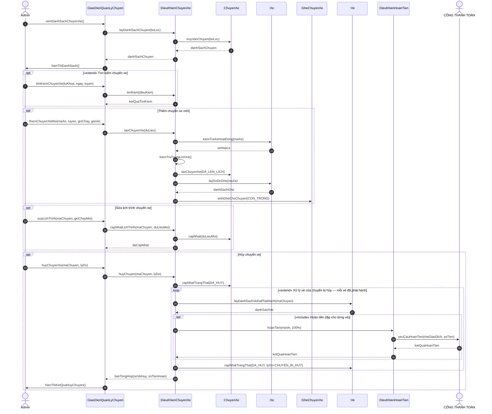
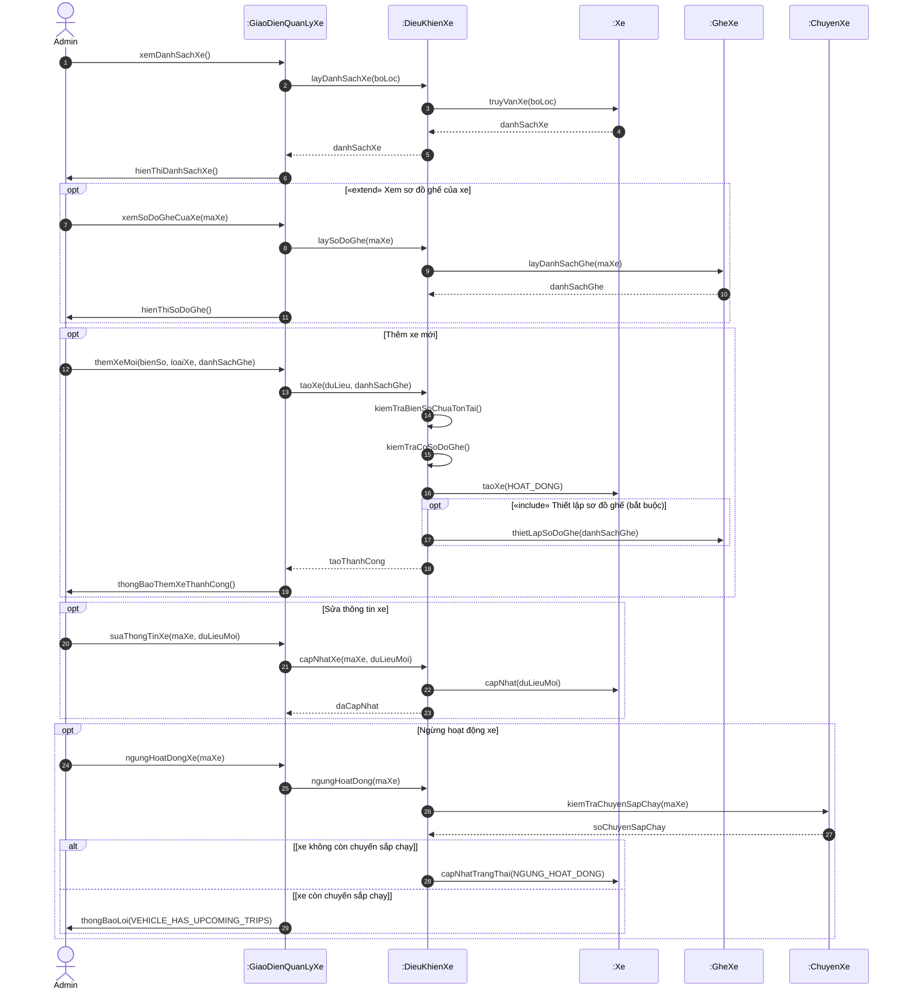
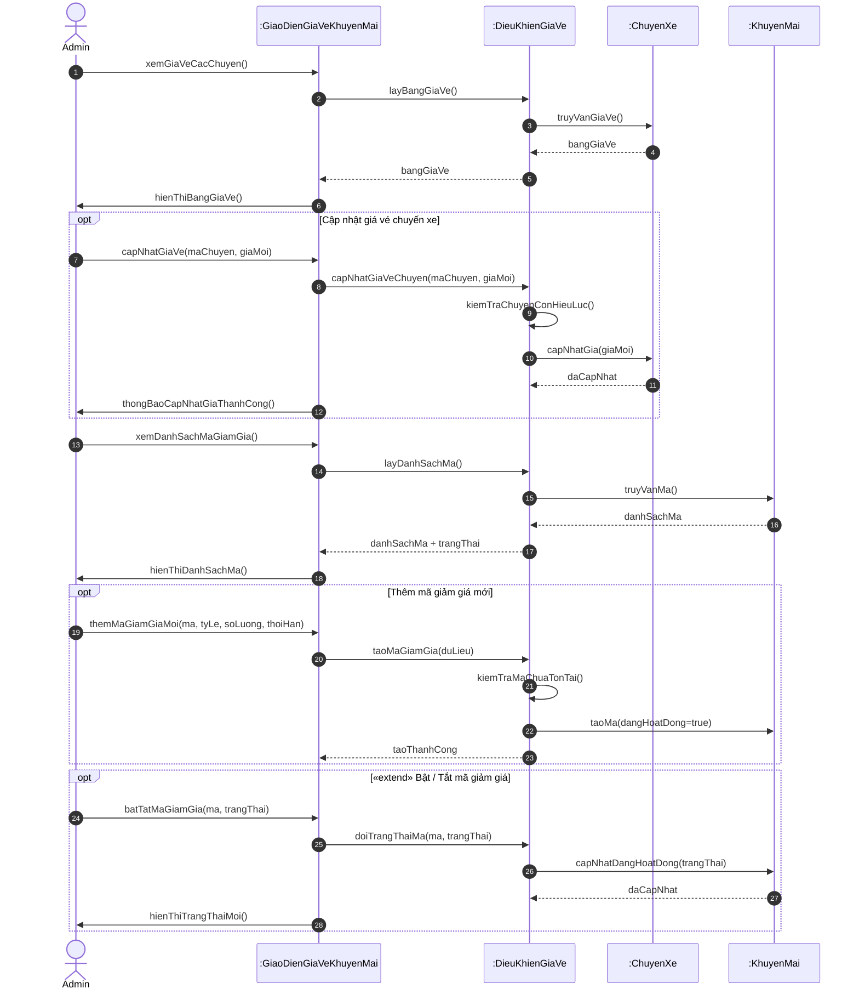
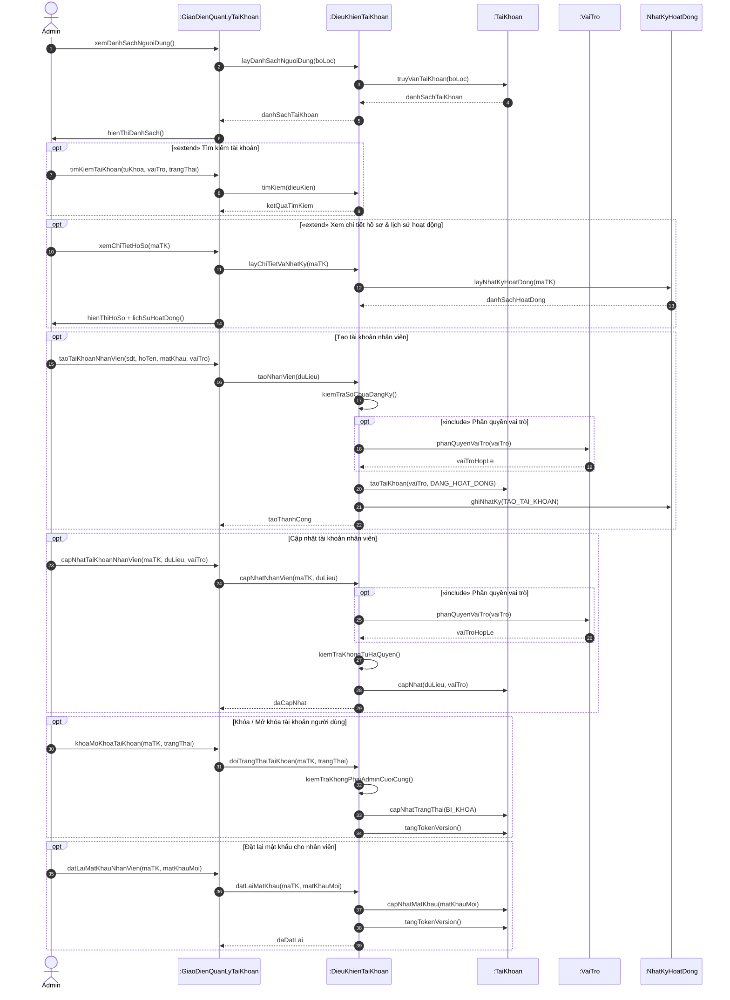
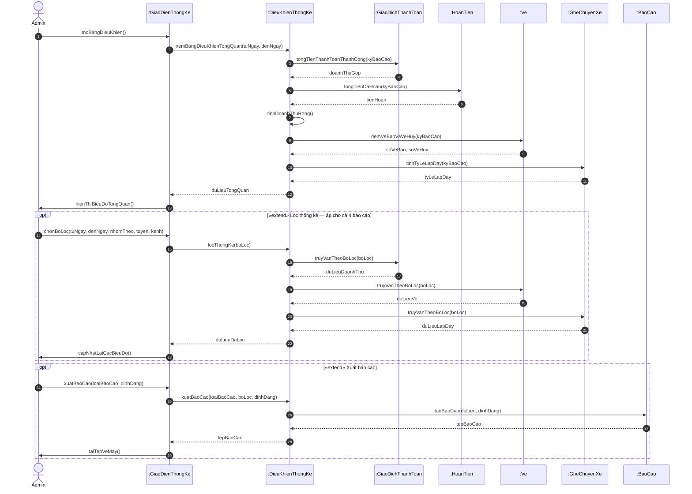

# SEQUENCE DIAGRAM — PHẦN 2: NHÓM QUẢN TRỊ

Tiếp theo `Sequence_Diagrams_P1_NghiepVu.md` (SD01 đến SD11).
Quy ước ký hiệu và phân lớp đối tượng xem ở file phần 1.

---

## SD12 - Quản lý chuyến xe & lịch trình

Use case: **UC-12 (sơ đồ D12)**

### Đối tượng tham gia

| Đối tượng | Loại |
|---|---|
| Admin | Tác nhân |
| :GiaoDienQuanLyChuyen | Giao diện (boundary) |
| :DieuKhienChuyenXe | Điều khiển (control) |
| :ChuyenXe | Thực thể (entity) |
| :Xe | Thực thể (entity) |
| :GheChuyenXe | Thực thể (entity) |
| :Ve | Thực thể (entity) |
| :DieuKhienHoanTien | Điều khiển (control) |
| CỔNG THANH TOÁN | Hệ thống ngoài |

### Sơ đồ

### Bảng thông điệp

| STT | Từ | Đến | Thông điệp | Loại |
|---|---|---|---|---|
| 1 | Admin | :GiaoDienQuanLyChuyen | xemDanhSachChuyenXe() | Đồng bộ |
| 2 | :GiaoDienQuanLyChuyen | :DieuKhienChuyenXe | layDanhSachChuyen(boLoc) | Đồng bộ |
| 3 | :DieuKhienChuyenXe | :ChuyenXe | truyVanChuyen(boLoc) | Đồng bộ |
| - | :ChuyenXe | :DieuKhienChuyenXe | danhSachChuyen | Đáp ứng |
| - | :DieuKhienChuyenXe | :GiaoDienQuanLyChuyen | danhSachChuyen | Đáp ứng |
| 4 | :GiaoDienQuanLyChuyen | Admin | hienThiDanhSach() | Đồng bộ |
| 5 | Admin | :GiaoDienQuanLyChuyen | timKiemChuyenXe(tuKhoa, ngay, tuyen) | Đồng bộ |
| 6 | :GiaoDienQuanLyChuyen | :DieuKhienChuyenXe | timKiem(dieuKien) | Đồng bộ |
| - | :DieuKhienChuyenXe | :GiaoDienQuanLyChuyen | ketQuaTimKiem | Đáp ứng |
| 7 | Admin | :GiaoDienQuanLyChuyen | themChuyenXeMoi(maXe, tuyen, gioChay, giaVe) | Đồng bộ |
| 8 | :GiaoDienQuanLyChuyen | :DieuKhienChuyenXe | taoChuyenXe(duLieu) | Đồng bộ |
| 9 | :DieuKhienChuyenXe | :Xe | kiemTraXeHoatDong(maXe) | Đồng bộ |
| - | :Xe | :DieuKhienChuyenXe | xeHopLe | Đáp ứng |
| 10 | :DieuKhienChuyenXe | :DieuKhienChuyenXe | kiemTraTrungLichXe() | Đồng bộ |
| 11 | :DieuKhienChuyenXe | :ChuyenXe | taoChuyenXe(DA_LEN_LICH) | Tạo đối tượng |
| 12 | :DieuKhienChuyenXe | :Xe | laySoDoGhe(maXe) | Đồng bộ |
| - | :Xe | :DieuKhienChuyenXe | danhSachGhe | Đáp ứng |
| 13 | :DieuKhienChuyenXe | :GheChuyenXe | sinhGheChoChuyen(CON_TRONG) | Tạo đối tượng |
| 14 | Admin | :GiaoDienQuanLyChuyen | suaLichTrinh(maChuyen, gioChayMoi) | Đồng bộ |
| 15 | :GiaoDienQuanLyChuyen | :DieuKhienChuyenXe | capNhatLichTrinh(maChuyen, duLieuMoi) | Đồng bộ |
| 16 | :DieuKhienChuyenXe | :ChuyenXe | capNhat(duLieuMoi) | Đồng bộ |
| - | :DieuKhienChuyenXe | :GiaoDienQuanLyChuyen | daCapNhat | Đáp ứng |
| 17 | Admin | :GiaoDienQuanLyChuyen | huyChuyenXe(maChuyen, lyDo) | Đồng bộ |
| 18 | :GiaoDienQuanLyChuyen | :DieuKhienChuyenXe | huyChuyen(maChuyen, lyDo) | Đồng bộ |
| 19 | :DieuKhienChuyenXe | :ChuyenXe | capNhatTrangThai(DA_HUY) | Đồng bộ |
| 20 | :DieuKhienChuyenXe | :Ve | layDanhSachVeDaPhatHanh(maChuyen) | Đồng bộ |
| - | :Ve | :DieuKhienChuyenXe | danhSachVe | Đáp ứng |
| 21 | :DieuKhienChuyenXe | :DieuKhienHoanTien | hoanTien(maVe, 100%) | Đồng bộ |
| 22 | :DieuKhienHoanTien | CỔNG THANH TOÁN | yeuCauHoanTien(maGiaoDich, soTien) | Đồng bộ |
| - | CỔNG THANH TOÁN | :DieuKhienHoanTien | ketQuaHoanTien | Đáp ứng |
| - | :DieuKhienHoanTien | :DieuKhienChuyenXe | ketQuaHoanTien | Đáp ứng |
| 23 | :DieuKhienChuyenXe | :Ve | capNhatTrangThai(DA_HUY, lyDo=CHUYEN_BI_HUY) | Đồng bộ |
| - | :DieuKhienChuyenXe | :GiaoDienQuanLyChuyen | banTongHop(soVeHuy, soTienHoan) | Đáp ứng |
| 24 | :GiaoDienQuanLyChuyen | Admin | hienThiKetQuaHuyChuyen() | Đồng bộ |

> extend: Tìm kiếm chuyến xe, Xử lý vé của chuyến bị hủy. include: Xử lý vé của chuyến bị hủy -> Hoàn tiền (hoàn 100%). Thêm chuyến mới sẽ sinh toàn bộ ghế của chuyến từ sơ đồ ghế của xe.

---

## SD13 - Quản lý xe & sơ đồ ghế

Use case: **UC-13 (sơ đồ D13)**

### Đối tượng tham gia

| Đối tượng | Loại |
|---|---|
| Admin | Tác nhân |
| :GiaoDienQuanLyXe | Giao diện (boundary) |
| :DieuKhienXe | Điều khiển (control) |
| :Xe | Thực thể (entity) |
| :GheXe | Thực thể (entity) |
| :ChuyenXe | Thực thể (entity) |

### Sơ đồ

### Bảng thông điệp

| STT | Từ | Đến | Thông điệp | Loại |
|---|---|---|---|---|
| 1 | Admin | :GiaoDienQuanLyXe | xemDanhSachXe() | Đồng bộ |
| 2 | :GiaoDienQuanLyXe | :DieuKhienXe | layDanhSachXe(boLoc) | Đồng bộ |
| 3 | :DieuKhienXe | :Xe | truyVanXe(boLoc) | Đồng bộ |
| - | :Xe | :DieuKhienXe | danhSachXe | Đáp ứng |
| - | :DieuKhienXe | :GiaoDienQuanLyXe | danhSachXe | Đáp ứng |
| 4 | :GiaoDienQuanLyXe | Admin | hienThiDanhSachXe() | Đồng bộ |
| 5 | Admin | :GiaoDienQuanLyXe | xemSoDoGheCuaXe(maXe) | Đồng bộ |
| 6 | :GiaoDienQuanLyXe | :DieuKhienXe | laySoDoGhe(maXe) | Đồng bộ |
| 7 | :DieuKhienXe | :GheXe | layDanhSachGhe(maXe) | Đồng bộ |
| - | :GheXe | :DieuKhienXe | danhSachGhe | Đáp ứng |
| 8 | :GiaoDienQuanLyXe | Admin | hienThiSoDoGhe() | Đồng bộ |
| 9 | Admin | :GiaoDienQuanLyXe | themXeMoi(bienSo, loaiXe, danhSachGhe) | Đồng bộ |
| 10 | :GiaoDienQuanLyXe | :DieuKhienXe | taoXe(duLieu, danhSachGhe) | Đồng bộ |
| 11 | :DieuKhienXe | :DieuKhienXe | kiemTraBienSoChuaTonTai() | Đồng bộ |
| 12 | :DieuKhienXe | :DieuKhienXe | kiemTraCoSoDoGhe() | Đồng bộ |
| 13 | :DieuKhienXe | :Xe | taoXe(HOAT_DONG) | Tạo đối tượng |
| 14 | :DieuKhienXe | :GheXe | thietLapSoDoGhe(danhSachGhe) | Tạo đối tượng |
| - | :DieuKhienXe | :GiaoDienQuanLyXe | taoThanhCong | Đáp ứng |
| 15 | :GiaoDienQuanLyXe | Admin | thongBaoThemXeThanhCong() | Đồng bộ |
| 16 | Admin | :GiaoDienQuanLyXe | suaThongTinXe(maXe, duLieuMoi) | Đồng bộ |
| 17 | :GiaoDienQuanLyXe | :DieuKhienXe | capNhatXe(maXe, duLieuMoi) | Đồng bộ |
| 18 | :DieuKhienXe | :Xe | capNhat(duLieuMoi) | Đồng bộ |
| - | :DieuKhienXe | :GiaoDienQuanLyXe | daCapNhat | Đáp ứng |
| 19 | Admin | :GiaoDienQuanLyXe | ngungHoatDongXe(maXe) | Đồng bộ |
| 20 | :GiaoDienQuanLyXe | :DieuKhienXe | ngungHoatDong(maXe) | Đồng bộ |
| 21 | :DieuKhienXe | :ChuyenXe | kiemTraChuyenSapChay(maXe) | Đồng bộ |
| - | :ChuyenXe | :DieuKhienXe | soChuyenSapChay | Đáp ứng |
| 22 | :DieuKhienXe | :Xe | capNhatTrangThai(NGUNG_HOAT_DONG) | Đồng bộ |
| 23 | :GiaoDienQuanLyXe | Admin | thongBaoLoi(VEHICLE_HAS_UPCOMING_TRIPS) | Đồng bộ |

> include: Thêm xe mới -> Thiết lập sơ đồ ghế (bắt buộc). extend: Xem sơ đồ ghế của xe. Ngừng hoạt động là xóa mềm.

---

## SD14 - Quản lý giá vé & khuyến mãi

Use case: **UC-14 (sơ đồ D14)**

### Đối tượng tham gia

| Đối tượng | Loại |
|---|---|
| Admin | Tác nhân |
| :GiaoDienGiaVeKhuyenMai | Giao diện (boundary) |
| :DieuKhienGiaVe | Điều khiển (control) |
| :ChuyenXe | Thực thể (entity) |
| :KhuyenMai | Thực thể (entity) |

### Sơ đồ

### Bảng thông điệp

| STT | Từ | Đến | Thông điệp | Loại |
|---|---|---|---|---|
| 1 | Admin | :GiaoDienGiaVeKhuyenMai | xemGiaVeCacChuyen() | Đồng bộ |
| 2 | :GiaoDienGiaVeKhuyenMai | :DieuKhienGiaVe | layBangGiaVe() | Đồng bộ |
| 3 | :DieuKhienGiaVe | :ChuyenXe | truyVanGiaVe() | Đồng bộ |
| - | :ChuyenXe | :DieuKhienGiaVe | bangGiaVe | Đáp ứng |
| - | :DieuKhienGiaVe | :GiaoDienGiaVeKhuyenMai | bangGiaVe | Đáp ứng |
| 4 | :GiaoDienGiaVeKhuyenMai | Admin | hienThiBangGiaVe() | Đồng bộ |
| 5 | Admin | :GiaoDienGiaVeKhuyenMai | capNhatGiaVe(maChuyen, giaMoi) | Đồng bộ |
| 6 | :GiaoDienGiaVeKhuyenMai | :DieuKhienGiaVe | capNhatGiaVeChuyen(maChuyen, giaMoi) | Đồng bộ |
| 7 | :DieuKhienGiaVe | :DieuKhienGiaVe | kiemTraChuyenConHieuLuc() | Đồng bộ |
| 8 | :DieuKhienGiaVe | :ChuyenXe | capNhatGia(giaMoi) | Đồng bộ |
| - | :ChuyenXe | :DieuKhienGiaVe | daCapNhat | Đáp ứng |
| 9 | :GiaoDienGiaVeKhuyenMai | Admin | thongBaoCapNhatGiaThanhCong() | Đồng bộ |
| 10 | Admin | :GiaoDienGiaVeKhuyenMai | xemDanhSachMaGiamGia() | Đồng bộ |
| 11 | :GiaoDienGiaVeKhuyenMai | :DieuKhienGiaVe | layDanhSachMa() | Đồng bộ |
| 12 | :DieuKhienGiaVe | :KhuyenMai | truyVanMa() | Đồng bộ |
| - | :KhuyenMai | :DieuKhienGiaVe | danhSachMa | Đáp ứng |
| - | :DieuKhienGiaVe | :GiaoDienGiaVeKhuyenMai | danhSachMa + trangThai | Đáp ứng |
| 13 | :GiaoDienGiaVeKhuyenMai | Admin | hienThiDanhSachMa() | Đồng bộ |
| 14 | Admin | :GiaoDienGiaVeKhuyenMai | themMaGiamGiaMoi(ma, tyLe, soLuong, thoiHan) | Đồng bộ |
| 15 | :GiaoDienGiaVeKhuyenMai | :DieuKhienGiaVe | taoMaGiamGia(duLieu) | Đồng bộ |
| 16 | :DieuKhienGiaVe | :DieuKhienGiaVe | kiemTraMaChuaTonTai() | Đồng bộ |
| 17 | :DieuKhienGiaVe | :KhuyenMai | taoMa(dangHoatDong=true) | Tạo đối tượng |
| - | :DieuKhienGiaVe | :GiaoDienGiaVeKhuyenMai | taoThanhCong | Đáp ứng |
| 18 | Admin | :GiaoDienGiaVeKhuyenMai | batTatMaGiamGia(ma, trangThai) | Đồng bộ |
| 19 | :GiaoDienGiaVeKhuyenMai | :DieuKhienGiaVe | doiTrangThaiMa(ma, trangThai) | Đồng bộ |
| 20 | :DieuKhienGiaVe | :KhuyenMai | capNhatDangHoatDong(trangThai) | Đồng bộ |
| - | :KhuyenMai | :DieuKhienGiaVe | daCapNhat | Đáp ứng |
| 21 | :GiaoDienGiaVeKhuyenMai | Admin | hienThiTrangThaiMoi() | Đồng bộ |

> extend: Bật / Tắt mã giảm giá (không xóa mã). Giá vé mới chỉ áp dụng cho đơn đặt sau đó, vé cũ giữ giá đã chụp lúc đặt.

---

## SD15 - Quản lý tài khoản & phân quyền

Use case: **UC-15 (sơ đồ D15)**

### Đối tượng tham gia

| Đối tượng | Loại |
|---|---|
| Admin | Tác nhân |
| :GiaoDienQuanLyTaiKhoan | Giao diện (boundary) |
| :DieuKhienTaiKhoan | Điều khiển (control) |
| :TaiKhoan | Thực thể (entity) |
| :VaiTro | Thực thể (entity) |
| :NhatKyHoatDong | Thực thể (entity) |

### Sơ đồ

### Bảng thông điệp

| STT | Từ | Đến | Thông điệp | Loại |
|---|---|---|---|---|
| 1 | Admin | :GiaoDienQuanLyTaiKhoan | xemDanhSachNguoiDung() | Đồng bộ |
| 2 | :GiaoDienQuanLyTaiKhoan | :DieuKhienTaiKhoan | layDanhSachNguoiDung(boLoc) | Đồng bộ |
| 3 | :DieuKhienTaiKhoan | :TaiKhoan | truyVanTaiKhoan(boLoc) | Đồng bộ |
| - | :TaiKhoan | :DieuKhienTaiKhoan | danhSachTaiKhoan | Đáp ứng |
| - | :DieuKhienTaiKhoan | :GiaoDienQuanLyTaiKhoan | danhSachTaiKhoan | Đáp ứng |
| 4 | :GiaoDienQuanLyTaiKhoan | Admin | hienThiDanhSach() | Đồng bộ |
| 5 | Admin | :GiaoDienQuanLyTaiKhoan | timKiemTaiKhoan(tuKhoa, vaiTro, trangThai) | Đồng bộ |
| 6 | :GiaoDienQuanLyTaiKhoan | :DieuKhienTaiKhoan | timKiem(dieuKien) | Đồng bộ |
| - | :DieuKhienTaiKhoan | :GiaoDienQuanLyTaiKhoan | ketQuaTimKiem | Đáp ứng |
| 7 | Admin | :GiaoDienQuanLyTaiKhoan | xemChiTietHoSo(maTK) | Đồng bộ |
| 8 | :GiaoDienQuanLyTaiKhoan | :DieuKhienTaiKhoan | layChiTietVaNhatKy(maTK) | Đồng bộ |
| 9 | :DieuKhienTaiKhoan | :NhatKyHoatDong | layNhatKyHoatDong(maTK) | Đồng bộ |
| - | :NhatKyHoatDong | :DieuKhienTaiKhoan | danhSachHoatDong | Đáp ứng |
| 10 | :GiaoDienQuanLyTaiKhoan | Admin | hienThiHoSo + lichSuHoatDong() | Đồng bộ |
| 11 | Admin | :GiaoDienQuanLyTaiKhoan | taoTaiKhoanNhanVien(sdt, hoTen, matKhau, vaiTro) | Đồng bộ |
| 12 | :GiaoDienQuanLyTaiKhoan | :DieuKhienTaiKhoan | taoNhanVien(duLieu) | Đồng bộ |
| 13 | :DieuKhienTaiKhoan | :DieuKhienTaiKhoan | kiemTraSoChuaDangKy() | Đồng bộ |
| 14 | :DieuKhienTaiKhoan | :VaiTro | phanQuyenVaiTro(vaiTro) | Đồng bộ |
| - | :VaiTro | :DieuKhienTaiKhoan | vaiTroHopLe | Đáp ứng |
| 15 | :DieuKhienTaiKhoan | :TaiKhoan | taoTaiKhoan(vaiTro, DANG_HOAT_DONG) | Tạo đối tượng |
| 16 | :DieuKhienTaiKhoan | :NhatKyHoatDong | ghiNhatKy(TAO_TAI_KHOAN) | Đồng bộ |
| - | :DieuKhienTaiKhoan | :GiaoDienQuanLyTaiKhoan | taoThanhCong | Đáp ứng |
| 17 | Admin | :GiaoDienQuanLyTaiKhoan | capNhatTaiKhoanNhanVien(maTK, duLieu, vaiTro) | Đồng bộ |
| 18 | :GiaoDienQuanLyTaiKhoan | :DieuKhienTaiKhoan | capNhatNhanVien(maTK, duLieu) | Đồng bộ |
| 19 | :DieuKhienTaiKhoan | :VaiTro | phanQuyenVaiTro(vaiTro) | Đồng bộ |
| - | :VaiTro | :DieuKhienTaiKhoan | vaiTroHopLe | Đáp ứng |
| 20 | :DieuKhienTaiKhoan | :DieuKhienTaiKhoan | kiemTraKhongTuHaQuyen() | Đồng bộ |
| 21 | :DieuKhienTaiKhoan | :TaiKhoan | capNhat(duLieu, vaiTro) | Đồng bộ |
| - | :DieuKhienTaiKhoan | :GiaoDienQuanLyTaiKhoan | daCapNhat | Đáp ứng |
| 22 | Admin | :GiaoDienQuanLyTaiKhoan | khoaMoKhoaTaiKhoan(maTK, trangThai) | Đồng bộ |
| 23 | :GiaoDienQuanLyTaiKhoan | :DieuKhienTaiKhoan | doiTrangThaiTaiKhoan(maTK, trangThai) | Đồng bộ |
| 24 | :DieuKhienTaiKhoan | :DieuKhienTaiKhoan | kiemTraKhongPhaiAdminCuoiCung() | Đồng bộ |
| 25 | :DieuKhienTaiKhoan | :TaiKhoan | capNhatTrangThai(BI_KHOA) | Đồng bộ |
| 26 | :DieuKhienTaiKhoan | :TaiKhoan | tangTokenVersion() | Đồng bộ |
| 27 | Admin | :GiaoDienQuanLyTaiKhoan | datLaiMatKhauNhanVien(maTK, matKhauMoi) | Đồng bộ |
| 28 | :GiaoDienQuanLyTaiKhoan | :DieuKhienTaiKhoan | datLaiMatKhau(maTK, matKhauMoi) | Đồng bộ |
| 29 | :DieuKhienTaiKhoan | :TaiKhoan | capNhatMatKhau(matKhauMoi) | Đồng bộ |
| 30 | :DieuKhienTaiKhoan | :TaiKhoan | tangTokenVersion() | Đồng bộ |
| - | :DieuKhienTaiKhoan | :GiaoDienQuanLyTaiKhoan | daDatLai | Đáp ứng |

> include: Tạo / Cập nhật tài khoản nhân viên -> Phân quyền vai trò. extend: Tìm kiếm tài khoản, Xem chi tiết hồ sơ & lịch sử hoạt động. Khóa tài khoản sẽ tăng token_version để đá phiên đang đăng nhập.

---

## SD16 - Thống kê & báo cáo doanh thu

Use case: **UC-16 (sơ đồ D16)**

### Đối tượng tham gia

| Đối tượng | Loại |
|---|---|
| Admin | Tác nhân |
| :GiaoDienThongKe | Giao diện (boundary) |
| :DieuKhienThongKe | Điều khiển (control) |
| :GiaoDichThanhToan | Thực thể (entity) |
| :HoanTien | Thực thể (entity) |
| :Ve | Thực thể (entity) |
| :GheChuyenXe | Thực thể (entity) |
| :BaoCao | Thực thể (entity) |

### Sơ đồ

### Bảng thông điệp

| STT | Từ | Đến | Thông điệp | Loại |
|---|---|---|---|---|
| 1 | Admin | :GiaoDienThongKe | moBangDieuKhien() | Đồng bộ |
| 2 | :GiaoDienThongKe | :DieuKhienThongKe | xemBangDieuKhienTongQuan(tuNgay, denNgay) | Đồng bộ |
| 3 | :DieuKhienThongKe | :GiaoDichThanhToan | tongTienThanhToanThanhCong(kyBaoCao) | Đồng bộ |
| - | :GiaoDichThanhToan | :DieuKhienThongKe | doanhThuGop | Đáp ứng |
| 4 | :DieuKhienThongKe | :HoanTien | tongTienDaHoan(kyBaoCao) | Đồng bộ |
| - | :HoanTien | :DieuKhienThongKe | tienHoan | Đáp ứng |
| 5 | :DieuKhienThongKe | :DieuKhienThongKe | tinhDoanhThuRong() | Đồng bộ |
| 6 | :DieuKhienThongKe | :Ve | demVeBanVaVeHuy(kyBaoCao) | Đồng bộ |
| - | :Ve | :DieuKhienThongKe | soVeBan, soVeHuy | Đáp ứng |
| 7 | :DieuKhienThongKe | :GheChuyenXe | tinhTyLeLapDay(kyBaoCao) | Đồng bộ |
| - | :GheChuyenXe | :DieuKhienThongKe | tyLeLapDay | Đáp ứng |
| - | :DieuKhienThongKe | :GiaoDienThongKe | duLieuTongQuan | Đáp ứng |
| 8 | :GiaoDienThongKe | Admin | hienThiBieuDoTongQuan() | Đồng bộ |
| 9 | Admin | :GiaoDienThongKe | chonBoLoc(tuNgay, denNgay, nhomTheo, tuyen, kenh) | Đồng bộ |
| 10 | :GiaoDienThongKe | :DieuKhienThongKe | locThongKe(boLoc) | Đồng bộ |
| 11 | :DieuKhienThongKe | :GiaoDichThanhToan | truyVanTheoBoLoc(boLoc) | Đồng bộ |
| - | :GiaoDichThanhToan | :DieuKhienThongKe | duLieuDoanhThu | Đáp ứng |
| 12 | :DieuKhienThongKe | :Ve | truyVanTheoBoLoc(boLoc) | Đồng bộ |
| - | :Ve | :DieuKhienThongKe | duLieuVe | Đáp ứng |
| 13 | :DieuKhienThongKe | :GheChuyenXe | truyVanTheoBoLoc(boLoc) | Đồng bộ |
| - | :GheChuyenXe | :DieuKhienThongKe | duLieuLapDay | Đáp ứng |
| - | :DieuKhienThongKe | :GiaoDienThongKe | duLieuDaLoc | Đáp ứng |
| 14 | :GiaoDienThongKe | Admin | capNhatLaiCacBieuDo() | Đồng bộ |
| 15 | Admin | :GiaoDienThongKe | xuatBaoCao(loaiBaoCao, dinhDang) | Đồng bộ |
| 16 | :GiaoDienThongKe | :DieuKhienThongKe | xuatBaoCao(loaiBaoCao, boLoc, dinhDang) | Đồng bộ |
| 17 | :DieuKhienThongKe | :BaoCao | taoBaoCao(duLieu, dinhDang) | Tạo đối tượng |
| - | :BaoCao | :DieuKhienThongKe | tepBaoCao | Đáp ứng |
| - | :DieuKhienThongKe | :GiaoDienThongKe | tepBaoCao | Đáp ứng |
| 18 | :GiaoDienThongKe | Admin | taiTepVeMay() | Đồng bộ |

> extend: Lọc thống kê (áp cho cả 4 báo cáo), Xuất báo cáo. Doanh thu ròng = tổng thanh toán thành công trừ tiền đã hoàn.

---

## Đối chiếu đối tượng điều khiển với service backend

| Đối tượng điều khiển | Service trong `DacTaUseCase_v2.md` | Xuất hiện ở sơ đồ |
|---|---|---|
| `:DieuKhienXacThuc` | xác thực, RoleGuard | SD01 |
| `:DieuKhienDangKy`, `:DieuKhienMatKhau` | OtpService, SmsService | SD02, SD03, SD04 |
| `:DieuKhienHoSo` | — | SD05 |
| `:DieuKhienVe` | — | SD06 |
| `:DieuKhienChuyenXe` | — | SD07, SD12 |
| `:DieuKhienDatVe` | BookingService, SeatHoldService | SD08, SD09 |
| `:DieuKhienThanhToan` | PaymentService, PaymentGateway | SD08, SD09 |
| `:DieuKhienHuyVe` | TicketLookupService | SD10, SD11 |
| `:DieuKhienHoanTien` | RefundService | SD10, SD11, SD12 |
| `:DieuKhienXe` | — | SD13 |
| `:DieuKhienGiaVe` | — | SD14 |
| `:DieuKhienTaiKhoan` | RoleGuard, AuditService | SD15 |
| `:DieuKhienThongKe` | — | SD16 |

## Điểm cần xác nhận

Các điểm này lấy theo mặc định đã ghi trong `DacTaUseCase_v2.md` mục 11, nếu nhóm chốt khác thì sửa lại sơ đồ:

1. **SD08** — thời gian giữ chỗ ghi 10 phút theo quyết định của nhóm; sơ đồ use case không quy định.
2. **SD10** — hủy vé trực tuyến chỉ thực hiện sau khi hoàn tiền thành công. Nếu nhóm muốn hủy trước rồi hoàn sau thì đảo thứ tự thông điệp 13 và nhóm hoàn tiền.
3. **SD12** — `Hoàn tiền` được gọi từ `Xử lý vé của chuyến bị hủy`. Cần mở ảnh `12_QuanLyChuyenXeVaLichTrinh.png` đối chiếu xem có phải include trực tiếp từ `Hủy chuyến xe` không.
4. **SD11, SD16** — hướng mũi tên extend và use case đích của `Xuất báo cáo` chưa chắc chắn.
5. **SD16** — định dạng tệp xuất báo cáo chưa quy định, sơ đồ chỉ ghi `dinhDang`.

## Việc tiếp theo

Sau Sequence Diagram, theo kế hoạch đồ án là **sơ đồ lớp (Class Diagram)**. Danh sách lớp
có thể rút trực tiếp từ các đối tượng thực thể trong file này:
`TaiKhoan`, `VaiTro`, `MaOTP`, `PhienLamViec`, `Xe`, `GheXe`, `ChuyenXe`, `GheChuyenXe`,
`DonDatVe`, `Ve`, `GiaoDichThanhToan`, `HoanTien`, `KhuyenMai`, `NhatKyHoatDong`, `BaoCao`.

Các thao tác của từng lớp lấy từ cột "Thông điệp" trong các bảng ở trên — đây chính là
bước "ánh xạ thông điệp thành thao tác" mà Chương 4 mô tả.
