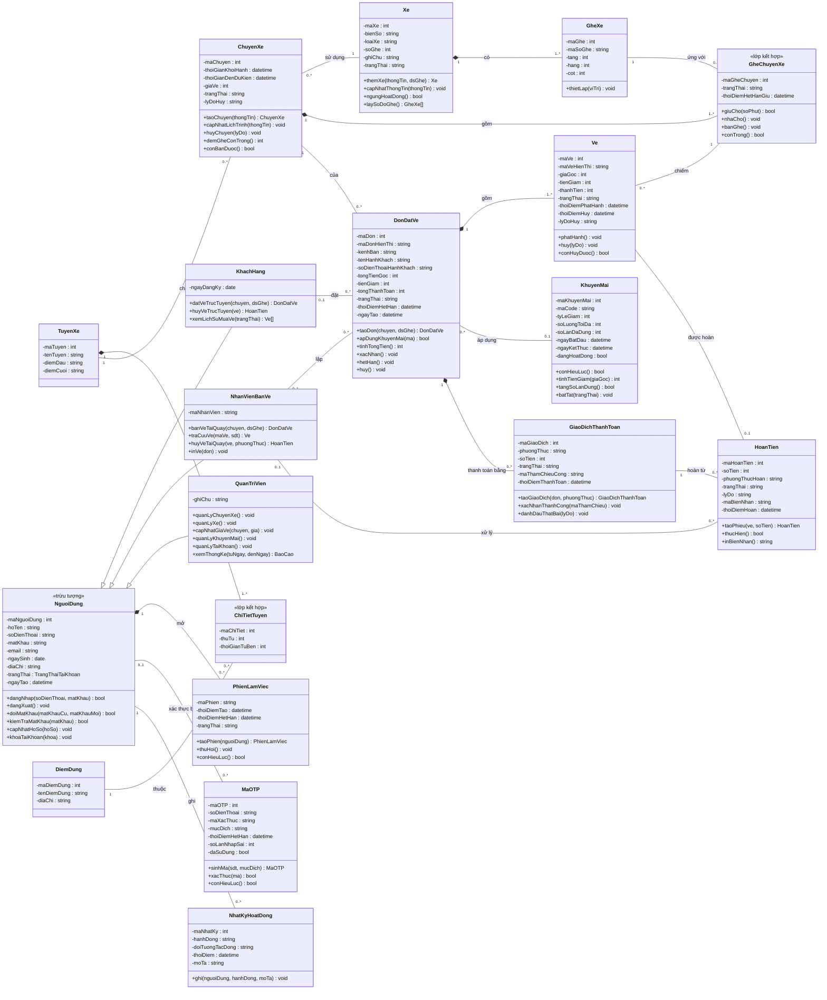

# SƠ ĐỒ LỚP MỨC PHÂN TÍCH — HỆ THỐNG ĐẶT VÉ XE KHÁCH TRỰC TUYẾN

## 1. Phạm vi và cách dựng

Sơ đồ chỉ gồm **lớp thực thể**, đúng mức phân tích của Chương 5. Lớp giao diện
(`:GiaoDien…`) và lớp điều khiển (`:DieuKhien…`) xuất hiện trong sequence diagram
thuộc mức thiết kế nên không đưa vào đây.

Cách rút ra, theo đúng trình tự Chương 5:

| Bước | Việc làm | Nguồn |
|---|---|---|
| 1 | Xác định lớp đối tượng chính | Danh từ trong đặc tả use case + đối tượng thực thể trong sequence |
| 2 | Xác định thuộc tính | Dữ liệu hệ thống cần quản lý, nêu trong luồng sự kiện |
| 3 | Xác định trách nhiệm (phương thức) | Cột *Thông điệp* trong 16 bảng của sequence diagram |
| 4 | Xác định quan hệ và bản số | Ràng buộc nghiệp vụ trong đặc tả |
| 5 | Xác định lớp phụ, lớp kết hợp | Tách khi thuộc tính có cấu trúc phức tạp |

Chương 5 nói rõ ở bước xác định thuộc tính: *"chỉ dùng đủ thuộc tính để diễn đạt
trạng thái đối tượng ở giai đoạn phân tích"* và *"không quan tâm đến các thuộc tính
mô tả cài đặt"*. Vì vậy các thuộc tính kỹ thuật như `token_version`, `password_hash`,
`jti` trong bản nháp CSDL **không** có mặt ở đây.

## 2. Quy ước ký hiệu

| Ký hiệu | Nghĩa |
|---|---|
| `+` | public |
| `-` | private |
| `#` | protected |
| Tên lớp *in nghiêng* | Lớp trừu tượng |
| Tam giác rỗng | Generalization (kế thừa) |
| Thoi **đặc** | Composition — phần tử con mất khi đối tượng chứa mất |
| Thoi rỗng | Aggregation — phần tử con vẫn tồn tại độc lập |
| Đường thẳng | Association |
| Nét đứt | Dependency |

**Cách đọc bản số:** con số đặt cạnh lớp nào thì đếm số thể hiện của **chính lớp đó**.
Ví dụ `Xe 1 ◆——— 1..* GheXe` đọc là: một `Xe` có từ 1 đến nhiều `GheXe`,
và một `GheXe` thuộc đúng một `Xe`.

## 3. Danh sách các lớp đối tượng và quan hệ

### 3.1. Danh sách lớp đối tượng

| STT | Tên lớp | Loại | Ý nghĩa / ghi chú |
|---|---|---|---|
| 1 | *NguoiDung* | Con người | Lớp tổng quát cho cả 3 vai trò. Thuộc tính phân loại là vaiTro (áp dụng Bước 3.2 Chương 5: tách lớp con theo thuộc tính phân loại). |
| 2 | KhachHang | Con người | Chuyên biệt của NguoiDung. Đặc trưng riêng: đặt vé và hủy vé trực tuyến. |
| 3 | NhanVienBanVe | Con người | Chuyên biệt của NguoiDung. Đặc trưng riêng: nghiệp vụ tại quầy. |
| 4 | QuanTriVien | Con người | Chuyên biệt của NguoiDung. Đặc trưng riêng: quản trị danh mục và thống kê. |
| 5 | PhienLamViec | Sự kiện | Phiên đăng nhập của một người dùng. Hủy người dùng thì phiên mất theo. |
| 6 | MaOTP | Sự kiện | Mã xác thực gửi qua dịch vụ SMS. Dùng cho đăng ký và khôi phục mật khẩu. |
| 7 | NhatKyHoatDong | Sự kiện | Ghi lại thao tác của người dùng, phục vụ chức năng xem lịch sử hoạt động. |
| 8 | Xe | Sự vật hữu hình | Phương tiện của nhà xe. Ngừng hoạt động là xóa mềm, không xóa thật. |
| 9 | GheXe | Sự vật hữu hình | Một ghế vật lý trên xe. Là thành phần của Xe, xe mất thì ghế mất. |
| 10 | ChuyenXe | Sự kiện | Một lượt xe chạy theo lịch trình cụ thể. |
| 11 | GheChuyenXe «lớp kết hợp» | Khái niệm | Lớp kết hợp giữa ChuyenXe và GheXe. Mang trạng thái bán của một ghế trong một chuyến cụ thể. Đây là nơi chống đặt trùng ghế. |
| 12 | KhuyenMai | Khái niệm | Mã giảm giá theo phần trăm. Bật tắt được, không xóa. |
| 13 | DonDatVe | Sự kiện | Một lần đặt vé, gồm một hoặc nhiều vé của cùng một chuyến. |
| 14 | Ve | Sự kiện | Một chỗ ngồi đã bán cho một hành khách. Là thành phần của DonDatVe. |
| 15 | GiaoDichThanhToan | Sự kiện | Một lần thanh toán cho đơn. Một đơn có thể có nhiều lần nếu thất bại rồi trả lại. |
| 16 | HoanTien | Sự kiện | Phiếu hoàn tiền cho một vé bị hủy. Hoàn tiền mặt không gọi cổng thanh toán. |
| 17 | TuyenXe | Sự vật | Tuyến đường di chuyển |
| 18 | DiemDung | Sự vật | Trạm dừng/đón/trả khách |
| 19 | ChiTietTuyen «lớp kết hợp» | Khái niệm | Điểm dừng thuộc tuyến kèm thứ tự |

### 3.2. Danh sách quan hệ

| STT | Quan hệ | Loại | Bản số | Ý nghĩa / ghi chú |
|---|---|---|---|---|
| 1 | KhachHang ──▷ NguoiDung | Generalization | — | Khách hàng là một trường hợp của người dùng |
| 2 | NhanVienBanVe ──▷ NguoiDung | Generalization | — | Nhân viên bán vé là một trường hợp của người dùng |
| 3 | QuanTriVien ──▷ NguoiDung | Generalization | — | Quản trị viên là một trường hợp của người dùng |
| 4 | NguoiDung — PhienLamViec (mở) | Composition | 1 — 0..* | Phiên chỉ tồn tại gắn với người dùng, người dùng mất thì phiên mất |
| 5 | NguoiDung — MaOTP (xác thực bằng) | Association | 0..1 — 0..* | Mã đăng ký phát sinh trước khi có tài khoản nên đầu người dùng là 0..1 |
| 6 | NguoiDung — NhatKyHoatDong (ghi) | Association | 1 — 0..* | Mỗi thao tác sinh một dòng nhật ký |
| 7 | Xe — GheXe (có) | Composition | 1 — 1..* | Ghế là thành phần vật lý của xe, xe mất thì ghế mất |
| 8 | ChuyenXe — Xe (sử dụng) | Association | 0..* — 1 | Xe tồn tại độc lập với chuyến nên đây là association, không phải aggregation |
| 9 | ChuyenXe — GheChuyenXe (gồm) | Composition | 1 — 1..* | Ghế của chuyến chỉ có nghĩa trong chuyến đó |
| 10 | GheXe — GheChuyenXe (ứng với) | Association | 1 — 0..* | Một ghế vật lý xuất hiện trong nhiều chuyến |
| 11 | KhachHang — DonDatVe (đặt) | Association | 0..1 — 0..* | Đơn tại quầy không gắn tài khoản khách nên đầu khách hàng là 0..1 |
| 12 | NhanVienBanVe — DonDatVe (lập) | Association | 0..1 — 0..* | Chỉ đơn bán tại quầy mới gắn nhân viên |
| 13 | ChuyenXe — DonDatVe (của) | Association | 1 — 0..* | Một đơn chỉ thuộc một chuyến |
| 14 | DonDatVe — Ve (gồm) | Composition | 1 — 1..* | Vé là thành phần của đơn, hủy đơn thì vé mất |
| 15 | Ve — GheChuyenXe (chiếm) | Association | 0..* — 1 | Mỗi vé ứng đúng một ghế của chuyến. Một ghế có thể gắn nhiều vé theo thời gian vì vé hủy vẫn giữ lại và ghế được bán lại; ràng buộc nghiệp vụ là tại một thời điểm chỉ có tối đa một vé đang hiệu lực trên ghế đó. |
| 16 | DonDatVe — KhuyenMai (áp dụng) | Association | 0..* — 0..1 | Một đơn dùng tối đa một mã |
| 17 | DonDatVe — GiaoDichThanhToan (thanh toán bằng) | Composition | 1 — 0..* | Giao dịch chỉ có nghĩa trong đơn, có thể nhiều lần nếu lần đầu thất bại |
| 18 | Ve — HoanTien (được hoàn) | Association | 1 — 0..1 | Mỗi vé bị hủy sinh tối đa một phiếu hoàn |
| 19 | GiaoDichThanhToan — HoanTien (hoàn từ) | Association | 1 — 0..* | Hoàn tiền trả về đúng giao dịch gốc |
| 20 | NhanVienBanVe — HoanTien (xử lý) | Association | 0..1 — 0..* | Chỉ hoàn tiền mặt tại quầy mới gắn nhân viên |

## 4. Mô tả chi tiết từng lớp đối tượng

### NguoiDung

*Con người* — Lớp tổng quát cho cả 3 vai trò. Thuộc tính phân loại là vaiTro (áp dụng Bước 3.2 Chương 5: tách lớp con theo thuộc tính phân loại).

**Thuộc tính**

| STT | Tên thuộc tính | Kiểu | Ràng buộc | Ý nghĩa / ghi chú |
|---|---|---|---|---|
| 1 | `- maNguoiDung` | int | Khóa chính | Định danh người dùng |
| 2 | `- hoTen` | string | Bắt buộc | Họ tên đầy đủ |
| 3 | `- soDienThoai` | string | Duy nhất, 10 số | Dùng làm tên đăng nhập |
| 4 | `- matKhau` | string | Bắt buộc, tối thiểu 8 ký tự | Mật khẩu đăng nhập |
| 5 | `- email` | string | Có thể rỗng | Thư điện tử liên hệ |
| 6 | `- ngaySinh` | date | Có thể rỗng | Ngày sinh |
| 7 | `- diaChi` | string | Có thể rỗng | Địa chỉ liên hệ |
| 8 | `- trangThai` | TrangThaiTaiKhoan | DANG_HOAT_DONG / BI_KHOA | Trạng thái tài khoản |
| 9 | `- ngayTao` | datetime | Bắt buộc | Thời điểm tạo tài khoản |

**Trách nhiệm chính**

| STT | Phương thức | Ý nghĩa |
|---|---|---|
| 1 | `+ dangNhap(soDienThoai : string, matKhau : string) : bool` | Xác thực và mở phiên |
| 2 | `+ dangXuat() : void` | Thu hồi phiên hiện tại |
| 3 | `+ doiMatKhau(matKhauCu : string, matKhauMoi : string) : bool` | Tự đổi mật khẩu |
| 4 | `+ kiemTraMatKhau(matKhau : string) : bool` | So khớp mật khẩu |
| 5 | `+ capNhatHoSo(hoSo : HoSo) : void` | Sửa thông tin cá nhân |
| 6 | `+ khoaTaiKhoan(khoa : bool) : void` | Khóa hoặc mở khóa |

### KhachHang

*Con người* — Chuyên biệt của NguoiDung. Đặc trưng riêng: đặt vé và hủy vé trực tuyến.

**Thuộc tính**

| STT | Tên thuộc tính | Kiểu | Ràng buộc | Ý nghĩa / ghi chú |
|---|---|---|---|---|
| 1 | `- ngayDangKy` | date | Bắt buộc | Ngày đăng ký thành viên |

**Trách nhiệm chính**

| STT | Phương thức | Ý nghĩa |
|---|---|---|
| 1 | `+ datVeTrucTuyen(chuyen : ChuyenXe, dsGhe : GheChuyenXe[]) : DonDatVe` | Đặt vé online |
| 2 | `+ huyVeTrucTuyen(ve : Ve) : HoanTien` | Tự hủy vé đã mua |
| 3 | `+ xemLichSuMuaVe(trangThai : string) : Ve[]` | Xem lịch sử vé |

### NhanVienBanVe

*Con người* — Chuyên biệt của NguoiDung. Đặc trưng riêng: nghiệp vụ tại quầy.

**Thuộc tính**

| STT | Tên thuộc tính | Kiểu | Ràng buộc | Ý nghĩa / ghi chú |
|---|---|---|---|---|
| 1 | `- maNhanVien` | string | Duy nhất | Mã nhân viên nội bộ |

**Trách nhiệm chính**

| STT | Phương thức | Ý nghĩa |
|---|---|---|
| 1 | `+ banVeTaiQuay(chuyen : ChuyenXe, dsGhe : GheChuyenXe[]) : DonDatVe` | Bán vé tại quầy |
| 2 | `+ traCuuVe(maVe : string, sdt : string) : Ve` | Tra cứu vé của khách |
| 3 | `+ huyVeTaiQuay(ve : Ve, phuongThuc : string) : HoanTien` | Hủy vé tại quầy |
| 4 | `+ inVe(don : DonDatVe) : void` | In vé cho khách |

### QuanTriVien

*Con người* — Chuyên biệt của NguoiDung. Đặc trưng riêng: quản trị danh mục và thống kê.

**Thuộc tính**

| STT | Tên thuộc tính | Kiểu | Ràng buộc | Ý nghĩa / ghi chú |
|---|---|---|---|---|
| 1 | `- ghiChu` | string | Có thể rỗng | Ghi chú nội bộ |

**Trách nhiệm chính**

| STT | Phương thức | Ý nghĩa |
|---|---|---|
| 1 | `+ quanLyChuyenXe() : void` | Thêm, sửa, hủy chuyến |
| 2 | `+ quanLyXe() : void` | Quản lý xe và sơ đồ ghế |
| 3 | `+ capNhatGiaVe(chuyen : ChuyenXe, gia : int) : void` | Đổi giá vé chuyến |
| 4 | `+ quanLyKhuyenMai() : void` | Thêm và bật tắt mã giảm giá |
| 5 | `+ quanLyTaiKhoan() : void` | Tạo, sửa, khóa tài khoản |
| 6 | `+ xemThongKe(tuNgay : date, denNgay : date) : BaoCao` | Xem báo cáo doanh thu |

### PhienLamViec

*Sự kiện* — Phiên đăng nhập của một người dùng. Hủy người dùng thì phiên mất theo.

**Thuộc tính**

| STT | Tên thuộc tính | Kiểu | Ràng buộc | Ý nghĩa / ghi chú |
|---|---|---|---|---|
| 1 | `- maPhien` | string | Khóa chính | Định danh phiên |
| 2 | `- thoiDiemTao` | datetime | Bắt buộc | Lúc đăng nhập |
| 3 | `- thoiDiemHetHan` | datetime | Bắt buộc | Hạn của phiên |
| 4 | `- trangThai` | string | CON_HIEU_LUC / DA_THU_HOI | Trạng thái phiên |

**Trách nhiệm chính**

| STT | Phương thức | Ý nghĩa |
|---|---|---|
| 1 | `+ taoPhien(nguoiDung : NguoiDung) : PhienLamViec` | Mở phiên mới |
| 2 | `+ thuHoi() : void` | Vô hiệu phiên |
| 3 | `+ conHieuLuc() : bool` | Kiểm tra còn hạn |

### MaOTP

*Sự kiện* — Mã xác thực gửi qua dịch vụ SMS. Dùng cho đăng ký và khôi phục mật khẩu.

**Thuộc tính**

| STT | Tên thuộc tính | Kiểu | Ràng buộc | Ý nghĩa / ghi chú |
|---|---|---|---|---|
| 1 | `- maOTP` | int | Khóa chính | Định danh mã |
| 2 | `- soDienThoai` | string | Bắt buộc | Số nhận mã |
| 3 | `- maXacThuc` | string | 6 chữ số | Nội dung mã |
| 4 | `- mucDich` | string | DANG_KY / KHOI_PHUC | Mục đích sử dụng |
| 5 | `- thoiDiemHetHan` | datetime | Bắt buộc | Hạn của mã |
| 6 | `- soLanNhapSai` | int | Mặc định 0 | Đếm số lần nhập sai |
| 7 | `- daSuDung` | bool | Mặc định false | Đã dùng hay chưa |

**Trách nhiệm chính**

| STT | Phương thức | Ý nghĩa |
|---|---|---|
| 1 | `+ sinhMa(sdt : string, mucDich : string) : MaOTP` | Tạo mã mới |
| 2 | `+ xacThuc(ma : string) : bool` | Đối chiếu mã người dùng nhập |
| 3 | `+ conHieuLuc() : bool` | Kiểm tra hạn và số lần sai |

### NhatKyHoatDong

*Sự kiện* — Ghi lại thao tác của người dùng, phục vụ chức năng xem lịch sử hoạt động.

**Thuộc tính**

| STT | Tên thuộc tính | Kiểu | Ràng buộc | Ý nghĩa / ghi chú |
|---|---|---|---|---|
| 1 | `- maNhatKy` | int | Khóa chính | Định danh bản ghi |
| 2 | `- hanhDong` | string | Bắt buộc | Tên thao tác |
| 3 | `- doiTuongTacDong` | string | Có thể rỗng | Đối tượng bị tác động |
| 4 | `- thoiDiem` | datetime | Bắt buộc | Lúc xảy ra |
| 5 | `- moTa` | string | Có thể rỗng | Mô tả chi tiết |

**Trách nhiệm chính**

| STT | Phương thức | Ý nghĩa |
|---|---|---|
| 1 | `+ ghi(nguoiDung : NguoiDung, hanhDong : string, moTa : string) : void` | Thêm một dòng nhật ký |

### Xe

*Sự vật hữu hình* — Phương tiện của nhà xe. Ngừng hoạt động là xóa mềm, không xóa thật.

**Thuộc tính**

| STT | Tên thuộc tính | Kiểu | Ràng buộc | Ý nghĩa / ghi chú |
|---|---|---|---|---|
| 1 | `- maXe` | int | Khóa chính | Định danh xe |
| 2 | `- bienSo` | string | Duy nhất | Biển số xe |
| 3 | `- loaiXe` | string | Bắt buộc | Giường nằm, ghế ngồi... |
| 4 | `- soGhe` | int | Suy ra từ sơ đồ ghế | Tổng số ghế |
| 5 | `- ghiChu` | string | Có thể rỗng | Tình trạng kỹ thuật |
| 6 | `- trangThai` | string | HOAT_DONG / NGUNG_HOAT_DONG | Trạng thái khai thác |

**Trách nhiệm chính**

| STT | Phương thức | Ý nghĩa |
|---|---|---|
| 1 | `+ themXe(thongTin : ThongTinXe, dsGhe : GheXe[]) : Xe` | Khai báo xe mới |
| 2 | `+ capNhatThongTin(thongTin : ThongTinXe) : void` | Sửa thông tin xe |
| 3 | `+ ngungHoatDong() : bool` | Xóa mềm, chặn nếu còn chuyến |
| 4 | `+ laySoDoGhe() : GheXe[]` | Lấy sơ đồ ghế |

### GheXe

*Sự vật hữu hình* — Một ghế vật lý trên xe. Là thành phần của Xe, xe mất thì ghế mất.

**Thuộc tính**

| STT | Tên thuộc tính | Kiểu | Ràng buộc | Ý nghĩa / ghi chú |
|---|---|---|---|---|
| 1 | `- maGhe` | int | Khóa chính | Định danh ghế |
| 2 | `- maSoGhe` | string | Duy nhất trong xe | Ký hiệu ghế, ví dụ A01 |
| 3 | `- tang` | int | 1 hoặc 2 | Tầng của ghế |
| 4 | `- hang` | int | Bắt buộc | Vị trí hàng |
| 5 | `- cot` | int | Bắt buộc | Vị trí cột |

**Trách nhiệm chính**

| STT | Phương thức | Ý nghĩa |
|---|---|---|
| 1 | `+ thietLap(viTri : ViTri) : void` | Thiết lập vị trí trên sơ đồ |

### ChuyenXe

*Sự kiện* — Một lượt xe chạy theo lịch trình cụ thể.

**Thuộc tính**

| STT | Tên thuộc tính | Kiểu | Ràng buộc | Ý nghĩa / ghi chú |
|---|---|---|---|---|
| 1 | `- maChuyen` | int | Khóa chính | Định danh chuyến |
| 2 | `- diemDi` | string | Bắt buộc | (Sẽ được thay bằng Tuyến xe) |
| 3 | `- diemDen` | string | Khác điểm đi | (Sẽ được thay bằng Tuyến xe) |
| 4 | `- thoiGianKhoiHanh` | datetime | Phải ở tương lai khi tạo | Giờ xuất bến |
| 5 | `- thoiGianDenDuKien` | datetime | Sau giờ khởi hành | Giờ đến dự kiến |
| 6 | `- giaVe` | int | Lớn hơn 0, đơn vị VND | Giá vé niêm yết |
| 7 | `- trangThai` | string | MO_BAN / DA_HUY / HOAN_THANH | Trạng thái chuyến |
| 8 | `- lyDoHuy` | string | Có thể rỗng | Lý do khi hủy chuyến |

**Trách nhiệm chính**

| STT | Phương thức | Ý nghĩa |
|---|---|---|
| 1 | `+ taoChuyen(thongTin : ThongTinChuyen) : ChuyenXe` | Mở chuyến mới, sinh ghế |
| 2 | `+ capNhatLichTrinh(thongTin : ThongTinChuyen) : void` | Sửa giờ chạy, đổi xe |
| 3 | `+ huyChuyen(lyDo : string) : void` | Hủy chuyến và xử lý vé |
| 4 | `+ demGheConTrong() : int` | Đếm ghế còn bán được |
| 5 | `+ conBanDuoc() : bool` | Kiểm tra còn nhận đặt vé |

### GheChuyenXe

*Khái niệm* — Lớp kết hợp giữa ChuyenXe và GheXe. Mang trạng thái bán của một ghế trong một chuyến cụ thể. Đây là nơi chống đặt trùng ghế.

**Thuộc tính**

| STT | Tên thuộc tính | Kiểu | Ràng buộc | Ý nghĩa / ghi chú |
|---|---|---|---|---|
| 1 | `- maGheChuyen` | int | Khóa chính | Định danh |
| 2 | `- trangThai` | string | CON_TRONG / GIU_CHO / DA_BAN | Trạng thái ghế |
| 3 | `- thoiDiemHetHanGiu` | datetime | Có thể rỗng | Hạn giữ chỗ tạm thời |

**Trách nhiệm chính**

| STT | Phương thức | Ý nghĩa |
|---|---|---|
| 1 | `+ giuCho(soPhut : int) : bool` | Khóa ghế tạm thời |
| 2 | `+ nhaCho() : void` | Trả ghế về còn trống |
| 3 | `+ banGhe() : void` | Chốt bán ghế |
| 4 | `+ conTrong() : bool` | Kiểm tra còn đặt được |

### KhuyenMai

*Khái niệm* — Mã giảm giá theo phần trăm. Bật tắt được, không xóa.

**Thuộc tính**

| STT | Tên thuộc tính | Kiểu | Ràng buộc | Ý nghĩa / ghi chú |
|---|---|---|---|---|
| 1 | `- maKhuyenMai` | int | Khóa chính | Định danh |
| 2 | `- maCode` | string | Duy nhất, chữ hoa | Mã khách nhập |
| 3 | `- tyLeGiam` | int | Từ 1 đến 100 | Phần trăm giảm |
| 4 | `- soLuongToiDa` | int | Có thể rỗng là không giới hạn | Số lượt tối đa |
| 5 | `- soLanDaDung` | int | Mặc định 0 | Số lượt đã dùng |
| 6 | `- ngayBatDau` | datetime | Bắt buộc | Bắt đầu hiệu lực |
| 7 | `- ngayKetThuc` | datetime | Sau ngày bắt đầu | Hết hiệu lực |
| 8 | `- dangHoatDong` | bool | Mặc định true | Bật hay tắt |

**Trách nhiệm chính**

| STT | Phương thức | Ý nghĩa |
|---|---|---|
| 1 | `+ conHieuLuc() : bool` | Kiểm tra bật, còn hạn, còn lượt |
| 2 | `+ tinhTienGiam(giaGoc : int) : int` | Tính số tiền được giảm |
| 3 | `+ tangSoLanDung() : bool` | Trừ lượt, nguyên tử |
| 4 | `+ batTat(trangThai : bool) : void` | Bật hoặc tắt mã |

### DonDatVe

*Sự kiện* — Một lần đặt vé, gồm một hoặc nhiều vé của cùng một chuyến.

**Thuộc tính**

| STT | Tên thuộc tính | Kiểu | Ràng buộc | Ý nghĩa / ghi chú |
|---|---|---|---|---|
| 1 | `- maDon` | int | Khóa chính | Định danh đơn |
| 2 | `- maDonHienThi` | string | Duy nhất | Mã đơn cho khách tra cứu |
| 3 | `- kenhBan` | string | TRUC_TUYEN / TAI_QUAY | Kênh phát sinh đơn |
| 4 | `- tenHanhKhach` | string | Bắt buộc | Tên người đi |
| 5 | `- soDienThoaiHanhKhach` | string | Bắt buộc | Liên hệ người đi |
| 6 | `- tongTienGoc` | int | Lớn hơn 0 | Tổng giá niêm yết |
| 7 | `- tienGiam` | int | Mặc định 0 | Tổng tiền được giảm |
| 8 | `- tongThanhToan` | int | Bằng gốc trừ giảm | Số tiền phải trả |
| 9 | `- trangThai` | string | CHO_THANH_TOAN / DA_XAC_NHAN / HET_HAN / DA_HUY | Trạng thái đơn |
| 10 | `- thoiDiemHetHan` | datetime | Có thể rỗng | Hạn giữ chỗ của đơn |
| 11 | `- ngayTao` | datetime | Bắt buộc | Lúc tạo đơn |

**Trách nhiệm chính**

| STT | Phương thức | Ý nghĩa |
|---|---|---|
| 1 | `+ taoDon(chuyen : ChuyenXe, dsGhe : GheChuyenXe[]) : DonDatVe` | Tạo đơn và giữ chỗ |
| 2 | `+ apDungKhuyenMai(ma : string) : bool` | Áp mã giảm giá |
| 3 | `+ tinhTongTien() : int` | Tính lại tổng tiền |
| 4 | `+ xacNhan() : void` | Chốt đơn khi thanh toán xong |
| 5 | `+ hetHan() : void` | Hủy đơn khi quá hạn giữ chỗ |
| 6 | `+ huy() : void` | Hủy đơn khi mọi vé đã hủy |

### Ve

*Sự kiện* — Một chỗ ngồi đã bán cho một hành khách. Là thành phần của DonDatVe.

**Thuộc tính**

| STT | Tên thuộc tính | Kiểu | Ràng buộc | Ý nghĩa / ghi chú |
|---|---|---|---|---|
| 1 | `- maVe` | int | Khóa chính | Định danh vé |
| 2 | `- maVeHienThi` | string | Duy nhất | Mã vé in cho khách |
| 3 | `- giaVe` | int | Lớn hơn 0 | Giá chụp lúc đặt |
| 4 | `- tienGiam` | int | Mặc định 0 | Tiền giảm của vé |
| 5 | `- tienThanhToan` | int | Bằng giá trừ giảm | Số tiền thực trả |
| 6 | `- trangThai` | string | GIU_CHO / DA_THANH_TOAN / DA_HUY / HET_HAN | Trạng thái vé |
| 7 | `- thoiDiemPhatHanh` | datetime | Có thể rỗng | Lúc phát hành |
| 8 | `- thoiDiemHuy` | datetime | Có thể rỗng | Lúc hủy |
| 9 | `- lyDoHuy` | string | Có thể rỗng | Khách hủy, tại quầy, chuyến bị hủy |

**Trách nhiệm chính**

| STT | Phương thức | Ý nghĩa |
|---|---|---|
| 1 | `+ phatHanh() : void` | Phát hành vé sau thanh toán |
| 2 | `+ huy(lyDo : string) : void` | Hủy vé và trả ghế |
| 3 | `+ conHuyDuoc() : bool` | Kiểm tra điều kiện hủy |

### GiaoDichThanhToan

*Sự kiện* — Một lần thanh toán cho đơn. Một đơn có thể có nhiều lần nếu thất bại rồi trả lại.

**Thuộc tính**

| STT | Tên thuộc tính | Kiểu | Ràng buộc | Ý nghĩa / ghi chú |
|---|---|---|---|---|
| 1 | `- maGiaoDich` | int | Khóa chính | Định danh giao dịch |
| 2 | `- phuongThuc` | string | MOMO / ZALOPAY / VIETQR / THE / TIEN_MAT | Hình thức trả |
| 3 | `- soTien` | int | Lớn hơn 0 | Số tiền giao dịch |
| 4 | `- trangThai` | string | CHO_XU_LY / THANH_CONG / THAT_BAI / HET_HAN | Kết quả |
| 5 | `- maThamChieuCong` | string | Có thể rỗng | Mã từ cổng thanh toán |
| 6 | `- thoiDiemThanhToan` | datetime | Có thể rỗng | Lúc trả tiền xong |

**Trách nhiệm chính**

| STT | Phương thức | Ý nghĩa |
|---|---|---|
| 1 | `+ taoGiaoDich(don : DonDatVe, phuongThuc : string) : GiaoDichThanhToan` | Khởi tạo |
| 2 | `+ xacNhanThanhCong(maThamChieu : string) : void` | Ghi nhận thành công |
| 3 | `+ danhDauThatBai(lyDo : string) : void` | Ghi nhận thất bại |

### HoanTien

*Sự kiện* — Phiếu hoàn tiền cho một vé bị hủy. Hoàn tiền mặt không gọi cổng thanh toán.

**Thuộc tính**

| STT | Tên thuộc tính | Kiểu | Ràng buộc | Ý nghĩa / ghi chú |
|---|---|---|---|---|
| 1 | `- maHoanTien` | int | Khóa chính | Định danh phiếu |
| 2 | `- soTien` | int | Lớn hơn 0 | Số tiền hoàn |
| 3 | `- phuongThucHoan` | string | CONG_THANH_TOAN / TIEN_MAT | Cách hoàn |
| 4 | `- trangThai` | string | CHO_XU_LY / HOAN_TAT / THAT_BAI | Trạng thái xử lý |
| 5 | `- lyDo` | string | Bắt buộc | Lý do hoàn |
| 6 | `- maBienNhan` | string | Có thể rỗng | Mã biên nhận in tại quầy |
| 7 | `- thoiDiemHoan` | datetime | Có thể rỗng | Lúc hoàn xong |

**Trách nhiệm chính**

| STT | Phương thức | Ý nghĩa |
|---|---|---|
| 1 | `+ taoPhieu(ve : Ve, soTien : int) : HoanTien` | Lập phiếu hoàn |
| 2 | `+ thucHien() : bool` | Thực hiện hoàn tiền |
| 3 | `+ inBienNhan() : string` | Sinh và in biên nhận |
## 5. Sơ đồ lớp dạng Mermaid

Xem nhanh trong trình soạn thảo. Bản chính thức để nộp là file `ClassDiagram_DatVeXeKhach.drawio`.

## 6. Những điểm đã điều chỉnh so với sequence diagram

Ba thay đổi có chủ ý, cần biết để không tưởng là sai sót:

| # | Thay đổi | Lý do |
|---|---|---|
| 1 | Bỏ lớp `VaiTro`, thay bằng kế thừa `NguoiDung` → `KhachHang` / `NhanVienBanVe` / `QuanTriVien` | Chương 5 Bước 3.2: khi một lớp có thuộc tính phân loại và cách xử lý phụ thuộc giá trị đó thì tách thành lớp con. Ba vai trò có trách nhiệm và liên kết khác hẳn nhau nên đủ điều kiện tách. Thông điệp `phanQuyenVaiTro()` trong SD15 nay ứng với việc xác định lớp con khi tạo tài khoản. |
| 2 | Bỏ lớp `BaoCao` | Báo cáo là tệp xuất ra, không được lưu và không có chu trình sống trong hệ thống. Theo tiêu chuẩn nhận dạng đối tượng của Chương 5 thì nó không đạt, giống các ứng viên bị loại như "Thông điệp", "Mẫu tin" trong ví dụ ATM. Phương thức `xemThongKe()` của `QuanTriVien` vẫn giữ. |
| 3 | Thêm lớp kết hợp `GheChuyenXe` | Trạng thái bán của một ghế chỉ có nghĩa khi gắn với một chuyến cụ thể, nên nó là thuộc tính của **quan hệ** giữa `ChuyenXe` và `GheXe`, không phải của riêng lớp nào. Đây đúng là trường hợp lớp kết hợp ở slide 106-107. |

## 7. Việc cần làm tiếp

1. **Thay mục 5 của `DacTaUseCase_v2.md`.** Mục đó hiện là mô hình dữ liệu nháp mình tự suy ra khi chưa có sơ đồ lớp. Giờ đã có sơ đồ lớp thật thì phải lấy sơ đồ này làm chuẩn, nếu không code sẽ lệch với tài liệu nộp.

2. **Chuyển sang RDM.** Theo Chương 6, áp 9 quy tắc chuyển đổi để sinh mô hình quan hệ từ sơ đồ lớp này. Ba chỗ cần chú ý khi chuyển:
   - Quan hệ kế thừa `NguoiDung` với 3 lớp con — chọn một trong các cách gộp bảng hoặc tách bảng.
   - Lớp kết hợp `GheChuyenXe` — thành bảng riêng với khóa ngoại tới cả `ChuyenXe` và `GheXe`.
   - Các quan hệ bản số `0..1` (`KhachHang` — `DonDatVe`, `NhanVienBanVe` — `DonDatVe`) — khóa ngoại cho phép rỗng.

3. **Sơ đồ trạng thái cho lớp `Ve`.** Chương 5 có phần này và `Ve` là đối tượng có chu trình sống rõ nhất: CHO → DA_PHAT_HANH → DA_HUY, kèm nhánh HET_HAN. Thời gian giữ chỗ 10 phút thuộc về sơ đồ trạng thái chứ không phải sơ đồ lớp.
