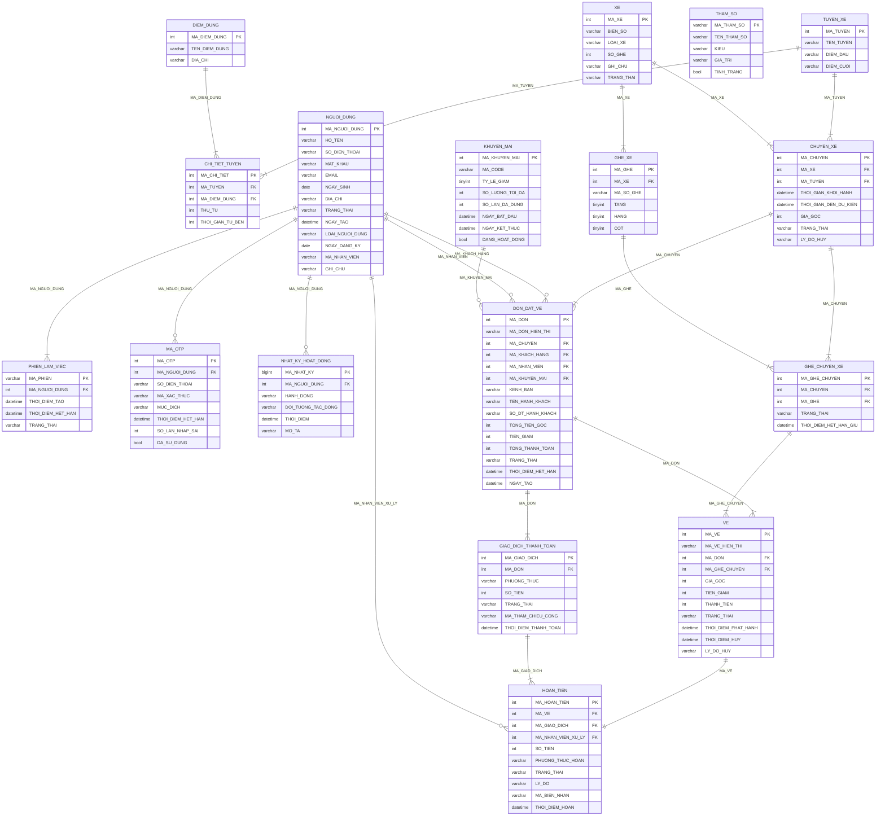

# MÔ HÌNH DỮ LIỆU QUAN HỆ (RDM) — HỆ THỐNG ĐẶT VÉ XE KHÁCH TRỰC TUYẾN

Sinh từ sơ đồ lớp mức phân tích bằng 9 quy tắc chuyển đổi của Chương 6.
Môn học không dùng ERD, chuyển thẳng từ sơ đồ lớp sang lược đồ quan hệ.

**16 lớp → 14 bảng, 114 cột, 17 khóa ngoại, 41 ràng buộc toàn vẹn.**

## 1. Áp dụng 9 quy tắc Chương 6

| Quy tắc | Nội dung | Áp dụng ở đâu |
|---|---|---|
| #1 | Mỗi lớp đơn giản thành một bảng, thuộc tính thành cột | Toàn bộ 13 lớp thực thể |
| #2 | Quan hệ 1-1 | **Không có** quan hệ 1-1 nào trong sơ đồ lớp |
| #3 | Quan hệ 1-n: đưa khóa bên *một* xuống làm khóa ngoại ở bên *nhiều* | 15 trong 17 khóa ngoại |
| #4 | Quan hệ m-n: tạo bảng trung gian chứa khóa của cả hai | `GHE_CHUYEN_XE` giữa `CHUYEN_XE` và `GHE_XE` |
| #5 | Quan hệ kế thừa | `NGUOI_DUNG` — chọn **cách 2** (xem mục 2) |
| #6 | Thuộc tính có cấu trúc phức tạp thành bảng phụ | Không có thuộc tính nào thuộc dạng này |
| #7 | Thuộc tính kiểu mảng thành bảng chi tiết | Đã xử lý từ sơ đồ lớp: `GHE_XE`, `VE` vốn đã tách thành lớp riêng |
| #8 | Thuộc tính giá trị rời rạc thành bảng danh mục | **Cố ý không áp dụng** (xem mục 2) |
| #9 | Bảng tham số | `THAM_SO` theo dạng 2 |

## 2. Hai quyết định cần giải thích

### 2.1. Quy tắc #5 — chọn cách 2 cho quan hệ kế thừa

Sơ đồ lớp có `NguoiDung` với ba lớp con `KhachHang`, `NhanVienBanVe`, `QuanTriVien`.
Đây là trường hợp *(complete, disjoint)*: mỗi người dùng thuộc đúng một trong ba loại.
Chương 6 cho ba cách, cả ba đều hợp lệ với trường hợp này:

| Cách | Mô tả | Vì sao chọn hay không |
|---|---|---|
| Cách 1 | Mỗi lớp con một bảng đầy đủ, không có bảng cha | **Không chọn.** `DON_DAT_VE` phải trỏ tới khách hàng *hoặc* nhân viên, khóa ngoại sẽ không biết trỏ vào bảng nào. Đăng nhập cũng phải dò cả ba bảng. |
| **Cách 2** | Một bảng duy nhất kèm cột phân loại | **Chọn.** Ba lớp con chỉ có đúng một thuộc tính riêng mỗi lớp nên phần lãng phí không gian không đáng kể, đổi lại khóa ngoại và đăng nhập đều đơn giản. |
| Cách 3 | Bảng cha chung cộng bảng riêng cho mỗi lớp con | **Không chọn.** Tiết kiệm hơn nhưng phải join thêm cho ba bảng chỉ chứa một cột, không bõ công. |

Nhược điểm của cách 2 là CSDL không tự chặn được dữ liệu sai loại, nên phải bù bằng
ràng buộc toàn vẹn — đã liệt kê đầy đủ ở bảng `NGUOI_DUNG` và `DON_DAT_VE`.
Chương 6 cũng làm đúng như vậy trong ví dụ `NHAN_VIEN` ở slide 32.

### 2.2. Quy tắc #8 — không tách bảng danh mục

Các cột như `TRANG_THAI`, `KENH_BAN`, `PHUONG_THUC` đều có tập giá trị rời rạc.
Theo đúng câu chữ Quy tắc #8 thì nên tách thành bảng danh mục, nhưng ở đây không tách, vì:

- Tập giá trị là **cố định trong mã nguồn**, người dùng không thêm sửa được. Tách ra chỉ
  thêm phép join mà không thêm khả năng gì.
- Bảng danh mục chỉ có ích khi danh mục **do người dùng quản lý** — trong hệ thống này
  phần đó đã nằm ở `KHUYEN_MAI` và `XE`, vốn đã là bảng riêng.

## 3. Danh sách các bảng

| STT | Bảng | Số cột | Lớp nguồn | Quy tắc áp dụng |
|---|---|---|---|---|
| 1 | `NGUOI_DUNG` | 13 | NguoiDung + KhachHang + NhanVienBanVe + QuanTriVien | #1, #5 (cách 2: một bảng kèm cột phân loại) |
| 2 | `PHIEN_LAM_VIEC` | 5 | PhienLamViec | #1, #3 (quan hệ 1-n) |
| 3 | `MA_OTP` | 8 | MaOTP | #1, #3 (1-n, khóa ngoại cho phép rỗng) |
| 4 | `NHAT_KY_HOAT_DONG` | 6 | NhatKyHoatDong | #1, #3 |
| 5 | `THAM_SO` | 5 | (không có lớp tương ứng) | #9 (bảng tham số, dạng 2) |
| 6 | `XE` | 6 | Xe | #1 |
| 7 | `GHE_XE` | 6 | GheXe | #1, #3 (composition 1-n) |
| 8 | `CHUYEN_XE` | 9 | ChuyenXe | #1, #3 |
| 9 | `GHE_CHUYEN_XE` | 5 | GheChuyenXe (lớp kết hợp) | #4 (quan hệ m-n → bảng trung gian) |
| 10 | `KHUYEN_MAI` | 8 | KhuyenMai | #1 |
| 11 | `DON_DAT_VE` | 15 | DonDatVe | #1, #3 (bốn quan hệ 1-n đổ vào) |
| 12 | `VE` | 11 | Ve | #1, #3 (composition 1-n từ DON_DAT_VE) |
| 13 | `GIAO_DICH_THANH_TOAN` | 7 | GiaoDichThanhToan | #1, #3 |
| 14 | `HOAN_TIEN` | 10 | HoanTien | #1, #3 |
| 15 | `TUYEN_XE` | 4 | TuyenXe | #1 |
| 16 | `DIEM_DUNG` | 3 | DiemDung | #1 |
| 17 | `CHI_TIET_TUYEN` | 4 | ChiTietTuyen | #4 |

### 3.1. Danh sách khóa ngoại

| STT | Bảng con | Cột | Bảng cha | Bản số |
|---|---|---|---|---|
| 1 | `PHIEN_LAM_VIEC` | `MA_NGUOI_DUNG` | `NGUOI_DUNG` | n — 1 |
| 2 | `MA_OTP` | `MA_NGUOI_DUNG` | `NGUOI_DUNG` | n — 0..1 |
| 3 | `NHAT_KY_HOAT_DONG` | `MA_NGUOI_DUNG` | `NGUOI_DUNG` | n — 0..1 |
| 4 | `GHE_XE` | `MA_XE` | `XE` | n — 1 |
| 5 | `CHUYEN_XE` | `MA_XE` | `XE` | n — 1 |
| 6 | `GHE_CHUYEN_XE` | `MA_CHUYEN` | `CHUYEN_XE` | n — 1 |
| 7 | `GHE_CHUYEN_XE` | `MA_GHE` | `GHE_XE` | n — 1 |
| 8 | `DON_DAT_VE` | `MA_CHUYEN` | `CHUYEN_XE` | n — 1 |
| 9 | `DON_DAT_VE` | `MA_KHACH_HANG` | `NGUOI_DUNG` | n — 0..1 |
| 10 | `DON_DAT_VE` | `MA_NHAN_VIEN` | `NGUOI_DUNG` | n — 0..1 |
| 11 | `DON_DAT_VE` | `MA_KHUYEN_MAI` | `KHUYEN_MAI` | n — 0..1 |
| 12 | `VE` | `MA_DON` | `DON_DAT_VE` | n — 1 |
| 13 | `VE` | `MA_GHE_CHUYEN` | `GHE_CHUYEN_XE` | n — 1 |
| 14 | `GIAO_DICH_THANH_TOAN` | `MA_DON` | `DON_DAT_VE` | n — 1 |
| 15 | `HOAN_TIEN` | `MA_VE` | `VE` | 1 — 1 |
| 16 | `HOAN_TIEN` | `MA_GIAO_DICH` | `GIAO_DICH_THANH_TOAN` | n — 1 |
| 17 | `HOAN_TIEN` | `MA_NHAN_VIEN_XU_LY` | `NGUOI_DUNG` | n — 0..1 |
| 18 | `CHUYEN_XE` | `MA_TUYEN` | `TUYEN_XE` | n — 1 |
| 19 | `CHI_TIET_TUYEN` | `MA_TUYEN` | `TUYEN_XE` | n — 1 |
| 20 | `CHI_TIET_TUYEN` | `MA_DIEM_DUNG` | `DIEM_DUNG` | n — 1 |

## 4. Mô tả chi tiết từng bảng

### NGUOI_DUNG

Nguồn: NguoiDung + KhachHang + NhanVienBanVe + QuanTriVien — Quy tắc #1, #5 (cách 2: một bảng kèm cột phân loại)

Gộp lớp cha và 3 lớp con vào một bảng. Ba lớp con chỉ có một thuộc tính riêng mỗi lớp nên gộp lại tiết kiệm hơn tách bảng, lại giúp đăng nhập và khóa ngoại đơn giản.

| STT | Cột | Kiểu | Khóa | Ràng buộc | Ý nghĩa |
|---|---|---|---|---|---|
| 1 | `MA_NGUOI_DUNG` | int | PK | tự tăng | Định danh người dùng |
| 2 | `HO_TEN` | varchar(100) | — | NOT NULL | Họ tên đầy đủ |
| 3 | `SO_DIEN_THOAI` | varchar(10) | U | NOT NULL, UNIQUE | Dùng làm tên đăng nhập |
| 4 | `MAT_KHAU` | varchar(255) | — | NOT NULL | Mật khẩu đã băm |
| 5 | `EMAIL` | varchar(150) | — | NULL | Thư điện tử liên hệ |
| 6 | `NGAY_SINH` | date | — | NULL | Ngày sinh |
| 7 | `DIA_CHI` | varchar(255) | — | NULL | Địa chỉ liên hệ |
| 8 | `TRANG_THAI` | varchar(20) | — | DANG_HOAT_DONG \| BI_KHOA | Trạng thái tài khoản |
| 9 | `NGAY_TAO` | datetime | — | NOT NULL | Thời điểm tạo tài khoản |
| 10 | `LOAI_NGUOI_DUNG` | varchar(20) | — | NOT NULL | Cột phân loại của Quy tắc #5 |
| 11 | `NGAY_DANG_KY` | date | — | NULL | Riêng khách hàng |
| 12 | `MA_NHAN_VIEN` | varchar(20) | — | NULL, UNIQUE | Riêng nhân viên bán vé |
| 13 | `GHI_CHU` | varchar(255) | — | NULL | Riêng quản trị viên |

**Ràng buộc toàn vẹn**

- LOAI_NGUOI_DUNG nhận đúng một trong ba giá trị: KHACH_HANG, NHAN_VIEN_BAN_VE, QUAN_TRI_VIEN
- Nếu LOAI_NGUOI_DUNG = KHACH_HANG thì NGAY_DANG_KY <> null, MA_NHAN_VIEN = null
- Nếu LOAI_NGUOI_DUNG = NHAN_VIEN_BAN_VE thì MA_NHAN_VIEN <> null, NGAY_DANG_KY = null
- Phải luôn tồn tại ít nhất một dòng có LOAI_NGUOI_DUNG = QUAN_TRI_VIEN và TRANG_THAI = DANG_HOAT_DONG

### PHIEN_LAM_VIEC

Nguồn: PhienLamViec — Quy tắc #1, #3 (quan hệ 1-n)

Khóa ngoại đặt ở bên nhiều theo Quy tắc #3.

| STT | Cột | Kiểu | Khóa | Ràng buộc | Ý nghĩa |
|---|---|---|---|---|---|
| 1 | `MA_PHIEN` | varchar(64) | PK | — | Định danh phiên |
| 2 | `MA_NGUOI_DUNG` | int | FK | NOT NULL → NGUOI_DUNG | Chủ phiên |
| 3 | `THOI_DIEM_TAO` | datetime | — | NOT NULL | Lúc đăng nhập |
| 4 | `THOI_DIEM_HET_HAN` | datetime | — | NOT NULL | Hạn của phiên |
| 5 | `TRANG_THAI` | varchar(20) | — | CON_HIEU_LUC \| DA_THU_HOI | Trạng thái phiên |

**Ràng buộc toàn vẹn**

- Xóa NGUOI_DUNG thì xóa theo các dòng PHIEN_LAM_VIEC (quan hệ composition)

### MA_OTP

Nguồn: MaOTP — Quy tắc #1, #3 (1-n, khóa ngoại cho phép rỗng)

MA_NGUOI_DUNG cho phép rỗng vì mã đăng ký phát sinh trước khi có tài khoản.

| STT | Cột | Kiểu | Khóa | Ràng buộc | Ý nghĩa |
|---|---|---|---|---|---|
| 1 | `MA_OTP` | int | PK | tự tăng | Định danh mã |
| 2 | `MA_NGUOI_DUNG` | int | FK | NULL → NGUOI_DUNG | Rỗng khi đăng ký mới |
| 3 | `SO_DIEN_THOAI` | varchar(10) | — | NOT NULL | Số nhận mã |
| 4 | `MA_XAC_THUC` | varchar(255) | — | NOT NULL | Mã đã băm |
| 5 | `MUC_DICH` | varchar(20) | — | DANG_KY \| KHOI_PHUC | Mục đích sử dụng |
| 6 | `THOI_DIEM_HET_HAN` | datetime | — | NOT NULL | Hạn của mã |
| 7 | `SO_LAN_NHAP_SAI` | int | — | mặc định 0 | Đếm số lần nhập sai |
| 8 | `DA_SU_DUNG` | bool | — | mặc định false | Đã dùng hay chưa |

**Ràng buộc toàn vẹn**

- Chỉ mã mới nhất của cùng SO_DIEN_THOAI và MUC_DICH, chưa dùng và chưa hết hạn, mới hợp lệ
- SO_LAN_NHAP_SAI vượt ngưỡng thì mã bị vô hiệu

### NHAT_KY_HOAT_DONG

Nguồn: NhatKyHoatDong — Quy tắc #1, #3

Bảng phát sinh nhanh theo thời gian, cần đánh chỉ mục (MA_NGUOI_DUNG, THOI_DIEM).

| STT | Cột | Kiểu | Khóa | Ràng buộc | Ý nghĩa |
|---|---|---|---|---|---|
| 1 | `MA_NHAT_KY` | bigint | PK | tự tăng | Định danh bản ghi |
| 2 | `MA_NGUOI_DUNG` | int | FK | NULL → NGUOI_DUNG | Người thực hiện |
| 3 | `HANH_DONG` | varchar(50) | — | NOT NULL | Tên thao tác |
| 4 | `DOI_TUONG_TAC_DONG` | varchar(100) | — | NULL | Đối tượng bị tác động |
| 5 | `THOI_DIEM` | datetime | — | NOT NULL | Lúc xảy ra |
| 6 | `MO_TA` | varchar(255) | — | NULL | Mô tả chi tiết |

### THAM_SO

Nguồn: (không có lớp tương ứng) — Quy tắc #9 (bảng tham số, dạng 2)

Lưu các giá trị cấu hình của hệ thống: thời gian giữ chỗ, hạn OTP, mốc hủy vé, tỷ lệ hoàn tiền. Dạng 2 cho phép thêm tham số mới mà không sửa cấu trúc bảng.

| STT | Cột | Kiểu | Khóa | Ràng buộc | Ý nghĩa |
|---|---|---|---|---|---|
| 1 | `MA_THAM_SO` | varchar(50) | PK | — | Mã tham số, ví dụ THOI_GIAN_GIU_CHO_PHUT |
| 2 | `TEN_THAM_SO` | varchar(150) | — | NOT NULL | Tên hiển thị |
| 3 | `KIEU` | varchar(20) | — | int \| bool \| string | Kiểu giá trị |
| 4 | `GIA_TRI` | varchar(255) | — | NOT NULL | Giá trị hiện hành dạng chuỗi |
| 5 | `TINH_TRANG` | bool | — | mặc định true | Còn hiệu lực hay không |

**Ràng buộc toàn vẹn**

- GIA_TRI lưu dạng chuỗi, phần mềm dựa vào KIEU để đọc đúng nội dung
- TINH_TRANG = false nghĩa là tham số bị vô hiệu, dùng giá trị mặc định trong mã nguồn

### XE

Nguồn: Xe — Quy tắc #1

Ngừng hoạt động là xóa mềm qua cột TRANG_THAI, không xóa dòng.

| STT | Cột | Kiểu | Khóa | Ràng buộc | Ý nghĩa |
|---|---|---|---|---|---|
| 1 | `MA_XE` | int | PK | tự tăng | Định danh xe |
| 2 | `BIEN_SO` | varchar(20) | U | NOT NULL, UNIQUE | Biển số xe |
| 3 | `LOAI_XE` | varchar(50) | — | NOT NULL | Giường nằm, ghế ngồi |
| 4 | `SO_GHE` | int | — | > 0 | Tổng số ghế, suy từ GHE_XE |
| 5 | `GHI_CHU` | varchar(255) | — | NULL | Tình trạng kỹ thuật |
| 6 | `TRANG_THAI` | varchar(20) | — | HOAT_DONG \| NGUNG_HOAT_DONG | Trạng thái khai thác |

**Ràng buộc toàn vẹn**

- Không được đổi TRANG_THAI sang NGUNG_HOAT_DONG nếu xe còn chuyến MO_BAN chưa khởi hành

### GHE_XE

Nguồn: GheXe — Quy tắc #1, #3 (composition 1-n)

Ghế vật lý của xe. Xóa xe thì xóa theo.

| STT | Cột | Kiểu | Khóa | Ràng buộc | Ý nghĩa |
|---|---|---|---|---|---|
| 1 | `MA_GHE` | int | PK | tự tăng | Định danh ghế |
| 2 | `MA_XE` | int | FK | NOT NULL → XE | Xe chứa ghế |
| 3 | `MA_SO_GHE` | varchar(10) | U | NOT NULL | Ký hiệu ghế, ví dụ A01 |
| 4 | `TANG` | tinyint | — | 1 hoặc 2 | Tầng của ghế |
| 5 | `HANG` | tinyint | — | > 0 | Vị trí hàng |
| 6 | `COT` | tinyint | — | > 0 | Vị trí cột |

**Ràng buộc toàn vẹn**

- UNIQUE (MA_XE, MA_SO_GHE): mã ghế không trùng trong cùng một xe
- Mỗi XE phải có ít nhất một dòng GHE_XE (bản số 1..*)

### CHUYEN_XE

Nguồn: ChuyenXe — Quy tắc #1, #3

Một lượt xe chạy. GIA_VE là giá niêm yết hiện hành của chuyến.

| STT | Cột | Kiểu | Khóa | Ràng buộc | Ý nghĩa |
|---|---|---|---|---|---|
| 1 | `MA_CHUYEN` | int | PK | tự tăng | Định danh chuyến |
| 2 | `MA_XE` | int | FK | NOT NULL → XE | Xe chạy chuyến |
| 3 | `MA_TUYEN` | int | FK | NOT NULL → TUYEN_XE | Tuyến đường của chuyến |
| 5 | `THOI_GIAN_KHOI_HANH` | datetime | — | NOT NULL | Giờ xuất bến |
| 6 | `THOI_GIAN_DEN_DU_KIEN` | datetime | — | NOT NULL | Giờ đến dự kiến |
| 7 | `GIA_VE` | int | — | > 0, đơn vị VND | Giá vé niêm yết |
| 8 | `TRANG_THAI` | varchar(20) | — | MO_BAN \| DA_HUY \| HOAN_THANH | Trạng thái chuyến |
| 9 | `LY_DO_HUY` | varchar(255) | — | NULL | Lý do khi hủy chuyến |

**Ràng buộc toàn vẹn**

- DIEM_DI <> DIEM_DEN
- THOI_GIAN_DEN_DU_KIEN > THOI_GIAN_KHOI_HANH
- Một XE không được gán hai chuyến MO_BAN trùng khoảng thời gian
- Chỉ chuyến TRANG_THAI = MO_BAN mới được sửa hoặc nhận đặt vé

### GHE_CHUYEN_XE

Nguồn: GheChuyenXe (lớp kết hợp) — Quy tắc #4 (quan hệ m-n → bảng trung gian)

Bảng trung gian giữa CHUYEN_XE và GHE_XE, mang thêm thuộc tính riêng của quan hệ là trạng thái bán và hạn giữ chỗ. Đây là nơi chống đặt trùng ghế.

| STT | Cột | Kiểu | Khóa | Ràng buộc | Ý nghĩa |
|---|---|---|---|---|---|
| 1 | `MA_GHE_CHUYEN` | int | PK | tự tăng | Định danh |
| 2 | `MA_CHUYEN` | int | FK | NOT NULL → CHUYEN_XE | Chuyến xe |
| 3 | `MA_GHE` | int | FK | NOT NULL → GHE_XE | Ghế vật lý |
| 4 | `TRANG_THAI` | varchar(20) | — | CON_TRONG \| GIU_CHO \| DA_BAN | Trạng thái ghế |
| 5 | `THOI_DIEM_HET_HAN_GIU` | datetime | — | NULL | Hạn giữ chỗ tạm thời |

**Ràng buộc toàn vẹn**

- UNIQUE (MA_CHUYEN, MA_GHE): mỗi ghế chỉ xuất hiện một lần trong một chuyến
- TRANG_THAI = GIU_CHO thì THOI_DIEM_HET_HAN_GIU <> null
- TRANG_THAI = CON_TRONG hoặc DA_BAN thì THOI_DIEM_HET_HAN_GIU = null
- Ghế GIU_CHO đã quá THOI_DIEM_HET_HAN_GIU được coi như CON_TRONG

### KHUYEN_MAI

Nguồn: KhuyenMai — Quy tắc #1

Mã giảm giá theo phần trăm, bật tắt được chứ không xóa.

| STT | Cột | Kiểu | Khóa | Ràng buộc | Ý nghĩa |
|---|---|---|---|---|---|
| 1 | `MA_KHUYEN_MAI` | int | PK | tự tăng | Định danh |
| 2 | `MA_CODE` | varchar(30) | U | NOT NULL, UNIQUE, chữ hoa | Mã khách nhập |
| 3 | `TY_LE_GIAM` | tinyint | — | 1..100 | Phần trăm giảm |
| 4 | `SO_LUONG_TOI_DA` | int | — | NULL là không giới hạn | Số lượt tối đa |
| 5 | `SO_LAN_DA_DUNG` | int | — | mặc định 0 | Số lượt đã dùng |
| 6 | `NGAY_BAT_DAU` | datetime | — | NOT NULL | Bắt đầu hiệu lực |
| 7 | `NGAY_KET_THUC` | datetime | — | NOT NULL | Hết hiệu lực |
| 8 | `DANG_HOAT_DONG` | bool | — | mặc định true | Bật hay tắt |

**Ràng buộc toàn vẹn**

- TY_LE_GIAM từ 1 đến 100
- NGAY_KET_THUC > NGAY_BAT_DAU
- SO_LAN_DA_DUNG <= SO_LUONG_TOI_DA khi SO_LUONG_TOI_DA <> null
- Mã dùng được khi DANG_HOAT_DONG = true, đang trong khoảng ngày và còn lượt

### DON_DAT_VE

Nguồn: DonDatVe — Quy tắc #1, #3 (bốn quan hệ 1-n đổ vào)

MA_KHACH_HANG và MA_NHAN_VIEN cùng trỏ về NGUOI_DUNG nhưng khác vai trò, cả hai đều cho phép rỗng vì bản số phía đó là 0..1.

| STT | Cột | Kiểu | Khóa | Ràng buộc | Ý nghĩa |
|---|---|---|---|---|---|
| 1 | `MA_DON` | int | PK | tự tăng | Định danh đơn |
| 2 | `MA_DON_HIEN_THI` | varchar(20) | U | NOT NULL, UNIQUE | Mã đơn cho khách tra cứu |
| 3 | `MA_CHUYEN` | int | FK | NOT NULL → CHUYEN_XE | Chuyến của đơn |
| 4 | `MA_KHACH_HANG` | int | FK | NULL → NGUOI_DUNG | Khách đặt, rỗng nếu bán tại quầy |
| 5 | `MA_NHAN_VIEN` | int | FK | NULL → NGUOI_DUNG | Nhân viên lập đơn |
| 6 | `MA_KHUYEN_MAI` | int | FK | NULL → KHUYEN_MAI | Mã giảm giá đã áp |
| 7 | `KENH_BAN` | varchar(20) | — | TRUC_TUYEN \| TAI_QUAY | Kênh phát sinh đơn |
| 8 | `TEN_HANH_KHACH` | varchar(100) | — | NOT NULL | Tên người đi |
| 9 | `SO_DT_HANH_KHACH` | varchar(10) | — | NOT NULL | Liên hệ người đi |
| 10 | `TONG_TIEN_GOC` | int | — | > 0 | Tổng giá niêm yết |
| 11 | `TIEN_GIAM` | int | — | mặc định 0 | Tổng tiền được giảm |
| 12 | `TONG_THANH_TOAN` | int | — | >= 0 | Số tiền phải trả |
| 13 | `TRANG_THAI` | varchar(20) | — | CHO_THANH_TOAN \| DA_XAC_NHAN \| HET_HAN \| DA_HUY | Trạng thái đơn |
| 14 | `THOI_DIEM_HET_HAN` | datetime | — | NULL | Hạn giữ chỗ của đơn |
| 15 | `NGAY_TAO` | datetime | — | NOT NULL | Lúc tạo đơn |

**Ràng buộc toàn vẹn**

- KENH_BAN = TRUC_TUYEN thì MA_KHACH_HANG <> null và MA_NHAN_VIEN = null
- KENH_BAN = TAI_QUAY thì MA_NHAN_VIEN <> null
- Dòng NGUOI_DUNG mà MA_KHACH_HANG trỏ tới phải có LOAI_NGUOI_DUNG = KHACH_HANG
- Dòng NGUOI_DUNG mà MA_NHAN_VIEN trỏ tới phải có LOAI_NGUOI_DUNG = NHAN_VIEN_BAN_VE
- TONG_THANH_TOAN = TONG_TIEN_GOC - TIEN_GIAM
- TRANG_THAI = CHO_THANH_TOAN thì THOI_DIEM_HET_HAN <> null

### VE

Nguồn: Ve — Quy tắc #1, #3 (composition 1-n từ DON_DAT_VE)

Giá được chụp lại lúc đặt nên đổi giá chuyến sau đó không ảnh hưởng vé cũ.

| STT | Cột | Kiểu | Khóa | Ràng buộc | Ý nghĩa |
|---|---|---|---|---|---|
| 1 | `MA_VE` | int | PK | tự tăng | Định danh vé |
| 2 | `MA_VE_HIEN_THI` | varchar(20) | U | NOT NULL, UNIQUE | Mã vé in cho khách |
| 3 | `MA_DON` | int | FK | NOT NULL → DON_DAT_VE | Đơn chứa vé |
| 4 | `MA_GHE_CHUYEN` | int | FK | NOT NULL → GHE_CHUYEN_XE | Ghế vé chiếm |
| 5 | `GIA_GOC` | int | — | > 0 | Giá gốc chụp lúc đặt |
| 6 | `TIEN_GIAM` | int | — | mặc định 0 | Tiền giảm của vé |
| 7 | `THANH_TIEN` | int | — | >= 0 | Số tiền thực trả |
| 8 | `TRANG_THAI` | varchar(20) | — | GIU_CHO \| DA_THANH_TOAN \| DA_HUY \| HET_HAN | Trạng thái vé |
| 9 | `THOI_DIEM_PHAT_HANH` | datetime | — | NULL | Lúc phát hành |
| 10 | `THOI_DIEM_HUY` | datetime | — | NULL | Lúc hủy |
| 11 | `LY_DO_HUY` | varchar(30) | — | NULL | KHACH_HUY \| TAI_QUAY \| CHUYEN_BI_HUY |

**Ràng buộc toàn vẹn**

- TIEN_THANH_TOAN = GIA_VE - TIEN_GIAM
- Mọi VE của cùng một MA_DON phải thuộc cùng một chuyến với DON_DAT_VE.MA_CHUYEN
- Tại một thời điểm, mỗi MA_GHE_CHUYEN có tối đa một VE ở trạng thái DA_THANH_TOAN
- TRANG_THAI = DA_HUY thì THOI_DIEM_HUY <> null và LY_DO_HUY <> null

### GIAO_DICH_THANH_TOAN

Nguồn: GiaoDichThanhToan — Quy tắc #1, #3

Một đơn có thể có nhiều giao dịch nếu lần đầu thất bại rồi trả lại.

| STT | Cột | Kiểu | Khóa | Ràng buộc | Ý nghĩa |
|---|---|---|---|---|---|
| 1 | `MA_GIAO_DICH` | int | PK | tự tăng | Định danh giao dịch |
| 2 | `MA_DON` | int | FK | NOT NULL → DON_DAT_VE | Đơn được thanh toán |
| 3 | `PHUONG_THUC` | varchar(20) | — | MOMO \| ZALOPAY \| VIETQR \| THE \| TIEN_MAT | Hình thức trả |
| 4 | `SO_TIEN` | int | — | > 0 | Số tiền giao dịch |
| 5 | `TRANG_THAI` | varchar(20) | — | CHO_XU_LY \| THANH_CONG \| THAT_BAI \| HET_HAN | Kết quả |
| 6 | `MA_THAM_CHIEU_CONG` | varchar(100) | — | NULL | Mã từ cổng thanh toán |
| 7 | `THOI_DIEM_THANH_TOAN` | datetime | — | NULL | Lúc trả tiền xong |

**Ràng buộc toàn vẹn**

- Mỗi MA_DON có tối đa một giao dịch TRANG_THAI = THANH_CONG
- TRANG_THAI = THANH_CONG thì THOI_DIEM_THANH_TOAN <> null
- PHUONG_THUC = TIEN_MAT chỉ xuất hiện khi DON_DAT_VE.KENH_BAN = TAI_QUAY

### HOAN_TIEN

Nguồn: HoanTien — Quy tắc #1, #3

Hoàn tiền mặt tại quầy không gọi cổng thanh toán, chỉ ghi nhận sổ sách.

| STT | Cột | Kiểu | Khóa | Ràng buộc | Ý nghĩa |
|---|---|---|---|---|---|
| 1 | `MA_HOAN_TIEN` | int | PK | tự tăng | Định danh phiếu |
| 2 | `MA_VE` | int | FK | NOT NULL, UNIQUE → VE | Vé được hoàn |
| 3 | `MA_GIAO_DICH` | int | FK | NOT NULL → GIAO_DICH_THANH_TOAN | Giao dịch gốc |
| 4 | `MA_NHAN_VIEN_XU_LY` | int | FK | NULL → NGUOI_DUNG | Nhân viên trả tiền mặt |
| 5 | `SO_TIEN` | int | — | > 0 | Số tiền hoàn |
| 6 | `PHUONG_THUC_HOAN` | varchar(20) | — | CONG_THANH_TOAN \| TIEN_MAT | Cách hoàn |
| 7 | `TRANG_THAI` | varchar(20) | — | CHO_XU_LY \| HOAN_TAT \| THAT_BAI | Trạng thái xử lý |
| 8 | `LY_DO` | varchar(255) | — | NOT NULL | Lý do hoàn |
| 9 | `MA_BIEN_NHAN` | varchar(20) | — | NULL, UNIQUE | Mã biên nhận in tại quầy |
| 10 | `THOI_DIEM_HOAN` | datetime | — | NULL | Lúc hoàn xong |

**Ràng buộc toàn vẹn**

- Mỗi MA_VE có tối đa một dòng HOAN_TIEN
- PHUONG_THUC_HOAN = TIEN_MAT thì MA_NHAN_VIEN_XU_LY <> null
- PHUONG_THUC_HOAN = CONG_THANH_TOAN thì GIAO_DICH_THANH_TOAN.PHUONG_THUC <> TIEN_MAT
- SO_TIEN <= VE.TIEN_THANH_TOAN

### TUYEN_XE

Nguồn: TuyenXe — Quy tắc #1

| STT | Cột | Kiểu | Khóa | Ràng buộc | Ý nghĩa |
|---|---|---|---|---|---|
| 1 | `MA_TUYEN` | int | PK | tự tăng | Định danh tuyến |
| 2 | `TEN_TUYEN` | varchar(100) | — | NOT NULL | Tên tuyến |
| 3 | `DIEM_DAU` | varchar(100) | — | NOT NULL | Điểm khởi hành |
| 4 | `DIEM_CUOI` | varchar(100) | — | NOT NULL | Điểm kết thúc |

### DIEM_DUNG

Nguồn: DiemDung — Quy tắc #1

| STT | Cột | Kiểu | Khóa | Ràng buộc | Ý nghĩa |
|---|---|---|---|---|---|
| 1 | `MA_DIEM_DUNG` | int | PK | tự tăng | Định danh điểm dừng |
| 2 | `TEN_DIEM_DUNG` | varchar(100) | — | NOT NULL | Tên điểm dừng |
| 3 | `DIA_CHI` | varchar(255) | — | NOT NULL | Địa chỉ chi tiết |

### CHI_TIET_TUYEN

Nguồn: ChiTietTuyen — Quy tắc #4

| STT | Cột | Kiểu | Khóa | Ràng buộc | Ý nghĩa |
|---|---|---|---|---|---|
| 1 | `MA_CHI_TIET` | int | PK | tự tăng | Định danh |
| 2 | `MA_TUYEN` | int | FK | NOT NULL → TUYEN_XE | Tuyến xe |
| 3 | `MA_DIEM_DUNG` | int | FK | NOT NULL → DIEM_DUNG | Điểm dừng |
| 4 | `THU_TU` | int | — | > 0 | Thứ tự trên tuyến |
| 5 | `THOI_GIAN_TU_BEN` | int | — | >= 0 | Số phút di chuyển từ bến đầu |

## 5. Lược đồ dạng Mermaid

Bản chính thức để nộp là `RDM_DatVeXeKhach.drawio`.

## 6. Chỉ mục đề nghị

Chương 6 lưu ý phải tính đến khối lượng dữ liệu phát sinh nhanh và yêu cầu truy xuất nhanh.
Bốn bảng dưới đây lớn nhanh nhất:

| Bảng | Chỉ mục | Phục vụ |
|---|---|---|
| `CHUYEN_XE` | (DIEM_DI, DIEM_DEN, THOI_GIAN_KHOI_HANH) | Tra cứu chuyến — truy vấn nhiều nhất của khách |
| `GHE_CHUYEN_XE` | (MA_CHUYEN, TRANG_THAI) | Đếm ghế trống, hiển thị sơ đồ ghế |
| `VE` | (MA_DON), (MA_GHE_CHUYEN) | Lấy vé theo đơn, kiểm tra ghế đã bán |
| `NHAT_KY_HOAT_DONG` | (MA_NGUOI_DUNG, THOI_DIEM) | Xem lịch sử hoạt động của một tài khoản |
| `DON_DAT_VE` | (TRANG_THAI, THOI_DIEM_HET_HAN) | Job dọn đơn quá hạn giữ chỗ |

## 7. Việc cần làm tiếp

1. **Thay mục 5 của `DacTaUseCase_v2.md` bằng file này.** Mục đó là mô hình dữ liệu nháp
   suy ra khi chưa có sơ đồ lớp, có vài chỗ khác với bản chính thức ở đây: tên bảng tiếng Anh,
   tách `users` không có cột phân loại, thiếu bảng `THAM_SO`. Để nguyên thì lúc code sẽ lệch
   với tài liệu nộp.

2. **Các tham số cấu hình chuyển vào bảng `THAM_SO`.** Mục 4 của `DacTaUseCase_v2.md` liệt kê
   chúng dưới dạng biến môi trường. Theo Quy tắc #9 thì chúng thuộc về CSDL, để admin đổi được
   mà không phải sửa mã nguồn và khởi động lại:

   | MA_THAM_SO | Ý nghĩa | Giá trị đề nghị |
   |---|---|---|
   | `THOI_GIAN_GIU_CHO_PHUT` | Thời gian giữ chỗ tạm thời (phút) | 5 |
   | `OTP_HIEU_LUC_PHUT` | Thời hạn mã OTP (phút) | 5 |
   | `OTP_MAX_ATTEMPTS` | Số lần nhập sai OTP tối đa | 5 |
   | `GIO_TOI_THIEU_TRUOC_KHI_HUY` | Hủy vé trước giờ chạy ít nhất bao nhiêu giờ | 24 |
   | `PHAN_TRAM_HOAN_TIEN` | Tỷ lệ hoàn tiền khi khách tự hủy | 90 |
   | `SO_GHE_TOI_DA_MOI_VE` | Số ghế tối đa mỗi đơn | 5 |

3. **Sơ đồ trạng thái cho `VE`**, rồi tới thiết kế giao diện — hình từng màn hình,
   danh sách thành phần, danh sách biến cố, theo đúng mẫu bảng ở Chương 6.
