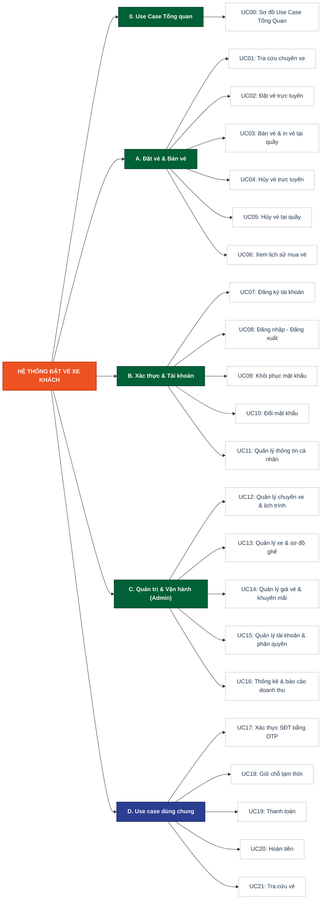

# PHÂN HỆ 04: ĐẶC TẢ USE CASE (USE CASE SPECIFICATIONS)
### HỆ THỐNG ĐẶT VÉ XE KHÁCH TRỰC TUYẾN
*(Tương ứng Bài thực hành BTH 4 — chuẩn hóa dựa trên tập sơ đồ Use Case trong thư mục `USECASE`)*

> **Phiên bản:** 2.0 — cập nhật theo bộ sơ đồ Use Case mới nhất (08/10/2026)
> **Thay đổi lớn:** bỏ quan hệ `<<include>> Đăng nhập` toàn hệ thống, bổ sung 2 tác nhân phụ (Dịch vụ SMS, Cổng thanh toán), tách nhóm **Use case dùng chung**, gộp UC trùng lặp.
> Chi tiết xem **Phụ lục A — Nhật ký chỉnh sửa & lỗi logic đã xử lý** ở cuối tài liệu.

---

## 🧩 DANH SÁCH TÁC NHÂN (ACTORS)

| Tác nhân | Loại | Vai trò trong hệ thống |
| :--- | :--- | :--- |
| **Khách hàng** | Chính (primary) | Người dùng cuối: tra cứu, đặt vé, hủy vé, quản lý tài khoản cá nhân. |
| **Nhân viên bán vé** | Chính (primary) | Tác nghiệp tại quầy bến xe: tra cứu, bán vé, hủy vé hộ khách. |
| **Admin** | Chính (primary) | Quản trị danh mục, lịch trình, giá vé, tài khoản và xem báo cáo. |
| **Dịch vụ SMS** | Phụ (secondary) | Hệ thống ngoài, nhận lệnh gửi và đối chiếu mã OTP. |
| **Cổng thanh toán** | Phụ (secondary) | Hệ thống ngoài, xử lý giao dịch thu tiền và hoàn tiền. |

> **Ghi chú mô hình hóa:** tác nhân phụ không *khởi tạo* use case, mà được hệ thống gọi tới để hoàn tất nghiệp vụ. Vì vậy mũi tên liên kết luôn đi từ use case ➜ tác nhân phụ.

---

## 🌳 CÂY CẤU TRÚC HỆ THỐNG USE CASE (USE CASE TREE SUMMARY)

```text
HỆ THỐNG ĐẶT VÉ XE KHÁCH TRỰC TUYẾN
│
├── 🎯 [0] SƠ ĐỒ USE CASE TỔNG QUAN
│   └── UC00: Sơ đồ Use Case Tổng Quan (5 tác nhân)
│
├── 🎫 [A] PHÂN HỆ NGHIỆP VỤ ĐẶT VÉ & BÁN VÉ
│   ├── UC01: Tra cứu chuyến xe              (Khách hàng, Nhân viên bán vé)
│   ├── UC02: Đặt vé trực tuyến              (Khách hàng → Cổng thanh toán)
│   ├── UC03: Bán vé & in vé tại quầy        (Nhân viên bán vé → Cổng thanh toán)
│   ├── UC04: Hủy vé trực tuyến              (Khách hàng → Cổng thanh toán)
│   ├── UC05: Hủy vé tại quầy                (Nhân viên bán vé → Cổng thanh toán)
│   └── UC06: Xem lịch sử mua vé             (Khách hàng)
│
├── 🔐 [B] PHÂN HỆ XÁC THỰC & QUẢN LÝ TÀI KHOẢN
│   ├── UC07: Đăng ký tài khoản              (Khách hàng → Dịch vụ SMS)
│   ├── UC08: Đăng nhập - Đăng xuất          (Khách hàng, Nhân viên bán vé, Admin)
│   ├── UC09: Khôi phục mật khẩu             (Khách hàng → Dịch vụ SMS)
│   ├── UC10: Đổi mật khẩu                   (Khách hàng)
│   └── UC11: Quản lý thông tin cá nhân      (Khách hàng, Nhân viên bán vé, Admin)
│
├── ⚙️ [C] PHÂN HỆ QUẢN TRỊ & VẬN HÀNH (ADMIN)
│   ├── UC12: Quản lý chuyến xe & lịch trình (Admin → Cổng thanh toán)
│   ├── UC13: Quản lý xe & sơ đồ ghế         (Admin)
│   ├── UC14: Quản lý giá vé & khuyến mãi    (Admin)
│   ├── UC15: Quản lý tài khoản & phân quyền (Admin)
│   └── UC16: Thống kê & báo cáo doanh thu   (Admin)
│
└── 🔁 [D] USE CASE DÙNG CHUNG (SHARED / INCLUDED USE CASES)
    ├── UC17: Xác thực số điện thoại bằng OTP  ← UC07, UC09
    ├── UC18: Giữ chỗ tạm thời                 ← UC02, UC03
    ├── UC19: Thanh toán                       ← UC02, UC03
    ├── UC20: Hoàn tiền                        ← UC04, UC05, UC12
    └── UC21: Tra cứu vé                       ← UC05 (khuyến nghị thêm UC04)
```



---

## 1. ĐẶC TẢ SƠ ĐỒ USE CASE TỔNG QUAN (SYSTEM OVERVIEW SPECIFICATION)

#### Mô tả use case: Sơ đồ Use Case Tổng Quan (UC00)
*(Tương ứng sơ đồ tổng quát `USECASE/SoDoThongQuat.png`)*

| Thành phần | Nội dung đặc tả |
| :--- | :--- |
| **Tóm tắt** | Biểu diễn phạm vi (scope) tổng thể của Hệ thống Đặt vé xe khách trực tuyến: 3 tác nhân chính (Khách hàng, Nhân viên bán vé, Admin), 2 tác nhân phụ là hệ thống ngoài (Dịch vụ SMS, Cổng thanh toán), 17 use case nghiệp vụ và 5 use case dùng chung được tái sử dụng qua quan hệ `<<include>>`. |
| **Tác nhân** | **Chính:** Khách hàng, Nhân viên bán vé, Admin.<br>**Phụ:** Dịch vụ SMS, Cổng thanh toán. |
| **Dòng sự kiện chính** | 1. **Khách hàng** truy cập các chức năng: Đăng ký tài khoản, Đăng nhập, Đăng xuất, Khôi phục mật khẩu, Đổi mật khẩu, Quản lý thông tin cá nhân, Tra cứu chuyến xe, Đặt vé trực tuyến, Xem lịch sử mua vé, Hủy vé trực tuyến.<br>2. **Nhân viên bán vé** truy cập: Đăng nhập, Đăng xuất, Khôi phục mật khẩu, Quản lý thông tin cá nhân, Tra cứu chuyến xe, Bán vé tại quầy, Hủy vé tại quầy.<br>3. **Admin** truy cập: Đăng nhập, Đăng xuất, Quản lý thông tin cá nhân, Quản lý chuyến xe & lịch trình, Quản lý xe & sơ đồ ghế, Quản lý giá vé & khuyến mãi, Quản lý tài khoản & phân quyền, Thống kê & báo cáo doanh thu.<br>4. **Các quan hệ `<<include>>` ở mức tổng quát** (use case dùng chung được tái sử dụng):<br>　• Đăng ký tài khoản → *Xác thực số điện thoại bằng OTP*<br>　• Khôi phục mật khẩu → *Xác thực số điện thoại bằng OTP*<br>　• Đặt vé trực tuyến → *Giữ chỗ tạm thời*, *Thanh toán*<br>　• Bán vé tại quầy → *Giữ chỗ tạm thời*, *Thanh toán*<br>　• Hủy vé trực tuyến → *Hoàn tiền*<br>　• Hủy vé tại quầy → *Tra cứu vé*, *Hoàn tiền*<br>5. **Liên kết với tác nhân phụ:** *Xác thực OTP* ➜ Dịch vụ SMS; *Thanh toán* và *Hoàn tiền* ➜ Cổng thanh toán. |
| **Dòng sự kiện phụ** | - **Tra cứu chuyến xe** là use case công khai: khách vãng lai dùng được mà không cần đăng nhập.<br>- **Đăng ký tài khoản**, **Đăng nhập**, **Khôi phục mật khẩu** là các use case khởi đầu, không yêu cầu phiên làm việc trước đó. |
| **Tiền điều kiện (pre-condition)** | Hệ thống đang vận hành bình thường; kết nối tới Dịch vụ SMS và Cổng thanh toán khả dụng. |
| **Hậu điều kiện (post-condition)** | Người dùng được điều hướng tới đúng tập chức năng tương ứng với vai trò (role) đã được phân quyền. |

> **⚠️ Lưu ý quan trọng về việc bỏ `<<include>> Đăng nhập`:** Ở phiên bản cũ, hầu hết use case đều `<<include>>` tới "Đăng nhập". Đây là **lỗi mô hình hóa**: `<<include>>` nghĩa là *mỗi lần* chạy use case cơ sở thì use case được include **bắt buộc chạy lại từ đầu* — tức là người dùng phải đăng nhập lại mỗi lần bấm "Đặt vé". Thực tế đăng nhập chỉ xảy ra **một lần đầu phiên**, nên đúng chuẩn UML phải ghi vào **Tiền điều kiện: "Đã đăng nhập"**. Phiên bản này đã sửa toàn bộ theo hướng đó.

---

## 2. ĐẶC TẢ CHI TIẾT CÁC USE CASE PHÂN RÃ

---

### PHẦN A: NHÓM NGHIỆP VỤ ĐẶT VÉ & BÁN VÉ

#### Mô tả use case: Tra cứu chuyến xe (UC01)
*(Tương ứng sơ đồ phân rã `USECASE/TraCuuVaTimChuyenXe.png`)*

| Thành phần | Nội dung đặc tả |
| :--- | :--- |
| **Tóm tắt** | Cho phép Khách hàng và Nhân viên bán vé tìm danh sách chuyến xe theo điểm đi, điểm đến và ngày khởi hành; kết quả hiển thị kèm giờ chạy, giá vé và số ghế còn trống. |
| **Tác nhân** | **Chính:** Khách hàng, Nhân viên bán vé. |
| **Dòng sự kiện chính** | 1. Người dùng mở màn hình tra cứu chuyến xe.<br>2. Người dùng nhập **điểm đi**, **điểm đến** và **ngày khởi hành**.<br>3. Người dùng bấm "Tìm chuyến".<br>4. Hệ thống truy vấn CSDL lịch trình và trả về danh sách chuyến xe thỏa điều kiện, mỗi dòng gồm: giờ xuất bến, loại xe, giá vé, số ghế còn trống.<br>5. Người dùng xem kết quả; use case kết thúc. |
| **Dòng sự kiện phụ** | - **Lọc kết quả tra cứu (`<<extend>>`):** tại màn hình kết quả, người dùng có thể kích hoạt bộ lọc bổ sung (khung giờ sáng/chiều/đêm, loại xe giường nằm/ghế ngồi, khoảng giá) để thu hẹp danh sách. Hệ thống truy vấn lại và hiển thị kết quả đã lọc.<br>- **E1 — Không có chuyến phù hợp:** hệ thống hiển thị thông báo "Không tìm thấy chuyến xe phù hợp" và gợi ý ngày lân cận. |
| **Tiền điều kiện (pre-condition)** | CSDL lịch trình có dữ liệu chuyến xe. **Không yêu cầu đăng nhập.** |
| **Hậu điều kiện (post-condition)** | Danh sách chuyến xe kèm giá vé và số ghế trống được hiển thị chính xác; dữ liệu hệ thống không thay đổi (use case chỉ đọc). |

---

#### Mô tả use case: Đặt vé trực tuyến (UC02)
*(Tương ứng sơ đồ phân rã `USECASE/DatVeVaTamKhoaCho.png` và `USECASE/BanVeVaThanhToanTrucTuyen.png` — **đã gộp**)*

| Thành phần | Nội dung đặc tả |
| :--- | :--- |
| **Tóm tắt** | Cho phép Khách hàng hoàn tất trọn vẹn quy trình mua vé qua mạng: chọn chuyến → chọn ghế trên sơ đồ → hệ thống giữ chỗ tạm thời 5 phút → nhập thông tin hành khách và điểm đón/trả → thanh toán qua Cổng thanh toán → nhận vé điện tử kèm mã QR. |
| **Tác nhân** | **Chính:** Khách hàng. **Phụ:** Cổng thanh toán. |
| **Dòng sự kiện chính** | 1. Khách hàng tra cứu và chọn một chuyến xe trong kết quả của **UC01**.<br>2. Hệ thống hiển thị **sơ đồ ghế** của xe (xe giường nằm 2 tầng hiển thị tách tầng dưới / tầng trên), phân biệt rõ ghế *trống / đã bán / đang bị giữ*.<br>3. Khách hàng chọn một hoặc nhiều vị trí ghế trống.<br>4. **Giữ chỗ tạm thời (`<<include>>` → UC18):** hệ thống khóa các ghế vừa chọn trong **5 phút**, bắt đầu đếm ngược và chặn mọi kênh bán khác đặt trùng.<br>5. Khách hàng chọn **điểm đón** và **điểm trả** dọc tuyến.<br>6. Khách hàng nhập thông tin hành khách (họ tên, số điện thoại, email nhận vé).<br>7. Hệ thống tính tổng tiền và hiển thị màn hình xác nhận đơn hàng.<br>8. **Thanh toán (`<<include>>` → UC19):** hệ thống chuyển yêu cầu thu tiền sang Cổng thanh toán và chờ kết quả giao dịch.<br>9. **Xuất vé điện tử & Mã QR (`<<include>>`):** khi Cổng thanh toán báo thành công, hệ thống sinh mã vé, sinh mã QR, chuyển ghế từ trạng thái *đang giữ* sang *đã bán*, và gửi vé qua email/SMS cho khách. |
| **Dòng sự kiện phụ** | - **Áp dụng mã giảm giá (`<<extend>>`):** tại bước 7, trước khi xác nhận, khách hàng có thể nhập mã voucher. Hệ thống kiểm tra tính hợp lệ (còn hạn, còn lượt, đủ điều kiện đơn) rồi trừ trực tiếp vào tổng tiền.<br>- **Thanh toán qua Ví MoMo / ZaloPay (`<<extend>>` của UC19):** khách chọn phương thức ví điện tử.<br>- **Thanh toán qua VietQR / Thẻ ngân hàng (`<<extend>>` của UC19):** khách quét mã VietQR hoặc nhập thông tin thẻ.<br>- **E1 — Hết thời gian giữ chỗ:** nếu quá 5 phút mà chưa thanh toán xong, hệ thống tự động nhả ghế về trạng thái trống, hủy đơn và thông báo cho khách đặt lại.<br>- **E2 — Thanh toán thất bại / bị từ chối:** Cổng thanh toán trả mã lỗi; hệ thống giữ nguyên trạng thái *đang giữ chỗ* nếu còn thời gian và cho phép khách thử lại hoặc đổi phương thức.<br>- **E3 — Ghế bị người khác chiếm:** nếu tại bước 4 ghế vừa bị kênh khác khóa trước, hệ thống báo lỗi và yêu cầu khách chọn ghế khác. |
| **Tiền điều kiện (pre-condition)** | Khách hàng **đã đăng nhập**; chuyến xe mục tiêu còn ít nhất một ghế trống. |
| **Hậu điều kiện (post-condition)** | **Thành công:** vé ở trạng thái "Đã thanh toán", ghế ở trạng thái "Đã bán", vé điện tử + mã QR đã gửi tới khách, giao dịch được ghi nhận vào doanh thu.<br>**Thất bại:** ghế được nhả về trạng thái "Trống", không phát sinh giao dịch tài chính. |

> **📌 Ghi chú gộp:** Bản cũ tách thành UC02 *"Đặt vé trực tuyến & Tạm khóa chỗ"* và UC03 *"Đặt vé trực tuyến"*. Hai sơ đồ này mô tả **cùng một use case nghiệp vụ** ở hai mức chi tiết khác nhau nên đã được gộp. Các mục "Tìm kiếm chuyến xe", "Xem sơ đồ ghế", "Chọn ghế", "Nhập thông tin hành khách"… **không phải use case** mà là **các bước trong dòng sự kiện chính** (xem Phụ lục A, lỗi **L2**).

---

#### Mô tả use case: Bán vé & in vé tại quầy (UC03)
*(Tương ứng sơ đồ phân rã `USECASE/BanVeVaInVeTaiQuay.png`)*

| Thành phần | Nội dung đặc tả |
| :--- | :--- |
| **Tóm tắt** | Cho phép Nhân viên bán vé phục vụ khách mua vé trực tiếp tại bến: chọn chuyến, chọn ghế, giữ chỗ, thu tiền (tiền mặt hoặc VietQR) và in vé giấy giao cho hành khách. |
| **Tác nhân** | **Chính:** Nhân viên bán vé. **Phụ:** Cổng thanh toán. |
| **Dòng sự kiện chính** | 1. Khách tới quầy và nêu nhu cầu; nhân viên tra cứu chuyến (**UC01**) và chọn chuyến phù hợp.<br>2. Nhân viên mở sơ đồ ghế và chọn vị trí theo yêu cầu khách.<br>3. **Giữ chỗ tạm thời (`<<include>>` → UC18):** hệ thống khóa ghế trên toàn hệ thống để kênh trực tuyến không đặt trùng trong lúc nhân viên đang lập phiếu.<br>4. Nhân viên nhập thông tin hành khách và điểm đón/trả.<br>5. **Thanh toán (`<<include>>` → UC19):** nhân viên xác nhận hình thức thu tiền và hệ thống ghi nhận giao dịch.<br>6. **In vé (`<<include>>`):** sau khi giao dịch hợp lệ, hệ thống sinh mã vé và gửi lệnh in vé giấy cho khách; ghế chuyển sang trạng thái *đã bán*.<br>7. Doanh thu được cộng vào ca trực của nhân viên đang đăng nhập. |
| **Dòng sự kiện phụ** | - **Áp dụng mã giảm giá (`<<extend>>`):** nhân viên nhập mã voucher của khách trước khi chốt tiền.<br>- **Thanh toán tiền mặt (`<<extend>>` của UC19):** nhân viên xác nhận đã thu đủ tiền mặt; giao dịch không đi qua Cổng thanh toán.<br>- **Thanh toán qua VietQR (`<<extend>>` của UC19):** hệ thống hiển thị mã VietQR để khách quét; Cổng thanh toán xác nhận rồi hệ thống mới cho in vé.<br>- **E1 — Khách đổi ý trước khi thanh toán:** nhân viên hủy phiếu, hệ thống nhả ghế ngay lập tức.<br>- **E2 — Máy in lỗi:** giao dịch vẫn hợp lệ; nhân viên in lại từ chức năng tra cứu vé. |
| **Tiền điều kiện (pre-condition)** | Nhân viên bán vé **đã đăng nhập** và đang mở ca làm việc hợp lệ; chuyến xe còn ghế trống. |
| **Hậu điều kiện (post-condition)** | Vé giấy được in và giao cho khách, ghế ở trạng thái "Đã bán", tiền được ghi nhận vào doanh thu ca trực của nhân viên. |

---

#### Mô tả use case: Hủy vé trực tuyến (UC04)
*(Tương ứng sơ đồ phân rã `USECASE/HuyVeTrucTuyen.png`)*

| Thành phần | Nội dung đặc tả |
| :--- | :--- |
| **Tóm tắt** | Cho phép Khách hàng tự hủy vé đã mua qua website/ứng dụng và nhận lại tiền theo chính sách hoàn của nhà xe thông qua Cổng thanh toán. |
| **Tác nhân** | **Chính:** Khách hàng. **Phụ:** Cổng thanh toán. |
| **Dòng sự kiện chính** | 1. Khách hàng mở danh sách vé của mình và chọn vé cần hủy.<br>2. Hệ thống kiểm tra điều kiện hủy: trạng thái vé phải là "Đã thanh toán" và thời điểm hiện tại còn trong hạn cho phép hủy.<br>3. Hệ thống hiển thị **mức phí hủy** và **số tiền thực nhận lại** theo chính sách; khách hàng xác nhận.<br>4. **Hoàn tiền (`<<include>>` → UC20):** hệ thống gửi lệnh hoàn tiền tới Cổng thanh toán theo đúng kênh khách đã thanh toán ban đầu.<br>5. Hệ thống chuyển vé sang trạng thái "Đã hủy", nhả ghế về trạng thái "Trống" và gửi thông báo xác nhận cho khách. |
| **Dòng sự kiện phụ** | - **E1 — Quá hạn hủy:** hệ thống từ chối và hiển thị lý do kèm chính sách hủy vé.<br>- **E2 — Hoàn tiền thất bại:** đơn hoàn được chuyển sang trạng thái "Chờ xử lý" để Admin can thiệp thủ công; vé **vẫn** được hủy và ghế vẫn được nhả. |
| **Tiền điều kiện (pre-condition)** | Khách hàng **đã đăng nhập**; vé thuộc sở hữu của tài khoản, đang ở trạng thái "Đã thanh toán" và còn trong thời hạn được phép hủy. |
| **Hậu điều kiện (post-condition)** | Vé ở trạng thái "Đã hủy", ghế trở lại "Trống", giao dịch hoàn tiền được khởi tạo và ghi âm vào doanh thu. |

---

#### Mô tả use case: Hủy vé tại quầy (UC05)
*(Tương ứng sơ đồ phân rã `USECASE/HuyVeTaiQuay.png`)*

| Thành phần | Nội dung đặc tả |
| :--- | :--- |
| **Tóm tắt** | Cho phép Nhân viên bán vé xử lý yêu cầu hủy vé của hành khách tại bến: tra cứu vé, kiểm tra điều kiện, hoàn tiền (mặt hoặc điện tử) và in biên nhận hủy. |
| **Tác nhân** | **Chính:** Nhân viên bán vé. **Phụ:** Cổng thanh toán. *(Hành khách là bên thụ hưởng, không trực tiếp thao tác trên hệ thống — xem lỗi **L5** ở Phụ lục A.)* |
| **Dòng sự kiện chính** | 1. Hành khách tới quầy, cung cấp mã vé / số điện thoại đặt vé và giấy tờ tùy thân.<br>2. **Tra cứu vé (`<<include>>` → UC21):** nhân viên nhập thông tin, hệ thống truy xuất và hiển thị chi tiết vé để đối chiếu danh tính.<br>3. Hệ thống kiểm tra điều kiện hủy và hiển thị mức phí hủy, số tiền hoàn lại.<br>4. Nhân viên xác nhận hủy vé.<br>5. **Hoàn tiền (`<<include>>` → UC20):** hệ thống xử lý hoàn trả theo hình thức đã chọn.<br>6. Hệ thống chuyển vé sang "Đã hủy" và nhả ghế về "Trống". |
| **Dòng sự kiện phụ** | - **In biên nhận hủy vé (`<<extend>>`):** nhân viên in phiếu biên nhận giao cho hành khách làm bằng chứng đã hoàn tiền.<br>- **Hoàn tiền mặt (`<<extend>>` của UC20):** nhân viên chi tiền mặt trực tiếp tại quầy, hệ thống ghi nhận giảm quỹ ca trực.<br>- **Hoàn qua cổng thanh toán (`<<extend>>` của UC20):** hệ thống gửi lệnh hoàn về tài khoản/ví của khách.<br>- **E1 — Sai thông tin định danh:** nhân viên từ chối xử lý, use case kết thúc.<br>- **E2 — Quá hạn hủy:** hệ thống từ chối, hiển thị chính sách để nhân viên giải thích cho khách. |
| **Tiền điều kiện (pre-condition)** | Nhân viên bán vé **đã đăng nhập** và đang mở ca; vé tồn tại, ở trạng thái "Đã thanh toán" và còn trong hạn hủy. |
| **Hậu điều kiện (post-condition)** | Vé ở trạng thái "Đã hủy", ghế trở lại "Trống", tiền đã hoàn (mặt hoặc điện tử) và biên nhận được in nếu có yêu cầu. |

---

#### Mô tả use case: Xem lịch sử mua vé (UC06)
*(Tương ứng sơ đồ phân rã `USECASE/LichsuMuaVe.png`)*

| Thành phần | Nội dung đặc tả |
| :--- | :--- |
| **Tóm tắt** | Cho phép Khách hàng xem lại toàn bộ vé đã giao dịch trên tài khoản của mình, kèm bộ lọc theo trạng thái vé. |
| **Tác nhân** | **Chính:** Khách hàng. |
| **Dòng sự kiện chính** | 1. Khách hàng mở chức năng "Lịch sử mua vé".<br>2. Hệ thống truy xuất toàn bộ vé gắn với tài khoản đang đăng nhập, sắp xếp theo ngày khởi hành giảm dần.<br>3. Hệ thống hiển thị danh sách gồm: mã vé, tuyến, ngày giờ khởi hành, số ghế, số tiền, trạng thái vé. |
| **Dòng sự kiện phụ** | - **Lọc lịch sử theo trạng thái vé (`<<extend>>`):** khách hàng chọn lọc "Chưa đi" / "Đã hoàn thành" / "Đã hủy"; hệ thống hiển thị lại danh sách tương ứng.<br>- **E1 — Chưa có giao dịch nào:** hệ thống hiển thị trạng thái rỗng kèm gợi ý đặt vé. |
| **Tiền điều kiện (pre-condition)** | Khách hàng **đã đăng nhập** vào tài khoản cá nhân. |
| **Hậu điều kiện (post-condition)** | Danh sách vé của riêng tài khoản đang đăng nhập được hiển thị đầy đủ; dữ liệu không bị thay đổi. |

---

### PHẦN B: NHÓM XÁC THỰC & QUẢN LÝ TÀI KHOẢN

#### Mô tả use case: Đăng ký tài khoản (UC07)
*(Tương ứng sơ đồ phân rã `USECASE/DangKyTaiKhoan.png`)*

| Thành phần | Nội dung đặc tả |
| :--- | :--- |
| **Tóm tắt** | Cho phép Khách hàng tạo tài khoản thành viên mới, xác minh tính chính chủ của số điện thoại bằng mã OTP gửi qua Dịch vụ SMS. |
| **Tác nhân** | **Chính:** Khách hàng. **Phụ:** Dịch vụ SMS. |
| **Dòng sự kiện chính** | 1. Khách hàng mở màn hình đăng ký.<br>2. Khách hàng nhập họ tên, số điện thoại và mật khẩu.<br>3. Hệ thống kiểm tra định dạng dữ liệu và kiểm tra số điện thoại chưa tồn tại trong CSDL.<br>4. **Xác thực số điện thoại bằng OTP (`<<include>>` → UC17):** hệ thống sinh mã OTP, gửi qua Dịch vụ SMS và yêu cầu khách nhập lại.<br>5. OTP hợp lệ → hệ thống lưu tài khoản mới ở trạng thái "Đã kích hoạt" và thông báo thành công. |
| **Dòng sự kiện phụ** | - **E1 — Số điện thoại đã tồn tại:** hệ thống báo lỗi và gợi ý chuyển sang Đăng nhập hoặc Khôi phục mật khẩu.<br>- **E2 — OTP sai hoặc hết hạn:** xem dòng sự kiện phụ của **UC17**; nếu vượt quá số lần thử, hệ thống hủy phiên đăng ký và không tạo tài khoản. |
| **Tiền điều kiện (pre-condition)** | Số điện thoại chưa được đăng ký trong hệ thống và có khả năng nhận SMS. **Không yêu cầu đăng nhập.** |
| **Hậu điều kiện (post-condition)** | Tài khoản mới được lưu vào CSDL ở trạng thái kích hoạt; người dùng có thể đăng nhập ngay. |

---

#### Mô tả use case: Đăng nhập - Đăng xuất (UC08)
*(Tương ứng sơ đồ phân rã `USECASE/DangNhap-DangXuat.png`)*

| Thành phần | Nội dung đặc tả |
| :--- | :--- |
| **Tóm tắt** | Cung cấp luồng xác thực danh tính để khởi tạo phiên làm việc (Đăng nhập) và luồng chấm dứt phiên làm việc (Đăng xuất) cho cả ba tác nhân chính. |
| **Tác nhân** | **Chính:** Khách hàng, Nhân viên bán vé, Admin. |
| **Dòng sự kiện chính** | **A. Đăng nhập**<br>1. Người dùng nhập số điện thoại và mật khẩu.<br>2. Hệ thống đối chiếu với CSDL tài khoản và kiểm tra trạng thái tài khoản (không bị khóa).<br>3. Hệ thống xác định **vai trò (role)** của tài khoản, khởi tạo phiên làm việc (Session/Token) và điều hướng tới giao diện tương ứng với vai trò đó.<br><br>**B. Đăng xuất**<br>4. Người dùng chọn "Đăng xuất".<br>5. Hệ thống hủy Session/Token hiện tại, xóa dữ liệu phiên trên thiết bị và đưa người dùng về màn hình công khai. |
| **Dòng sự kiện phụ** | - **E1 — Sai thông tin đăng nhập:** hệ thống báo lỗi chung ("Số điện thoại hoặc mật khẩu không đúng") và đếm số lần sai.<br>- **E2 — Vượt quá số lần đăng nhập sai cho phép:** hệ thống tạm khóa đăng nhập trong một khoảng thời gian để chống dò mật khẩu.<br>- **E3 — Tài khoản bị Admin khóa:** hệ thống từ chối đăng nhập và hiển thị thông báo liên hệ quản trị. |
| **Tiền điều kiện (pre-condition)** | **Đăng nhập:** người dùng sở hữu tài khoản hợp lệ, chưa bị khóa.<br>**Đăng xuất:** đang tồn tại một phiên làm việc hợp lệ. |
| **Hậu điều kiện (post-condition)** | **Đăng nhập:** phiên làm việc được khởi tạo kèm đúng vai trò.<br>**Đăng xuất:** phiên làm việc bị hủy hoàn toàn, mọi yêu cầu sau đó phải xác thực lại. |

> **⚠️ Sửa lỗi logic:** Sơ đồ cũ vẽ **Đăng xuất `<<include>>` Đăng nhập**. Điều này sai về ngữ nghĩa — `<<include>>` nghĩa là "chạy Đăng xuất thì phải chạy luôn cả thủ tục Đăng nhập", vô lý. Quan hệ đúng là **"đã đăng nhập" là tiền điều kiện của Đăng xuất**. Đã bỏ mũi tên include khỏi đặc tả; **cần sửa lại file `DangNhap-DangXuat.png`**.

---

#### Mô tả use case: Khôi phục mật khẩu (UC09)
*(Tương ứng sơ đồ phân rã `USECASE/QuenMatKhau.png`)*

| Thành phần | Nội dung đặc tả |
| :--- | :--- |
| **Tóm tắt** | Hỗ trợ Khách hàng thiết lập mật khẩu mới khi quên mật khẩu cũ, bảo đảm an toàn bằng cách xác thực quyền sở hữu số điện thoại qua mã OTP. |
| **Tác nhân** | **Chính:** Khách hàng. **Phụ:** Dịch vụ SMS. |
| **Dòng sự kiện chính** | 1. Khách hàng chọn "Quên mật khẩu" và nhập số điện thoại đã đăng ký.<br>2. Hệ thống kiểm tra số điện thoại tồn tại và tài khoản đang khả dụng.<br>3. **Xác thực số điện thoại bằng OTP (`<<include>>` → UC17):** hệ thống gửi mã OTP khôi phục qua Dịch vụ SMS và yêu cầu khách nhập lại.<br>4. OTP hợp lệ → hệ thống cho phép nhập mật khẩu mới và xác nhận lại mật khẩu.<br>5. Hệ thống mã hóa, lưu mật khẩu mới và **vô hiệu hóa toàn bộ phiên đăng nhập cũ** trên mọi thiết bị. |
| **Dòng sự kiện phụ** | - **E1 — Số điện thoại không tồn tại:** hệ thống hiển thị thông báo trung lập (không tiết lộ số nào có/không có tài khoản) nhằm tránh lộ thông tin người dùng.<br>- **E2 — Mật khẩu mới không đạt yêu cầu an toàn:** hệ thống báo lỗi và yêu cầu nhập lại.<br>- **E3 — OTP sai/hết hạn:** xem **UC17**. |
| **Tiền điều kiện (pre-condition)** | Số điện thoại tồn tại trong CSDL và liên kết với một tài khoản khả dụng. **Không yêu cầu đăng nhập.** |
| **Hậu điều kiện (post-condition)** | Mật khẩu mới có hiệu lực; mọi Session/Token cũ bị thu hồi. |

---

#### Mô tả use case: Đổi mật khẩu (UC10)
*(Tương ứng sơ đồ phân rã `USECASE/DoiMatKhau.png`)*

| Thành phần | Nội dung đặc tả |
| :--- | :--- |
| **Tóm tắt** | Cho phép Khách hàng chủ động thay đổi mật khẩu đăng nhập khi vẫn đang nhớ mật khẩu hiện tại. |
| **Tác nhân** | **Chính:** Khách hàng. |
| **Dòng sự kiện chính** | 1. Khách hàng mở chức năng "Đổi mật khẩu".<br>2. Khách hàng nhập mật khẩu hiện tại, mật khẩu mới và xác nhận mật khẩu mới.<br>3. Hệ thống đối chiếu mật khẩu hiện tại với CSDL.<br>4. Hệ thống kiểm tra mật khẩu mới đạt chính sách an toàn và khác mật khẩu cũ.<br>5. Hệ thống mã hóa và lưu mật khẩu mới, thông báo thành công. |
| **Dòng sự kiện phụ** | - **E1 — Mật khẩu hiện tại sai:** hệ thống từ chối và giữ nguyên mật khẩu cũ.<br>- **E2 — Hai ô mật khẩu mới không khớp:** hệ thống báo lỗi tại chỗ, chưa gửi yêu cầu lên máy chủ. |
| **Tiền điều kiện (pre-condition)** | Khách hàng **đã đăng nhập** và nhớ mật khẩu hiện tại. |
| **Hậu điều kiện (post-condition)** | Mật khẩu mới có hiệu lực ngay; mật khẩu cũ không còn dùng để đăng nhập được. |

---

#### Mô tả use case: Quản lý thông tin cá nhân (UC11)
*(Tương ứng sơ đồ phân rã `USECASE/QuanLyThongTinCaNhan.png`)*

| Thành phần | Nội dung đặc tả |
| :--- | :--- |
| **Tóm tắt** | Cho phép người dùng đã đăng nhập xem và cập nhật hồ sơ cá nhân của chính mình. |
| **Tác nhân** | **Chính:** Khách hàng, Nhân viên bán vé, Admin. *(Sơ đồ tổng quát nối cả Admin tới use case này — xem lỗi **L7**.)* |
| **Dòng sự kiện chính** | 1. Người dùng mở mục "Hồ sơ cá nhân".<br>2. Hệ thống truy xuất và hiển thị thông tin hiện hành: họ tên, số điện thoại, email, ngày sinh, địa chỉ, ảnh đại diện. |
| **Dòng sự kiện phụ** | - **Cập nhật thông tin cá nhân (`<<extend>>`):** người dùng bấm "Chỉnh sửa", thay đổi các trường được phép và bấm "Lưu". Hệ thống kiểm tra hợp lệ rồi ghi vào CSDL.<br>- **E1 — Dữ liệu không hợp lệ:** hệ thống báo lỗi theo từng trường và không lưu.<br>- **Ràng buộc:** số điện thoại là định danh đăng nhập nên **không cho sửa trực tiếp** tại đây; muốn đổi phải qua quy trình xác thực OTP riêng. |
| **Tiền điều kiện (pre-condition)** | Người dùng **đã đăng nhập** vào tài khoản của chính mình. |
| **Hậu điều kiện (post-condition)** | Thông tin hồ sơ mới được lưu vào CSDL và hiển thị ở các màn hình liên quan. |

---

### PHẦN C: NHÓM QUẢN TRỊ & VẬN HÀNH (DÀNH CHO ADMIN)

#### Mô tả use case: Quản lý chuyến xe & lịch trình (UC12)
*(Tương ứng sơ đồ phân rã `USECASE/QuanLyChuyenXeVaLichTrinh.png`)*

| Thành phần | Nội dung đặc tả |
| :--- | :--- |
| **Tóm tắt** | Cho phép Admin vận hành toàn diện lịch chạy: xem danh sách, thêm chuyến mới, sửa lịch trình, hủy chuyến và xử lý hoàn tiền cho hành khách của chuyến bị hủy. |
| **Tác nhân** | **Chính:** Admin. **Phụ:** Cổng thanh toán. |
| **Dòng sự kiện chính** | 1. **Xem danh sách chuyến xe:** Admin mở bảng tổng quan toàn bộ chuyến xe kèm trạng thái (Đang mở bán / Đã khóa / Đã hủy).<br>2. **Thêm chuyến xe mới:** Admin khai báo tuyến, ngày giờ xuất bến, xe phụ trách và giá vé; hệ thống kiểm tra xe không bị trùng lịch rồi lưu chuyến mới.<br>3. **Sửa lịch trình chuyến xe:** Admin điều chỉnh giờ chạy hoặc đổi xe; hệ thống gửi thông báo cho hành khách đã mua vé của chuyến đó.<br>4. **Hủy chuyến xe:** Admin hủy chuyến khi có sự cố bất khả kháng, nhập lý do hủy; hệ thống khóa chuyến và ngừng bán vé ngay lập tức.<br>5. **Hoàn tiền (`<<extend>>` → UC20):** nếu chuyến bị hủy **đã có vé bán ra**, hệ thống khởi tạo hoàn tiền 100% cho toàn bộ vé hợp lệ. |
| **Dòng sự kiện phụ** | - **Tìm kiếm chuyến xe (`<<extend>>`):** Admin lọc danh sách theo tuyến, ngày, trạng thái hoặc biển số xe.<br>- **Xử lý vé của chuyến bị hủy (`<<extend>>`):** với từng vé, Admin có thể chọn gửi SMS thông báo hoặc chuyển khách sang chuyến thay thế thay vì hoàn tiền.<br>- **Hoàn qua cổng thanh toán (`<<extend>>` của UC20)** / **Hoàn tiền mặt (`<<extend>>` của UC20).**<br>- **E1 — Sửa/xóa chuyến đã khởi hành:** hệ thống từ chối thao tác.<br>- **E2 — Xe bị trùng lịch:** hệ thống báo lỗi và chỉ ra chuyến đang xung đột. |
| **Tiền điều kiện (pre-condition)** | Admin **đã đăng nhập** với vai trò quản trị. |
| **Hậu điều kiện (post-condition)** | Lịch trình được cập nhật và phản ánh tức thời trên kênh bán vé trực tuyến lẫn quầy; các vé bị ảnh hưởng đã được xử lý hoàn tiền hoặc chuyển chuyến. |

> **⚠️ Sửa lỗi logic:** Sơ đồ cũ vẽ **Hủy chuyến xe `<<include>>` Hoàn tiền**. Nhưng nếu chuyến bị hủy **chưa bán được vé nào** thì không có gì để hoàn — quan hệ này **có điều kiện**, nên phải là `<<extend>>` chứ không phải `<<include>>` (xem lỗi **L6**).

---

#### Mô tả use case: Quản lý xe & sơ đồ ghế (UC13)
*(Tương ứng sơ đồ phân rã `USECASE/QuanLyXeVaSoDoGhe.png`)*

| Thành phần | Nội dung đặc tả |
| :--- | :--- |
| **Tóm tắt** | Cho phép Admin duy trì danh mục phương tiện (thêm, sửa, ngừng hoạt động) và cấu hình sơ đồ chỗ ngồi tương ứng cho từng xe. |
| **Tác nhân** | **Chính:** Admin. |
| **Dòng sự kiện chính** | 1. **Xem danh sách xe:** Admin mở bảng danh mục phương tiện kèm biển số, loại xe, số chỗ, trạng thái hoạt động.<br>2. **Thêm xe mới:** Admin khai báo biển số, hãng xe, loại xe (ghế ngồi / giường nằm / limousine).<br>3. **Thiết lập sơ đồ ghế (`<<include>>`):** ngay trong luồng thêm xe, hệ thống bắt buộc Admin định nghĩa bố cục chỗ ngồi (số tầng, số hàng, số ghế mỗi hàng, mã hiệu từng ghế) — không có sơ đồ ghế thì xe không thể được phân công chạy.<br>4. **Sửa thông tin xe:** Admin cập nhật biển số, loại xe hoặc ghi chú tình trạng kỹ thuật.<br>5. **Ngừng hoạt động xe:** Admin vô hiệu hóa xe khỏi danh sách phân công do bảo dưỡng hoặc hỏng hóc. |
| **Dòng sự kiện phụ** | - **Xem sơ đồ ghế của xe (`<<extend>>`):** từ danh sách xe, Admin bấm xem bản vẽ minh họa bố cục ghế của riêng xe đó.<br>- **E1 — Biển số đã tồn tại:** hệ thống từ chối thêm mới.<br>- **E2 — Ngừng hoạt động xe đang có chuyến mở bán:** hệ thống cảnh báo và yêu cầu Admin xử lý các chuyến đó trước (chuyển xe khác hoặc hủy chuyến qua **UC12**).<br>- **E3 — Sửa sơ đồ ghế của xe đã bán vé:** hệ thống chỉ cho phép sửa trên các chuyến chưa mở bán, tránh làm hỏng dữ liệu vé đã phát hành. |
| **Tiền điều kiện (pre-condition)** | Admin **đã đăng nhập** với vai trò quản trị. |
| **Hậu điều kiện (post-condition)** | Danh mục xe và sơ đồ ghế được cấu hình đầy đủ, sẵn sàng phục vụ việc tạo chuyến và hiển thị cho khách chọn ghế. |

---

#### Mô tả use case: Quản lý giá vé & khuyến mãi (UC14)
*(Tương ứng sơ đồ phân rã `USECASE/GiaVeVaKhuyenMai.png`)*

| Thành phần | Nội dung đặc tả |
| :--- | :--- |
| **Tóm tắt** | Cho phép Admin kiểm soát giá vé niêm yết theo chuyến và vận hành các chiến dịch khuyến mãi bằng mã voucher giảm giá. |
| **Tác nhân** | **Chính:** Admin. |
| **Dòng sự kiện chính** | 1. **Xem giá vé các chuyến xe:** Admin mở bảng giá hiện hành theo tuyến/chuyến.<br>2. **Cập nhật giá vé chuyến xe:** Admin điều chỉnh mức giá (tăng, giảm, phụ thu dịp lễ) và xác nhận áp dụng.<br>3. **Thêm mã giảm giá mới:** Admin tạo voucher gồm mã code, loại giảm (% hoặc số tiền cố định), giá trị giảm, số lượt sử dụng, thời hạn hiệu lực và điều kiện áp dụng.<br>4. **Xem danh sách mã giảm giá:** Admin theo dõi toàn bộ voucher kèm số lượt đã dùng và trạng thái bật/tắt. |
| **Dòng sự kiện phụ** | - **Bật / Tắt mã giảm giá (`<<extend>>`):** Admin dùng công tắc để tạm dừng hoặc kích hoạt lại một mã mà không cần xóa, giữ nguyên lịch sử sử dụng.<br>- **E1 — Mã code bị trùng:** hệ thống từ chối tạo mới.<br>- **E2 — Thời hạn kết thúc trước thời hạn bắt đầu:** hệ thống báo lỗi validation.<br>- **Ràng buộc:** giá vé mới **chỉ áp dụng cho giao dịch phát sinh sau thời điểm cập nhật**; các vé đã bán giữ nguyên giá cũ. |
| **Tiền điều kiện (pre-condition)** | Admin **đã đăng nhập** với vai trò quản trị. |
| **Hậu điều kiện (post-condition)** | Giá vé mới được đưa vào công thức tính tiền của **UC02/UC03**; voucher được lưu và khả dụng trên màn hình đặt vé nếu đang ở trạng thái bật. |

---

#### Mô tả use case: Quản lý tài khoản & phân quyền (UC15)
*(Tương ứng sơ đồ phân rã `USECASE/QuanLyTaiKhoanVaPhanQuyen.png`)*

| Thành phần | Nội dung đặc tả |
| :--- | :--- |
| **Tóm tắt** | Cho phép Admin quản trị toàn bộ tài khoản hệ thống: xem danh sách, tạo và cập nhật tài khoản nhân viên, gán vai trò, đặt lại mật khẩu và khóa/mở khóa tài khoản vi phạm. |
| **Tác nhân** | **Chính:** Admin. |
| **Dòng sự kiện chính** | 1. **Xem danh sách người dùng:** Admin mở bảng toàn bộ tài khoản (khách hàng và nhân viên) kèm vai trò và trạng thái.<br>2. **Tạo tài khoản nhân viên:** Admin nhập thông tin nhân viên và cấp tài khoản làm việc.<br>3. **Phân quyền vai trò (`<<include>>`):** mọi thao tác **Tạo** hoặc **Cập nhật** tài khoản nhân viên đều bắt buộc đi kèm bước gán vai trò (Nhân viên bán vé / Admin) để xác định phạm vi truy cập.<br>4. **Cập nhật tài khoản nhân viên:** Admin sửa hồ sơ hoặc thay đổi vai trò của nhân viên hiện hữu.<br>5. **Đặt lại mật khẩu cho nhân viên:** Admin cưỡng chế cấp mật khẩu tạm khi nhân viên mất quyền truy cập; nhân viên buộc phải đổi mật khẩu ở lần đăng nhập kế tiếp.<br>6. **Khóa / Mở khóa tài khoản người dùng:** Admin vô hiệu hóa quyền đăng nhập của một tài khoản vi phạm hoặc khôi phục lại. |
| **Dòng sự kiện phụ** | - **Tìm kiếm tài khoản (`<<extend>>`):** Admin lọc theo số điện thoại, họ tên hoặc vai trò.<br>- **Xem chi tiết hồ sơ & lịch sử hoạt động (`<<extend>>`):** Admin mở một tài khoản để xem hồ sơ đầy đủ và nhật ký thao tác (audit log).<br>- **E1 — Khóa tài khoản đang có phiên hoạt động:** hệ thống thu hồi Session/Token của tài khoản đó ngay lập tức.<br>- **E2 — Admin tự khóa chính mình:** hệ thống từ chối thao tác.<br>- **E3 — Khóa khách hàng đang có vé chưa đi:** hệ thống cảnh báo; vé vẫn giữ nguyên hiệu lực. |
| **Tiền điều kiện (pre-condition)** | Admin **đã đăng nhập** với vai trò quản trị cao nhất. |
| **Hậu điều kiện (post-condition)** | Hồ sơ, vai trò và trạng thái khóa/mở của tài khoản được cập nhật đồng bộ, quyết định ngay phạm vi truy cập của người dùng đó. |

---

#### Mô tả use case: Thống kê & báo cáo doanh thu (UC16)
*(Tương ứng sơ đồ phân rã `USECASE/ThongKeVaBaoCao.png` và `USECASE/ThongKe.png`)*

| Thành phần | Nội dung đặc tả |
| :--- | :--- |
| **Tóm tắt** | Cho phép Admin nắm bắt tình hình kinh doanh qua các báo cáo trực quan về doanh thu, số lượng vé bán/hủy và tỷ lệ lấp đầy chỗ ngồi, có thể lọc theo khoảng thời gian và kết xuất ra file. |
| **Tác nhân** | **Chính:** Admin. |
| **Dòng sự kiện chính** | 1. **Xem bảng điều khiển doanh thu tổng quan:** Admin vào Dashboard; hệ thống mặc định tổng hợp dữ liệu kỳ hiện tại và hiển thị các chỉ số then chốt cùng biểu đồ.<br>2. **Thống kê doanh thu:** hệ thống tổng hợp dòng tiền thực thu = tiền bán vé − tiền đã hoàn, phân rã theo tuyến và theo kênh bán (trực tuyến / tại quầy).<br>3. **Thống kê vé bán & vé hủy:** hệ thống đối chiếu số vé phát hành thành công với số vé bị hủy, tính tỷ lệ hủy.<br>4. **Thống kê tỷ lệ lấp đầy chỗ ngồi:** hệ thống tính tỷ lệ = số ghế đã bán / tổng số ghế khai thác, theo từng chuyến hoặc từng tuyến. |
| **Dòng sự kiện phụ** | - **Lọc thống kê (`<<extend>>`):** Admin chọn khoảng "Từ ngày – Đến ngày" (và tùy chọn tuyến/kênh bán). Bộ lọc tác động đồng thời lên **cả ba** báo cáo: doanh thu, vé bán & vé hủy, tỷ lệ lấp đầy — các biểu đồ được tính lại theo phạm vi mới.<br>- **Xuất báo cáo (`<<extend>>`):** Admin kết xuất dữ liệu đang hiển thị ra file Excel hoặc PDF để lưu trữ/trình ban giám đốc.<br>- **E1 — Khoảng thời gian không hợp lệ** (ngày bắt đầu sau ngày kết thúc): hệ thống báo lỗi và giữ nguyên kết quả cũ.<br>- **E2 — Không có dữ liệu trong kỳ:** hệ thống hiển thị biểu đồ rỗng kèm thông báo. |
| **Tiền điều kiện (pre-condition)** | Admin **đã đăng nhập**; CSDL có tồn tại giao dịch bán/hủy vé trong kỳ cần xem. |
| **Hậu điều kiện (post-condition)** | Báo cáo và biểu đồ hiển thị chính xác theo phạm vi lọc; file báo cáo được tải về nếu Admin yêu cầu. Dữ liệu nghiệp vụ không bị thay đổi (use case chỉ đọc). |

---

### PHẦN D: ĐẶC TẢ CÁC USE CASE DÙNG CHUNG (SHARED / INCLUDED USE CASES)

> Đây là các use case **không do tác nhân khởi tạo trực tiếp**, mà được các use case khác gọi tới qua quan hệ `<<include>>`. Việc tách riêng giúp tránh mô tả lặp và thể hiện đúng nguyên tắc **tái sử dụng (reuse)** của UML.

#### Mô tả use case: Xác thực số điện thoại bằng OTP (UC17)
**Được include bởi:** UC07 (Đăng ký tài khoản), UC09 (Khôi phục mật khẩu)

| Thành phần | Nội dung đặc tả |
| :--- | :--- |
| **Tóm tắt** | Xác minh người dùng thực sự sở hữu số điện thoại đã khai báo, bằng mã OTP dùng một lần gửi qua Dịch vụ SMS. |
| **Tác nhân** | **Phụ:** Dịch vụ SMS. |
| **Dòng sự kiện chính** | 1. Hệ thống sinh mã OTP ngẫu nhiên kèm thời hạn hiệu lực (ví dụ 60–120 giây).<br>2. Hệ thống gửi yêu cầu tới Dịch vụ SMS để chuyển mã OTP tới số điện thoại đích.<br>3. Người dùng nhập mã OTP nhận được.<br>4. Hệ thống đối chiếu mã, kiểm tra còn hạn và chưa sử dụng → trả kết quả hợp lệ cho use case gọi nó. |
| **Dòng sự kiện phụ** | - **E1 — Nhập sai OTP:** hệ thống báo lỗi và cho nhập lại, giới hạn số lần thử.<br>- **E2 — OTP hết hạn:** hệ thống cho phép yêu cầu gửi lại mã mới (có giới hạn tần suất để chống spam SMS).<br>- **E3 — Dịch vụ SMS không phản hồi:** hệ thống thông báo sự cố và cho thử lại sau. |
| **Tiền điều kiện (pre-condition)** | Số điện thoại hợp lệ và có khả năng nhận SMS; kết nối tới Dịch vụ SMS khả dụng. |
| **Hậu điều kiện (post-condition)** | Số điện thoại được đánh dấu "đã xác thực" cho phiên thao tác hiện tại; mã OTP bị vô hiệu sau khi dùng. |

---

#### Mô tả use case: Giữ chỗ tạm thời (UC18)
**Được include bởi:** UC02 (Đặt vé trực tuyến), UC03 (Bán vé & in vé tại quầy)

| Thành phần | Nội dung đặc tả |
| :--- | :--- |
| **Tóm tắt** | Khóa tạm thời các ghế vừa được chọn trong một khoảng thời gian giới hạn (5 phút) để tránh hai kênh bán đặt trùng cùng một ghế. |
| **Tác nhân** | *(Không có tác nhân trực tiếp — use case nội bộ hệ thống.)* |
| **Dòng sự kiện chính** | 1. Hệ thống nhận danh sách ghế cần giữ kèm định danh phiên đặt vé.<br>2. Hệ thống kiểm tra lại trạng thái từng ghế tại thời điểm hiện tại.<br>3. Hệ thống chuyển ghế sang trạng thái **"Đang giữ"**, gắn chủ sở hữu tạm thời và mốc hết hạn = thời điểm hiện tại + 5 phút.<br>4. Hệ thống trả về xác nhận giữ chỗ và thời gian còn lại để giao diện đếm ngược. |
| **Dòng sự kiện phụ** | - **E1 — Ghế vừa bị kênh khác chiếm:** thao tác giữ chỗ thất bại; hệ thống trả danh sách ghế không khả dụng để người dùng chọn lại.<br>- **E2 — Hết hạn giữ chỗ:** tác vụ nền tự động nhả ghế về trạng thái "Trống" và hủy đơn đang dở. |
| **Tiền điều kiện (pre-condition)** | Các ghế được yêu cầu đang ở trạng thái "Trống". |
| **Hậu điều kiện (post-condition)** | **Thành công:** ghế ở trạng thái "Đang giữ" kèm mốc hết hạn.<br>**Thất bại/hết hạn:** ghế trở về trạng thái "Trống". |

> **📌 Thống nhất thuật ngữ:** sơ đồ cũ dùng song song hai tên *"Tạm khóa chỗ (5 phút)"* và *"Giữ chỗ tạm thời"* cho cùng một chức năng. Toàn bộ tài liệu nay thống nhất dùng **"Giữ chỗ tạm thời"** (xem lỗi **L3**).

---

#### Mô tả use case: Thanh toán (UC19)
**Được include bởi:** UC02 (Đặt vé trực tuyến), UC03 (Bán vé & in vé tại quầy)

| Thành phần | Nội dung đặc tả |
| :--- | :--- |
| **Tóm tắt** | Xử lý thu tiền cho một đơn vé: xác định số tiền phải trả, chọn phương thức, thực hiện giao dịch và ghi nhận kết quả. |
| **Tác nhân** | **Phụ:** Cổng thanh toán. |
| **Dòng sự kiện chính** | 1. Hệ thống nhận thông tin đơn hàng và tính số tiền phải trả (đã trừ giảm giá nếu có).<br>2. Người dùng/nhân viên chọn phương thức thanh toán.<br>3. Hệ thống tạo giao dịch và gửi yêu cầu tới Cổng thanh toán (trừ trường hợp tiền mặt).<br>4. Hệ thống chờ và tiếp nhận kết quả giao dịch từ Cổng thanh toán.<br>5. Hệ thống ghi nhận giao dịch thành công kèm mã tham chiếu và trả kết quả cho use case gọi nó. |
| **Dòng sự kiện phụ** | - **Ví MoMo / ZaloPay (`<<extend>>`):** giao dịch được chuyển hướng qua ứng dụng ví điện tử để khách xác nhận.<br>- **VietQR / Thẻ ngân hàng (`<<extend>>`):** khách quét mã VietQR hoặc nhập thông tin thẻ.<br>- **Tiền mặt (`<<extend>>`, chỉ áp dụng tại quầy):** nhân viên xác nhận đã thu đủ tiền, giao dịch **không** đi qua Cổng thanh toán.<br>- **E1 — Giao dịch bị từ chối / hết thời gian chờ:** hệ thống đánh dấu giao dịch thất bại và cho phép thử lại hoặc đổi phương thức.<br>- **E2 — Cổng thanh toán trả kết quả chậm:** hệ thống ghi giao dịch ở trạng thái "Đang xử lý" và đối soát lại bằng webhook/truy vấn định kỳ, tránh trừ tiền mà không ra vé. |
| **Tiền điều kiện (pre-condition)** | Đơn hàng đã xác định đủ ghế, thông tin hành khách hợp lệ và thời gian giữ chỗ chưa hết hạn. |
| **Hậu điều kiện (post-condition)** | **Thành công:** giao dịch được ghi nhận, số tiền vào doanh thu, cho phép use case gọi tiếp tục xuất vé.<br>**Thất bại:** không phát sinh thay đổi tài chính. |

---

#### Mô tả use case: Hoàn tiền (UC20)
**Được include bởi:** UC04 (Hủy vé trực tuyến), UC05 (Hủy vé tại quầy); **được extend bởi** UC12 (Hủy chuyến xe)

| Thành phần | Nội dung đặc tả |
| :--- | :--- |
| **Tóm tắt** | Xử lý trả lại tiền cho hành khách khi vé bị hủy, theo đúng chính sách phí hủy và đúng kênh đã thu tiền ban đầu. |
| **Tác nhân** | **Phụ:** Cổng thanh toán. |
| **Dòng sự kiện chính** | 1. Hệ thống xác định vé cần hoàn và lý do hoàn (khách tự hủy / nhà xe hủy chuyến).<br>2. Hệ thống áp dụng chính sách: khách tự hủy → trừ phí hủy theo mốc thời gian; nhà xe hủy chuyến → hoàn **100%**.<br>3. Hệ thống xác định hình thức hoàn (qua Cổng thanh toán hoặc tiền mặt).<br>4. Hệ thống tạo lệnh hoàn và ghi nhận kết quả.<br>5. Hệ thống ghi giao dịch âm vào doanh thu và gửi thông báo cho khách. |
| **Dòng sự kiện phụ** | - **Hoàn qua cổng thanh toán (`<<extend>>`):** chuyển tiền về đúng ví/thẻ/tài khoản đã dùng khi mua.<br>- **Hoàn tiền mặt (`<<extend>>`):** chi trả trực tiếp tại quầy, giảm quỹ ca trực của nhân viên.<br>- **E1 — Lệnh hoàn bị từ chối:** chuyển sang trạng thái "Chờ xử lý thủ công" để Admin can thiệp; **việc hủy vé vẫn có hiệu lực**.<br>- **E2 — Số tiền hoàn bằng 0** (hủy quá sát giờ, phí hủy 100%): hệ thống vẫn ghi nhận bản ghi hoàn với giá trị 0 để phục vụ đối soát. |
| **Tiền điều kiện (pre-condition)** | Vé đang ở trạng thái "Đã thanh toán" và đã được xác định đủ điều kiện hủy. |
| **Hậu điều kiện (post-condition)** | Giao dịch hoàn được khởi tạo và ghi nhận; doanh thu kỳ tương ứng được điều chỉnh giảm. |

---

#### Mô tả use case: Tra cứu vé (UC21)
**Được include bởi:** UC05 (Hủy vé tại quầy). *Khuyến nghị bổ sung cho UC04 — xem lỗi **L8**.*

| Thành phần | Nội dung đặc tả |
| :--- | :--- |
| **Tóm tắt** | Truy xuất thông tin chi tiết của một vé dựa trên mã vé hoặc số điện thoại đặt vé, phục vụ việc đối chiếu danh tính trước khi thực hiện các thao tác nhạy cảm (hủy vé, in lại vé). |
| **Tác nhân** | *(Không có tác nhân trực tiếp — use case nội bộ hệ thống.)* |
| **Dòng sự kiện chính** | 1. Hệ thống nhận tiêu chí tra cứu (mã vé hoặc số điện thoại đặt vé).<br>2. Hệ thống truy vấn CSDL vé.<br>3. Hệ thống trả về chi tiết: mã vé, họ tên hành khách, tuyến, giờ khởi hành, số ghế, số tiền, trạng thái vé, kênh và phương thức thanh toán. |
| **Dòng sự kiện phụ** | - **E1 — Không tìm thấy vé:** hệ thống thông báo mã vé không tồn tại.<br>- **E2 — Nhiều vé cùng số điện thoại:** hệ thống trả về danh sách để người thao tác chọn đúng vé cần xử lý. |
| **Tiền điều kiện (pre-condition)** | Tiêu chí tra cứu được cung cấp đầy đủ và đúng định dạng. |
| **Hậu điều kiện (post-condition)** | Thông tin vé được hiển thị cho use case gọi nó; dữ liệu không bị thay đổi. |

---

## 📑 PHỤ LỤC A — NHẬT KÝ CHỈNH SỬA & CÁC LỖI LOGIC ĐÃ XỬ LÝ

### A.1. Các thay đổi bám theo sơ đồ mới

| # | Nội dung thay đổi | Bản cũ | Bản mới |
| :--- | :--- | :--- | :--- |
| 1 | Tác nhân trong sơ đồ tổng quát | 3 tác nhân | **5 tác nhân** (thêm Dịch vụ SMS, Cổng thanh toán) |
| 2 | Quan hệ include ở sơ đồ tổng quát | Mọi chức năng `<<include>>` **Đăng nhập** | `<<include>>` tới **5 use case dùng chung**: Xác thực OTP, Giữ chỗ tạm thời, Thanh toán, Hoàn tiền, Tra cứu vé |
| 3 | UC Tra cứu chuyến xe | 4 UC con + include "Xem giá vé & số ghế" + extend "Lọc theo khung giờ" | Gọn còn **Tra cứu chuyến xe** + extend **Lọc kết quả tra cứu** |
| 4 | Tác nhân của Hủy vé tại quầy | Khách hàng | **Nhân viên bán vé** (+ Cổng thanh toán) |

### A.2. Các lỗi logic đã phát hiện và cách xử lý

| Mã | Lỗi | Phân tích | Xử lý trong tài liệu |
| :--- | :--- | :--- | :--- |
| **L1** | `Đăng xuất <<include>> Đăng nhập` | `<<include>>` = use case cơ sở **luôn luôn** thực thi trọn vẹn use case được include. Đăng xuất không hề chạy lại thủ tục đăng nhập; "đang có phiên" chỉ là **điều kiện đầu vào**. | Bỏ quan hệ include; chuyển thành **Tiền điều kiện** của UC08. **Cần sửa lại file `DangNhap-DangXuat.png`.** |
| **L2** | UC02 và UC03 cũ trùng nhau | Hai sơ đồ cùng mô tả nghiệp vụ "Đặt vé trực tuyến" ở hai mức chi tiết. Ngoài ra các mục "Tìm kiếm chuyến", "Xem sơ đồ ghế", "Chọn ghế", "Nhập thông tin hành khách" là **các bước thao tác**, không phải use case (lỗi *functional decomposition* — phân rã chức năng nhầm thành use case). | **Gộp thành một UC02 duy nhất**; các bước trên đưa vào **Dòng sự kiện chính**. |
| **L3** | Trùng tên: "Tạm khóa chỗ (5 phút)" vs "Giữ chỗ tạm thời" | Cùng một chức năng nhưng hai tên khác nhau ở hai sơ đồ → khi sang Class/Sequence Diagram sẽ sinh ra hai thành phần thừa. | Thống nhất một tên: **"Giữ chỗ tạm thời"** (UC18), thời lượng 5 phút đưa vào nội dung đặc tả. |
| **L4** | Tên UC không nhất quán giữa sơ đồ tổng quát và sơ đồ phân rã | "Tra cứu & tìm chuyến xe" vs "Tra cứu chuyến xe"; "Khôi phục mật khẩu" vs "Quên mật khẩu"; "Bán vé & in vé tại quầy" vs "Bán vé tại quầy". | Lấy tên ở **sơ đồ tổng quát** làm chuẩn, thống nhất toàn tài liệu. |
| **L5** | Tác nhân sai ở Hủy vé tại quầy | Hành khách **không thao tác trên phần mềm**, họ chỉ nêu yêu cầu. Tác nhân phải là người trực tiếp tương tác với hệ thống. | Tác nhân chính = **Nhân viên bán vé**; hành khách là bên thụ hưởng (nêu trong dòng sự kiện). |
| **L6** | `Hủy chuyến xe <<include>> Hoàn tiền` | Chuyến bị hủy khi **chưa bán vé nào** thì không có gì để hoàn → quan hệ **có điều kiện**, không phải bắt buộc. | Đổi thành **`<<extend>>`** trong UC12. **Cần sửa lại file `QuanLyChuyenXeVaLichTrinh.png`.** |
| **L7** | Admin có "Quản lý thông tin cá nhân" ở sơ đồ tổng quát nhưng không có ở sơ đồ phân rã | Mâu thuẫn giữa hai mức sơ đồ. | Bổ sung **Admin** vào tác nhân của UC11. **Cần thêm actor Admin vào `QuanLyThongTinCaNhan.png`.** |
| **L8** | "Hủy vé trực tuyến" không include "Tra cứu vé" | Tại quầy phải tra cứu vé để đối chiếu, còn trực tuyến khách chọn vé từ danh sách của chính mình nên đã ngầm định danh. Chấp nhận được, nhưng nếu muốn cho phép hủy bằng mã vé mà không cần đăng nhập thì **bắt buộc** phải include UC21. | **Giữ nguyên** theo sơ đồ; ghi chú khuyến nghị để nhóm quyết định. |
| **L9** | Tên UC03 có chữ "in vé" nhưng sơ đồ không có use case nào về in vé | Thiếu bước xuất vé — trong khi luồng trực tuyến lại có "Xuất vé điện tử & Mã QR". | Bổ sung bước **In vé (`<<include>>`)** vào dòng sự kiện chính UC03. **Cần thêm vào `BanVeVaInVeTaiQuay.png`.** |
| **L10** | Hầu hết use case thiếu **dòng sự kiện ngoại lệ** | Bản cũ chỉ liệt kê các nhánh `<<extend>>`, thiếu các tình huống lỗi (thanh toán thất bại, hết hạn giữ chỗ, ghế bị chiếm...). Đây là phần chấm điểm quan trọng và là đầu vào cho Sequence Diagram. | Bổ sung các nhánh **E1, E2, E3…** cho từng use case. |

### A.3. Bảng ánh xạ số hiệu UC cũ → mới

| UC cũ | Tên | UC mới |
| :--- | :--- | :--- |
| UC00 | Sơ đồ Use Case Tổng Quan | UC00 |
| UC01 | Tra cứu & tìm chuyến xe | **UC01** (đổi tên: Tra cứu chuyến xe) |
| UC02 + UC03 | Đặt vé & Tạm khóa chỗ / Đặt vé trực tuyến | **UC02** (gộp) |
| UC04 | Bán vé & in vé tại quầy | **UC03** |
| UC05 | Hủy vé trực tuyến | **UC04** |
| UC06 | Hủy vé tại quầy | **UC05** |
| UC07 | Lịch sử mua vé | **UC06** |
| UC08 | Đăng ký tài khoản | **UC07** |
| UC09 | Đăng nhập - Đăng xuất | **UC08** |
| UC10 | Khôi phục mật khẩu | **UC09** |
| UC11 | Quản lý thông tin cá nhân | **UC11** |
| UC12 | Đổi mật khẩu | **UC10** |
| UC13 | Quản lý chuyến xe & lịch trình | **UC12** |
| UC14 | Quản lý xe & sơ đồ ghế | **UC13** |
| UC15 | Quản lý giá vé & khuyến mãi | **UC14** |
| UC16 | Quản lý tài khoản & phân quyền | **UC15** |
| UC17 | Thống kê & báo cáo doanh thu | **UC16** |
| *(mới)* | Nhóm use case dùng chung | **UC17 – UC21** |

### A.4. Việc cần làm tiếp trên file sơ đồ (.png)

- [ ] `DangNhap-DangXuat.png` — bỏ mũi tên `<<include>>` từ Đăng xuất tới Đăng nhập **(L1)**
- [ ] `QuanLyChuyenXeVaLichTrinh.png` — đổi `<<include>>` Hoàn tiền thành `<<extend>>` **(L6)**
- [ ] `QuanLyThongTinCaNhan.png` — thêm tác nhân **Admin** **(L7)**
- [ ] `BanVeVaInVeTaiQuay.png` — thêm use case **In vé** với quan hệ `<<include>>` **(L9)**
- [ ] Gộp `DatVeVaTamKhoaCho.png` và `BanVeVaThanhToanTrucTuyen.png` thành một sơ đồ `DatVeTrucTuyen.png` **(L2)**
- [ ] Rà soát lại nhãn trên sơ đồ cho khớp tên chuẩn ở Phụ lục A.3 **(L3, L4)**
